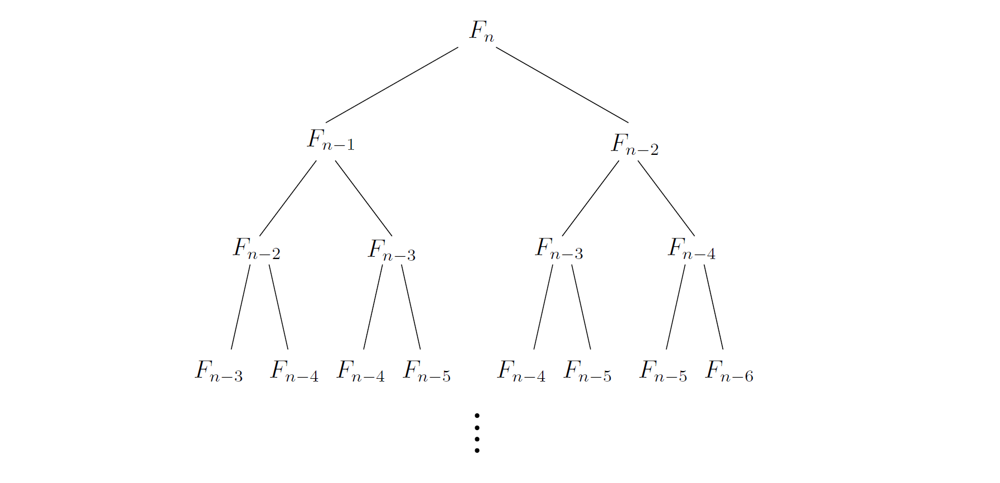

## 0.2 Enter Fibonacci

Al Khwarizmi's work could not have gained a foothold in the West were it not for the efforts of one man: the 15th century Italian mathematician [Leonardo Fibonacci](https://en.wikipedia.org/wiki/Fibonacci), who saw the potential of the positional system and worked hard to develop it further and propagandize it.

But today Fibonacci is most widely known for his famous sequence of numbers

$$
0, 1, 1, 2, 3, 5, 8, 13, 21, 34, \cdots,
$$

each the sum of its two immediate predecessors.

More formally, the Fibonacci numbers $F_n$ are generated by the simple rule

$$
F_n = \begin{cases}
F_{n-1} + F_{n-2} & \text{if}\ n > 1 \\
1 &\text{if}\ n = 1 \\
0 &\text{if}\ n= 0
\end{cases}
$$

No other sequence of numbers has been studied as extensively, or applied to more fields: biology, demography, art, architecture, music, to name just a few. And, together with the powers of $2$, it is computer science's favorite sequence.

In fact, the Fibonacci numbers grow *almost* as fast as the powers of $2$: for example, $F_{30}$ is
over a million, and $F_{100}$ is already 21 digits long! In general, $F_{n} \approx 2^{0.694n}$ (see Exercise 0.3). But what is the precise value of $F_{100}$, or of $F_{200}$?

Fibonacci himself would surely have wanted to know such things. To answer, we need an algorithm for computing the $n$th Fibonacci
number.

### An exponential algorithm

One idea is to slavishly implement the recursive definition of $F_{n}$. Here is the resulting algorithm, in the pseudocode notation used throughout this book:

```python
def fib1(n):
		if n == 0:
				return 0
		if n == 1:
				return 1
		return fib1(n - 1) + fib1(n - 2)
```

Whenever we have an algorithm, there are three questions we always ask about it:

1. Is it correct?

2. How much time does it take, as a function of $n$?

3. And can we do better?

The first question is moot here, as this algorithm is precisely Fibonacci's definition of $F_n$.
But the second demands an answer. Let $T(n)$ be the number of computer steps needed to
compute $\text{fib1}(n)$; what can we say about this function? For starters, if $n$ is less than $2$, the
procedure halts almost immediately, after just a couple of steps. Therefore,

$$T(n) \leq 2 \ \text{for}\ n \leq 1.$$

For larger values of $n$, there are two recursive invocations of $\text{fib1}$, taking time $T(n-1)$ and
$T(n-2)$, respectively, plus three computer steps (checks on the value of $n$ and a final addition).
Therefore,

$$T(n) = T(n-1) + T(n-2) + 3 \ \text{for}\ n > 1.$$

Compare this to the recurrence relation for $F_n$: we immediately see that $T(n) \geq F_n$.

This is very bad news: the running time of the algorithm grows as fast as the Fibonacci numbers! $T(n)$ is *exponential in* $n$, which implies that the algorithm is impractically slow
except for very small values of $n$.

&nbsp;



&nbsp;

Let's be a little more concrete about just how bad exponential time is.

To compute $F_{200}$, the $\text{fib1}$ algorithm executes $T(200) \geq F_{200} \geq  2^{138}$ elementary computer steps. How long this
actually takes depends, of course, on the computer used.

At this time, the fastest computer in the world is the [NEC Earth Simulator](https://en.wikipedia.org/wiki/Earth_Simulator), which clocks 40 trillion steps per second. Even on this machine, $\text{fib1}(200)$ would take at least 292 seconds. This means that, if we start the computation today, it would still be going long after the sun turns into a red giant star.

But technology is rapidly improving computer speeds have been doubling roughly every 18 months, a phenomenon sometimes called *[Moore's law](https://en.wikipedia.org/wiki/Moore%27s_law)*. With this extraordinary growth, perhaps $\text{fib1}$ will run a lot faster on next year's machines.

Let's see —the running time of $\text{fib1}(n)$ is proportional to $2^{0.694n} \approx (1.6)^{n}$, so it takes $1.6$ times longer to compute $F_{n+1}$ than $F_{n}$. And under Moore's law, computers get roughly $1.6$ times faster each year. So if we can reasonably compute $F_{100}$ with this year's technology, then next year we will manage $F_{101}$. And the year after, $F_{102}$.

And so on: just one more Fibonacci number every year! Such is the curse of exponential time.

In short, our naive recursive algorithm is correct but hopelessly inefficient. *Can we do better?*

### A polynomial algorithm

Let's try to understand why $\text{fib1}$ is so slow. Figure 0.1 shows the cascade of recursive invocations triggered by a single call to $\text{fib1}(n)$. Notice that many computations are repeated!

A more sensible scheme would store the intermediate results—the values $F_{0}, F_{1}, \cdots, F_{n-1}$—as soon as they become known.

```python
def fib2(n):
		# Base case.
		if n == 0:
				return 0

		# Initialize array.
		f = []; f[0] = 0; f[1] = 1

		# Fill array with values.
		for i in range(2, n):
				f[i] = f[i - 1] + f[i - 2]

		return f[n]
```

As with $\text{fib1}$, the correctness of this algorithm is self-evident because it directly uses the definition of $F_n$. How long does it take? The inner loop consists of a single computer step and is executed $n - 1$ times.

Therefore the number of computer steps used by $\text{fib2}$ is *linear in* $n$. From exponential we are down to polynomial, a huge breakthrough in running time. It is now perfectly reasonable to compute $F_{200}$ or even $F_{200,000}$.[^1]

As we will see repeatedly throughout this book, the right algorithm makes all the difference.

### A more careful analysis

In our discussion so far, we have been counting the number of *basic computer steps* executed
by each algorithm and thinking of these basic steps as taking a constant amount of time.

This is a very useful simplification. After all, a processor's instruction set has a variety of
basic primitives branching, storing to memory, comparing numbers, simple arithmetic, and so on— and rather than distinguishing between these elementary operations, it is far more convenient to lump them together into one category.

But looking back at our treatment of Fibonacci algorithms, we have been too liberal with what we consider a basic step. It is reasonable to treat addition as a single computer step if small numbers are being added, 32-bit numbers say.

But the $n$th Fibonacci number is about $0.694n$ bits long, and this can far exceed 32 as $n$ grows. Arithmetic operations on arbitrarily large numbers cannot possibly be performed in a single, constant-time step. We need to audit our earlier running time estimates and make them more honest.

We will see in Chapter 1 that the addition of two n-bit numbers takes time roughly proportional to $n$; this is not too hard to understand if you think back to the grade-school procedure for addition, which works on one digit at a time.

Thus $\text{fib1}$, which performs about $F_{n}$ additions, actually uses a number of *basic steps* roughly proportional to $nF_{n}$. Likewise, the number of steps taken by $\text{fib2}$ is proportional to $n^2$, still polynomial in $n$ and therefore exponentially superior to $\text{fib1}$.

This correction to the running time analysis does not diminish our breakthrough.

*But can we do even better than $\text{fib2}$?* Indeed we can: see Exercise 0.4.

&nbsp;

[^1]: To better appreciate the importance of this dichotomy between exponential and polynomial algorithms, the reader may want to peek ahead to the *story of Sissa and Moore*, in Chapter 8.
