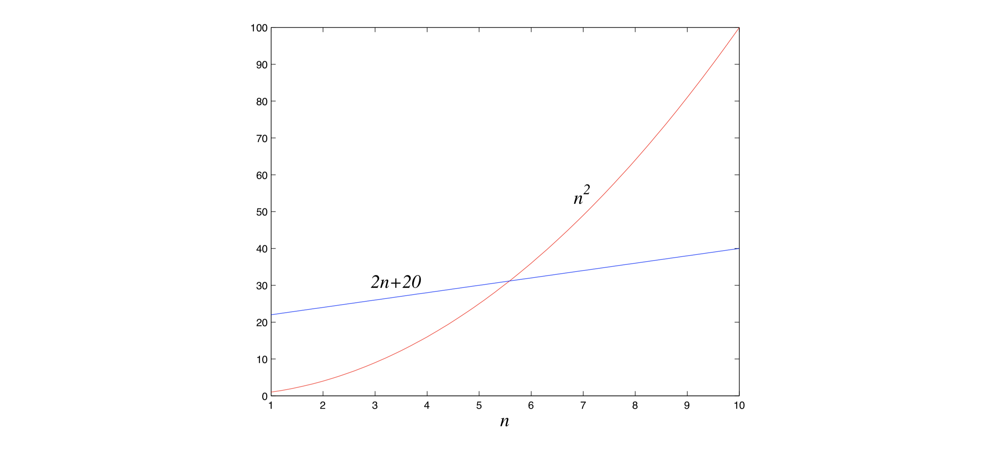

## 0.3 Big-$\mathcal{O}$ Notation

We've just seen how sloppiness in the analysis of running times can lead to an unacceptable level of inaccuracy in the result. But the opposite danger is also present: it is possible to be *too* precise. An insightful analysis is based on the right simplifications.

Expressing running time in terms of *basic computer steps* is already a simplification. After all, the time taken by one such step depends crucially on the particular processor and even on details such as caching strategy (as a result of which the running time can differ subtly from one execution to the next). Accounting for these architecture-specific minutiae is a nightmarishly complex task and yields a result that does not generalize from one computer to the next.

It therefore makes more sense to seek an uncluttered, machine-independent characterization of an algorithm's efficiency. To this end, we will always express running time by counting the number of basic computer steps, as a function of the size of the input.

And this simplification leads to another. Instead of reporting that an algorithm takes, say, $5n^3 + 4n + 3$ steps on an input of size $n$, it is much simpler to leave out lower-order terms such as $4n$ and $3$ (which become insignificant as $n$ grows), and even the detail of the coefficient $5$ in the leading term (computers will be five times faster in a few years anyway), and just say that the algorithm takes time $O(n^3)$ (pronounced "big oh of $n^3$").

It is time to define this notation precisely. In what follows, think of $f(n)$ and $g(n)$ as the running times of two algorithms on inputs of size $n$.

Let $f(n)$ and $g(n)$ be functions from positive integers to positive reals. We say $f = O(g)$ (which means that "$f$ grows no faster than $g$") if there is a constant $c > 0$ such that $f(n) \leq c \cdot g(n)$.

Saying $f = O(g)$ is a very loose analog of "$f \leq g$". It differs from the usual notion of $\leq$ because of the constant $c$, so that for instance $10n = O(n)$. This constant also allows us to disregard what happens for small values of $n$. For example, suppose we are choosing between two algorithms for a particular computational task.

One takes $f_1{(n)} = n^2$ steps, while the other takes $f_2{(n)} = 2n + 20$ steps (Figure 0.2). Which is better? Well, this depends on the value of $n$. For $n \leq 5$, $f_1$ is smaller; thereafter, $f_2$ is the clear winner. In this case, $f_2$ scales much better as $n$ grows, and therefore it is superior.

&nbsp;

&nbsp;

This superiority is captured by the big-$\mathcal{O}$ notation: $f_2 = O(f_1)$, because

$$
\frac{f_2{(n)}}{f_1{(n)}} = \frac{2n + 20}{n^2} \leq 22
$$

for all $n$; on the other hand, $f_1 \neq O(f_2)$, since the ratio $f_1{(n)} / f_2{(n)} = n^2 / (2n + 20)$ can get arbitrarily large, and so no constant $c$ will make the definition work.

Now another algorithm comes along, one that uses $f_3{(n)} = n + 1$ steps. Is this better than $f_2$? Certainly, but only by a constant factor. The discrepancy between $f_2$ and $f_3$ is tiny compared to the huge gap between $f_1$ and $f_2$. In order to stay focused on the big picture, we treat functions as equivalent if they differ only by multiplicative constants.

Returning to the definition of big-$\mathcal{O}$, we see that $f_2 = O(f_3)$:

$$
\frac{f_2{(n)}}{f_3{(n)}} = \frac{2n + 20}{n + 1} \leq 20,
$$

and of course $f_3 = O(f_2)$, this time with $c = 1$.

Just as $O(\cdot)$ is an analog of $\leq$, we can also define analogs of $\geq$ and $=$ as follows:

$$
f = \Omega(g) \ \text{means}\ g = O(f)
$$

$$
f = \Theta(g) \ \text{means}\ f = O(g) \ \text{and}\ f = \Omega(g).
$$

In the preceding example, $f_2 = \Theta(f_3)$ and $f_1 = \Omega(f_3)$.

Big-$\mathcal{O}$ notation lets us focus on the big picture. When faced with a complicated function like $3n^2 + 4n + 5$, we just replace it with $O(f(n))$, where $f(n)$ is as simple as possible. In this particular example we'd use $O(n^2)$, because the quadratic portion of the sum dominates the rest. Here are some commonsense rules that help simplify functions by omitting dominated terms:

1. Multiplicative constants can be omitted: $14n^2$ becomes $n^2$.

2. $n^a$ dominates $n^b$ if $a > b$: for instance, $n^2$ dominates $n$.

3. Any exponential dominates any polynomial: $3^n$ dominates $n^5$ (it even dominates $2^n$).

4. Likewise, any polynomial dominates any logarithm: $n$ dominates $(\log{n})^3$ . This also means, for example, that $n^2$ dominates $n\log{n}$.

Don't misunderstand this cavalier attitude toward constants. Programmers and algorithm developers are *very* interested in constants and would gladly stay up nights in order to make an algorithm run faster by a factor of $2$. But understanding algorithms at the level of this book would be impossible without the simplicity afforded by big-$\mathcal{O}$ notation.

&nbsp;
