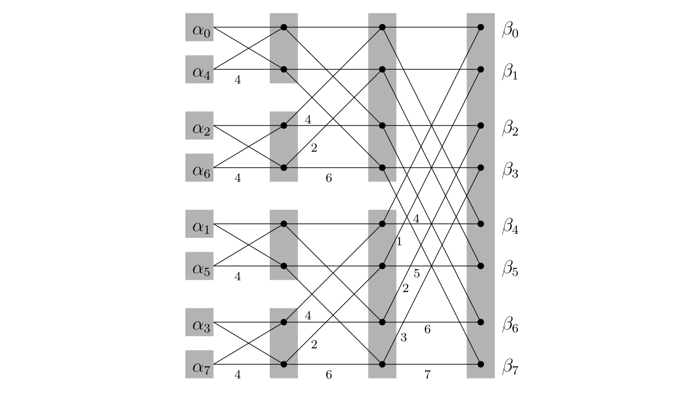

## 10.3 Quantum Fourier transform

Recall the fast Fourier transform (FFT) from Chapter 2. It takes as input an $M$-dimensional, complex-valued vector $\alpha$ (where $M$ is a power of $2$, say $M = 2^m$), and outputs an $M$-dimensional complex-valued vector $\beta$:

$$
\begin{bmatrix} \beta_0 \\ \beta_1 \\ \beta_2 \\ \beta_{M - 1} \end{bmatrix} = \frac{1}{\sqrt{M}}
\begin{bmatrix}
1 & 1              & 1               & \cdots & 1                   \\
1 & \omega         & \omega^2        & \cdots & \omega^{M-1}        \\
1 & \omega^2       & \omega^4        & \cdots & \omega^{2(M-1)}     \\
  & \vdots         &                 &        & \vdots              \\
1 & \omega^{j}     & \omega^{2j}     & \cdots & \omega^{(M-1)j}     \\
  & \vdots         &                 &        & \vdots              \\
1 & \omega^{(M-1)} & \omega^{2(M-1)} & \cdots & \omega^{(M-1)(M-1)} \\
\end{bmatrix}
\begin{bmatrix}
\alpha_0 \\ \alpha_1 \\ \alpha_2 \\ \vdots \alpha_{M-1}
\end{bmatrix}
$$

where $\omega$ is a complex $M$th root of unity (the extra factor of $\sqrt{M}$ is new and has the effect of ensuring that if the $|\alpha_i|^2$ add up to $1$, then so do the $|\beta_i|^2$). Although the preceding equation suggests an $O(M^2)$ algorithm, the classical FFT is able to perform this calculation in just $O(M \log{ M})$ steps, and it is this speedup that has had the profound effect of making digital signal processing practically feasible.

We will now see that quantum computers can implement the FFT exponentially faster, in $O(\log^2{M})$ time!

But wait, how can any algorithm take time less than M, the length of the input? The point is that we can encode the input in a superposition of just $m = \log{M}$ qubits: after all, this superposition consists of $2^m$ amplitude values. In the notation we introduced earlier, we would write the superposition as $\vert \alpha \rangle  = \sum_{j=0}^{M-1} \alpha_j \vert  j \rangle$ where $\alpha_i$ is the amplitude of the $m$-bit binary string corresponding to the number $i$ in the natural way.

This brings up an important point: the $\vert j \rangle$ notation is really just another way of writing a vector, where the index of each entry of the vector is written out explicitly in the special bracket symbol.

Starting from this input superposition $\vert \alpha \rangle$, the *quantum Fourier transform* (QFT) manipulates it appropriately in $m = \log{M}$ stages. At each stage the superposition evolves so that it encodes the intermediate results at the same stage of the classical FFT (whose circuit, with $m = \log{M}$ stages, is reproduced from Chapter 2 in Figure 10.4).

&nbsp;

&nbsp;

As we will see in Section 10.5, this can be achieved with $m$ quantum operations per stage. Ultimately, after $m$ such stages and $m^{2} = \log^2{M}$ elementary operations, we obtain the superposition $\vert \beta \rangle$ that corresponds to the desired output of the QFT.

So far we have only considered the good news about the QFT: its amazing speed. Now it is time to read the fine print. The classical FFT algorithm actually *outputs* the $M$ complex numbers $\beta_0, \cdots, \beta_{M-1}$. In contrast, the QFT only prepares a superposition $\vert \beta \rangle = \sum_{j=0}^{M-1} \beta \vert j \rangle$. And, as we saw earlier, these amplitudes are part of the "private world" of this quantum system.

Thus the only way to get our hands on this result is by measuring it! And measuring the state of the system only yields $m = \log{M}$ classical bits: specifically, the output is index $j$ with probability $|\beta_j|^2$.

So, instead of QFT, it would be more accurate to call this algorithm *quantum Fourier sampling*. Moreover, even though we have confined our attention to the case $M = 2^m$ in this section, the algorithm can be implemented for arbitrary values of $M$, and can be summarized as follows:

* **input**: a superposition of $m = \log{M}$ qubits, $\vert \alpha \rangle = \sum_{j=0}^{M-1} \alpha_j \vert j \rangle$

* **method**: using $O(m^2) = O(\log^2{M})$ quantum operations perform the quantum FFT to obtain the superposition $\vert \beta \rangle = \sum_{j=0}^{M-1} \beta_j \vert j \rangle$

* **output**: a random $m$-bit number $j$ (that is, $0 \leq j \leq M-1$), from the probability $\Pr(j) = |\beta_j|^2$

Quantum Fourier sampling is basically a quick way of getting a very rough idea about the output of the classical FFT, just detecting one of the larger components of the answer vector. In fact, we don’t even see the value of that component—we only see its index.

How can we use such meager information? In which applications of the FFT is just the index of the large components enough? This is what we explore next.
