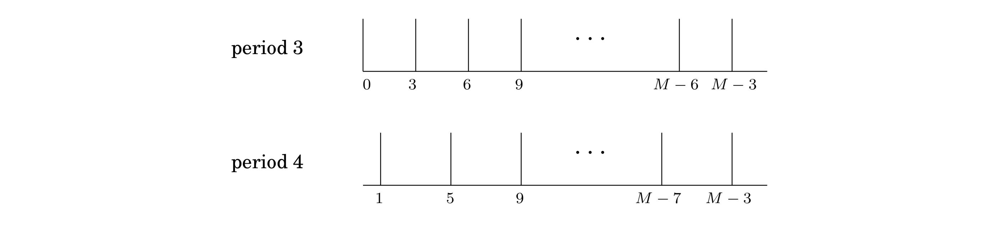

## 10.4 Periodicity

Suppose that the input to the $\text{QFT}$, $\alpha = (\alpha_0, \alpha_1, \cdots, \alpha_{M-1})$, is such that $\alpha_i = \alpha_j$ whenever $i \equiv j \bmod{k}$, where $k$ is a particular integer that divides $M$. That is, the array $\alpha$ consists of $M / k$ repetitions of some sequence $(\alpha_0, \alpha_1, \cdots, \alpha_{k-1})$ of length $k$. Moreover, suppose that exactly one of the $k$ numbers $\alpha_0, \cdots, \alpha_{k-1}$ is nonzero, say $\alpha_j$. Then we say that $\alpha$ is *periodic with period $k$ and offset $j$*.

It turns out that if the input vector is periodic, we can use quantum Fourier sampling to compute its period! This is based on the following fact, proved in the next box:

* Suppose the input to quantum Fourier sampling is periodic with period $k$, for some $k$ that divides $M$. Then the output will be a multiple of $M / k$, and it is equally likely to be any of the $k$ multiples of $M / k$.

Now a little thought tells us that by repeating the sampling a few times (repeatedly preparing the periodic superposition and doing Fourier sampling), and then taking the greatest common divisor of all the indices returned, we will with very high probability get the number $M / k$—and from it the period $k$ of the input!

Let's make this more price.

**Lemma** Suppose $s$ independent samples are drawn uniformly from $$0, \frac{M}{k}, \frac{2M}{k}, \cdots, \frac{(k - 1)M}{k}.$$ Then with probability at least $1 - \frac{k}{2^s}$, the greatest common divisor of these samples is $M / k$.

*Proof.* The only way this can fail is if all the samples are multiples of $j \cdots M / k$, where $j$ is some integer greater than $1$. So, fix any integer $j \geq 2$. The chance that a particular sample is a multiple of $jM / k$ is at most $1 / j \leq 1 / 2$; and thus the chance that all the samples are multiples of $jM / k$ is at most $1 / 2^s$.

So far we have been thinking about a particular number $j$; the probability that this bad event will happen for some $j \leq k$ is at most equal to the sum of these probabilities over the different values of $j$, which is no more than $\frac{k}{2^s}$. $\blacksquare$

We can make the failure probability as small as we like by taking $s$ to be an appropriate multiple of $\log{M}$.

&nbsp;

> **The Fourier Transform of a Periodic Vector**
>
> Suppose the vector $\vert \mathbf{\alpha} \rangle = (\alpha_0, \alpha_1, \cdots, \alpha_{M-1})$ is periodic with period $k$ and with no offset (that is, the nonzero terms are $\alpha_0, \alpha_k, \alpha_{2k}, \cdots$). Thus, $$\vert \mathbf{\alpha} \rangle = \sum_{j = 0}^{M / k - 1} \sqrt{\frac{k}{M}} \vert jk \rangle.$$
>
> We will show that its Fourier transform  $\beta  = (\beta_0, \beta_1, \cdots, \beta_{M-1})$ is also periodic, with period $M / k$ and no offset.
>
> **Claim** $$\vert \mathbf{\beta} \rangle = \frac{1}{\sqrt{k}} \sum_{j = 0}^{k-1} \vert \frac{jM}{k} \rangle .$$
>
> *Proof.* In the input vector, the coefficient $\alpha_l$ is $\sqrt{k / M}$ if $k$ divides $l$, and is zero otherwise. We can plug this into the formula for the $j$th coefficient of $\vert β \rangle$: $$\beta_k = \frac{1}{\sqrt{M}} \sum_{l = 0}^{M-1} \omega^{jl} \alpha_l = \frac{\sqrt{k}}{M} \sum_{i = 0}^{M / k - 1} \omega_{jik}.$$
> The summation is the geometric series, $1 + \omega^{jk} + \omega^{2jk} + \omega^{3jk} + \cdots$$, containing $M / k$ terms and with ratio $\omega^{jk}$ (recall that $\omega$ is a complex $M$th root of unity). There are two cases. If the ratio is exactly $1$, which happens if $jk \equiv 0 \bmod{M}$, then the sum of the series is simply the number of terms. If the ratio isn't $1$, we can apply the usual formula for geometric series to find that the sum is $\frac{1 - \omega^{jk(M / k)}}{1 - \omega^{jk}} = \frac{1 - \omega^{Mj}}{1 - \omega^{jk}} = 0$.
> Therefore $\beta_j$ is $1 / \sqrt{k}$ if $M$ divides $jk$, and is zero otherwise. $\blacksquare$
>
> More generally, we can consider the original superposition to be periodic with period $k$, but with some offset $l < k$: $$\vert \mathbf{\alpha} \rangle = \sum_{j = 0}^{M / k - 1} \sqrt{\frac{k}{M}} \vert jk + l \rangle.$$
> Then, as before, the Fourier transform $\vert \mathbf{\beta} \rangle$ will have nonzero amplitudes precisely as multiples of $M / k$.
>
> **Claim** $$\vert \mathbf{\beta} \rangle = \frac{1}{\sqrt{k}} \sum_{j = 0}^{k-1} \omega^{lk M / k} \vert \frac{jM}{k} \rangle.$$
>
> The proof of this claim is very similar to the preceding one (Exercise 10.5).
>
> We conclude that *the $\text{QFT}$ of any periodic superposition with period $k$ is an array that is everywhere zero, except at indices that are multiples of $M / k$, and all these $k$ nonzero coefficients have equal absolute values.* So if we sample the output, we will get an index that is a multiple of $M / k$, and each of the $k$ such indices will occur with probability $1 / k$.

&nbsp;
