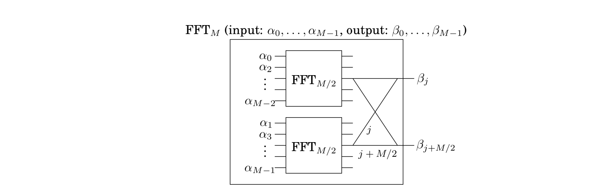
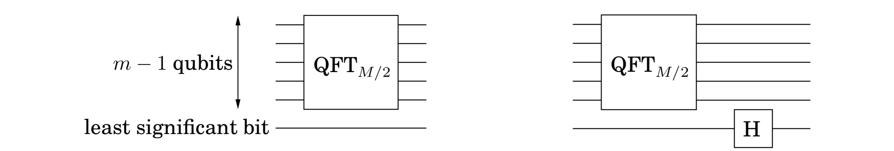

## 10.5 Quantum Circuits

So quantum computers can carry out a Fourier transform exponentially faster than classical computers. But what do these computers actually look like? What is a *quantum circuit* made up of, and exactly how does it compute Fourier transforms so quickly?

&nbsp;

### 10.5.1 Elementary Quantum Gates

An elementary quantum operation is analogous to an elementary gate like the $\text{AND}$ or $\text{NOT}$ gate in a classical circuit. It operates upon either a single qubit or two qubits.

One of the most important examples is the Hadamard gate, denoted by $\textbf{H}$, which operates on a single qubit.

* On input $\vert 0 \rangle$, it outputs $\textbf{H}(\vert 0 \rangle) = \frac{1}{\sqrt{2}}\vert 0 \rangle + \frac{1}{\sqrt{2}}\vert 1 \rangle$.

* And for input $\vert 1 \rangle$, $\textbf{H}(\vert 1 \rangle) = \frac{1}{\sqrt{2}}\vert 0 \rangle - \frac{1}{\sqrt{2}}\vert 1 \rangle$.

In pictures:

$$\begin{matrix}
\vert 0 \rangle \longrightarrow\boxed{\textbf{H}}\longrightarrow  \frac{1}{\sqrt{2}}\vert 0 \rangle + \frac{1}{\sqrt{2}}\vert 1 \rangle & &
\vert 1 \rangle \longrightarrow\boxed{\textbf{H}}\longrightarrow \frac{1}{\sqrt{2}}\vert 0 \rangle - \frac{1}{\sqrt{2}}\vert 1 \rangle \end{matrix}$$

Notice that in either case, measuring the resulting qubit yields $0$ with probability $1 / 2$ and $1$ with probability $1 / 2$. But what happens to the Hadamard gate is an arbitrary position $\alpha_0 \vert 0 \rangle + \alpha_1 \vert 1 \rangle$? The answer, dictated by linearity of quantum physics, is the superposition $\alpha_0 \textbf{H}(\vert 0 \rangle) = \frac{\alpha_0 + \alpha_1}{\sqrt{2}}\vert 0 \rangle + \frac{\alpha_0 - \alpha_1}{\sqrt{2}}\vert 1 \rangle$.

And so, if we apply the Hadamard gate to the output of a Hadamard gate, it restores the qubit to its original state!

Another basic gate is the controlled-$\text{NOT}$, or $\text{CNOT}$. It operates upon two qubits, with the first acting as a control qubit and the second as the target qubit. The $\text{CNOT}$ gate flips the second bit if and only if the first qubit is a $1$. Thus $\text{CNOT}(\vert 00 \rangle) = \vert 00 \rangle$ and $\text{CNOT}(\vert 10 \rangle) = \vert 11 \rangle$:

$$\begin{matrix}
\vert 00 \rangle \sqsupset\oplus\sqsubset \vert 00 \rangle & & & &
\vert 10 \rangle \sqsupset\oplus\sqsubset \vert 11 \rangle \end{matrix}$$

Yet another basic gate, the controlled phase gate, is described below in the subsection describing the quantum circuit for the $\text{QFT}$.

Now let us consider the following question: suppose we have a quantum state on $n$ qubits, $\vert \mathbf{\alpha} \rangle = \sum_{x \in \{0, 1\}^n} \alpha_x \vert x \rangle$. How many of these $2^n$ amplitutdes change if we apply the Hadamard gate to only the first qubit? The surpising answer is—all of them! The new superposition becomes $\vert \mathbf{\beta} \rangle = \sum_{x \in \{0, 1\}^n} \beta_x \vert x \rangle$, where $\beta_{0y} = \frac{\alpha_{0y} + \alpha_{1y}}{\sqrt{2}}$ and $\beta_{1y} = \frac{\alpha_{0y} - \alpha_{1y}}{\sqrt{2}}$. Looking at the results more closely, the quantum operation on the first qubit deals with each $n - 1$ bit suffix $y$ separately. Thus the pair of amplitudes $\alpha_{0y}$ and $\alpha_{1y}$ are transformed into $(\alpha_{0y} + \alpha_{1y}) / \sqrt{2}$ and $(\alpha_{0y} + \alpha_{1y}) / \sqrt{2}$. This is exactly the feature that will give us an exponential speedup in the quantum Fourier transform.

&nbsp;

### 10.5.2 Two Basic Types of Quantum Circuits

A quantum circuit takes some number $n$ of qubits as input, and outputs the same number of qubits. In the diagram these $n$ qubits are carried by the $n$ wires going from left to right. The quantum circuit consists of the application of a sequence of elementary quantum gates (of the kind described above) to single qubits and pairs of qubits.

At a high level, there are two basic functionalities of quantum circuits that we use in the design of quantum algorithms:

* **Quantum Fourier Transform** These quantum circuits take as input $n$ qubits in some state $\alpha$ and output the state $\beta$ resulting from applying the $\text{QFT}$ to $\alpha$.

* **Classical Functions** Consider a function $f$ with $n$ input bits and $m$ output bits, and suppose we have a classical circuit that outputs $f(x)$. Then there is a quantum circuit that, on input consisting of an $n$-bit string $x$ padded with $m$ $0$’s, outputs $x$ and $f(x)$: 

Now the input to this quantum circuit could be a superposition over the $n$ bit strings $x, \sum_x \vert x, 0^k \rangle$, in which case the output has to be $\sum_x \vert x, f(x) \rangle$. Exercise 10.7 explores the construction of such circuits out of elementary quantum gates.

Understanding quantum circuits at this high level is sufficient to follow the rest of this chapter. The next subsection on quantum circuits for the $\text{QFT}$ can therefore be safely skipped by anyone not wanting to delve into these details.

&nbsp;

### 10.5.3 The Quantum Fourier Transform Circuit

Here we have reproduced the diagram (from Section 2.6.4) showing how the classical $\text{FFT}$ circuit for $M$-vectors is composed of two $\text{FFT}$ circuits for $(M / 2)$-vectors followed by some simple gates.

&nbsp;

Let’s see how to simulate this on a quantum system. The input is now encoded in the $2^m$ amplitudes of $m = \log{M}$ qubits. Thus the decomposition of the inputs into evens and odds, as shown in the preceding figure, is clearly determined by one of the qubits—the least significant qubit. How do we separate the even and odd inputs and apply the recursive circuits to compute $\text{FFT}_{M / 2}$ on each half?

The answer is remarkable: just apply the quantum circuit $\text{QFT}_{M / 2}$ to the remaining $m - 1$ qubits. The effect of this is to apply $\text{QFT}_{M / 2}$ to the superposition of all the $m$-bit strings of the form $x0$ (of which there are $M / 2$), and separately to the superposition of all the $m$-bit strings of the form $x1$. Thus the two recursive classical circuits can be emulated by a single quantum circuit—an exponential speedup when we unwind the recursion!

&nbsp;

Let us now consider the gates in the classical $\text{FFT}$ circuit after the recursive calls to $\text{FFT}_{M / 2}$: the wires pair up $j$ with $M / 2 + j$, and ignoring for now the phase that is applied to the contents of the $(M / 2 + j)$ th wire, we must add and subtract these two quantities to obtain the $j$th and the $(M / 2 + j)$ th outputs, respectively. How would a quantum circuit achieve the result of these $M$ classical gates?

Simple: just perform the Hadamard gate on the first qubit! Recall from the preceding discussion (Section 10.5.1) that for every possible configuration of the remaining $m - 1$ qubits $x$, this pairs up the strings $0x$ and $1x$. Translating from binary, this means we are pairing up $x$ and $M / 2 + x$. Moreover the result of the Hadamard gate is that for each such pair, the amplitudes are replaced by the sum and difference (normalized by $1 / \sqrt{2}$), respectively. So far the $\text{QFT}$ requires almost no gates at all!

The phase that must be applied to the $(M / 2 + j)$ th wire for each $j$ requires a little more work. Notice that the phase of $\omega^j$ must be applied only if the first qubit is $1$. Now if $j$ is represented by the $m - 1$ bits $j_1 \cdots j_{m-1}$, then
$$\omega^j = \prod_{l = 1}^{m-1} \omega^{2^{j_l}}.$$
Thus the phase $\omega^j$ can be applied by applying for the $l$th wire (for each $l$) a phase of $\omega^{2^l}$ if the $l$th qubit is a $1$ and the first qubit is a $1$. This task can be accomplished by another two-qubit quantum gate—the conditional phase gate. It leaves the two qubits unchanged unless they are both $1$, in which case it applies a specified phase factor.

The $\text{QFT}$ circuit is now specified. The number of quantum gates is given by the formula $S(m) = S(m - 1) + O(m)$, which works out to $S(m) = O(m^2)$. The $\text{QFT}$ on inputs of size $M = 2^m$ thus requires $O(m^2) = O(\log^2 M)$ quantum operations.
