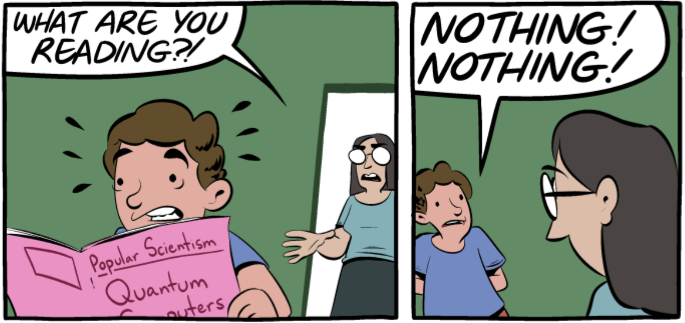

### Chapter 10
# Quantum algorithms

This book started with the world’s oldest and most widely used algorithms (the ones for adding and multiplying numbers) and an ancient hard problem $\text{(FACTORING)}$. In this last chapter the tables are turned: we present one of the latest algorithms—and it is an efficient algorithm for $\text{FACTORING}$!

There is a catch, of course: this algorithm needs a **quantum computer** to execute.

Quantum physics is a beautiful and mysterious theory that describes Nature in the small, at the level of elementary particles. One of the major discoveries of the nineties was that quantum computers—computers based on quantum physics principles—are radically different from those that operate according to the more familiar principles of classical physics. Surprisingly, they can be exponentially more powerful: as we shall see, quantum computers can solve $\text{FACTORING}$ in polynomial time! As a result, in a world with quantum computers, the systems that currently safeguard business transactions on the Internet (and are based on the RSA cryptosystem) will no longer be secure.

## Contents
1. [Qubits, Superposition, And Measurement](/algorithms/Chapter10/10.1)
2. [The Plan](/algorithms/Chapter10/10.2)
3. [Quantum Fourier Transform](/algorithms/Chapter10/10.3)
4. [Periodicity](/algorithms/Chapter10/10.4)
5. [Quantum Circuits](/algorithms/Chapter10/10.5)
6. [Factoring As Periodicity](/algorithms/Chapter10/10.6)
7. [The Quantum Algorithm for Factoring](/algorithms/Chapter10/10.7)
8. [Exercises](/algorithms/Chapter10/10-ex.pdf)
