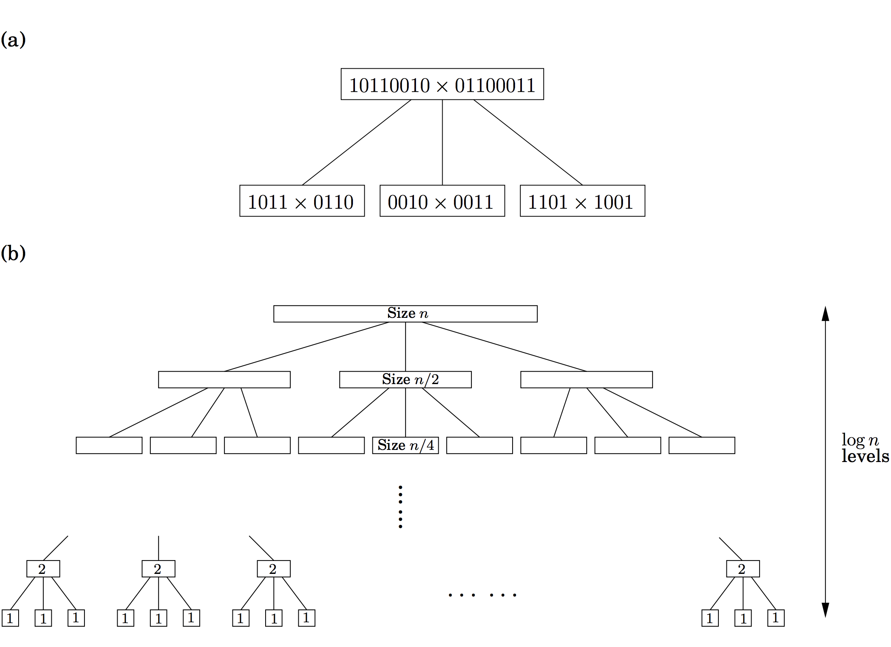

## 2.1 Multiplication

The mathematician Carl Friedrich Gauss (1777–1855) once noticed that although the product of two complex numbers

$$
(a + bi)(c + di) = ac - bd + (bc + ad)i
$$

seems to involve *four* real-number multiplications, it can in fact be done with just *three*: $ac$, $bd$, and $(a + b)(c + d)$, since

$$
bc + ad = (a + b)(c + d) - ac - bd.
$$

In our big-$O$ way of thinking, reducing the number of multiplications from four to three seems wasted ingenuity. But this modest improvement becomes very significant *when applied recursively*.

Let’s move away from complex numbers and see how this helps with regular multiplication. Suppose $x$ and $y$ are two $n$-bit integers, and assume for convenience that $n$ is a power of 2 (the more general case is hardly any different). As a first step toward multiplying $x$ and $y$, split each of them into their left and right halves, which are $n/2$ bits long:

$$
\begin{aligned}
x &= \boxed{x_L}\boxed{x_R}																 &&= 2^{n/2}x_L + x_R \\
y &= \boxed{\hspace{0.03cm} y_L}\boxed{\hspace{0.03cm} y_R}&&= 2^{n/2}y_L + y_R \\
\end{aligned}
$$

For instance, if $x = 101101102$ (the subscript 2 means “binary”) then $x_L = 10112$, $x_R = 01102$, and $x = 10112 \times 2^4 + 01102$. The product of x and y can then be rewritten as

$$
xy = (2^{n/2} x_L + x_R)(2^{n/2} y_L + y_R) = 2^{n} x_L y_L + 2^{n/2} (x_L y_R + x_R y_L) + x_R y_R.
$$

We will compute $xy$ via the expression on the right. The additions take linear time, as do the multiplications by powers of 2 (which are merely left-shifts). The significant operations are the four $n/2$-bit multiplications, $x_L y_L, x_L y_R, x_R y_L, x_R y_R$; these we can handle by four recursive calls.

Thus our method for multiplying $n$-bit numbers starts by making recursive calls to multiply these four pairs of $n/2$-bit numbers (four subproblems of half the size), and then evaluates the preceding expression in $O(n)$ time. Writing $T(n)$ for the overall running time on $n$-bit inputs, we get the **recurrence relation**

$$
T(n) = 4T(n/2) + O(n).
$$

We will soon see general strategies for solving such equations. In the meantime, this particular one works out to $O(n^2)$, the same running time as the traditional grade-school multiplication technique. So we have a radically new algorithm, but we haven’t yet made any progress in efficiency. How can our method be sped up?

This is where Gauss’s trick comes to mind. Although the expression for xy seems to demand four n/2-bit multiplications, as before just three will do: $x_L y_L, x_R y_R$, and $(x_L + x_R)(y_L + y_R)$, since

$$
x_L y_R + x_R y_L = (x_L + x_R)(y_L + y_R) - x_L y_ L - x_R y_R.
$$

The resulting algorithm, shown in Figure 2.1, has an improved running time [^1] of

$$
T(n) = 3T(n/2) + O(n).
$$


**Figure 2.1** A divide-and-conquer algorithm for integer multiplication.

```python
def multiply(x, y):
"""
Input: Positive integers x and y, in binary
Output: Their product
"""
n = max(size of x, size of y)
if n = 1:
	return xy

x_L, x_R = leftmost n/2, rightmost n/2 bits of x
y_L, y_R = leftmost n/2, rightmost n/2 bits of y

P1 = multiply(x_L, y_L)
P2 = multiply(x_R, y_R)
P3 = multiply(xL + xR, yL + yR)

return P1 * 2^n + (P3 - P1 - P2) * 2^(n/2) + P2
```


The point is that now the constant factor improvement, from 4 to 3, occurs *at every level of the
recursion*, and this compounding effect leads to a dramatically lower time bound of $O(n^{1.59})$.

This running time can be derived by looking at the algorithm’s pattern of recursive calls,
which form a tree structure, as in Figure 2.2. Let’s try to understand the shape of this tree. At
each successive level of recursion the subproblems get halved in size. At the ($\log_{2} n$)th level, the subproblems get down to size 1, and so the recursion ends. Therefore, the height of the tree is $\log_{2} n$. The branching factor is 3—each problem recursively produces three smaller ones—with the result that at depth $k$ in the tree there are $3^k$ subproblems, each of size $n / 2^{k}$.

For each subproblem, a linear amount of work is done in identifying further subproblems and combining their answers. Therefore the total time spent at depth k in the tree is

$$
3^k \times O(\frac{n}{2^k}) = (\frac{3}{2})^{k} \times O(n).
$$

At the very top level, when $k = 0$, this works out to $O(n)$. At the bottom, when $k = \log_{2} n$, it is $O(3^{\log_{2} n})$, which can be rewritten as $O(n^{\log_{2} 3 })$ (do you see why?). Between these two endpoints, the work done increases *geometrically* from $O(n)$ to $O(n^{\log_{2} 3 })$, by a factor of $3/2$ per level. The sum of any increasing geometric series is, within a constant factor, simply the last term of the series: such is the rapidity of the increase (Exercise 0.2). Therefore the overall running time is $O(n^{\log_{2} 3 })$ which is about $O(n^{1.59})$.

In the absence of Gauss’s trick, the recursion tree would have the same height, but the branching factor would be 4. There would be $4^{\log_{2} n} = n^2$ leaves, and therefore the running time would be at least this much. In divide-and-conquer algorithms, the number of subproblems translates into the branching factor of the recursion tree; small changes in this coefficient can have a big impact on running time. A practical note: it generally does not make sense to recurse all the way down to 1 bit. For most processors, 16- or 32-bit multiplication is a single operation, so by the time the numbers get into this range they should be handed over to the built-in procedure.

Finally, the eternal question: *Can we do better?* It turns out that even faster algorithms for multiplying numbers exist, based on another important divide-and-conquer algorithm: the fast Fourier transform, to be explained in Section 2.6.




[^1]: Actually, the recurrence should read $T(n) \leq 3T(n/2 + 1) + O(n)$ since the numbers ($x_L + x_R$) and ($y_L + y_R$) could be $n/2 + 1$ bits long. The one we’re using is simpler to deal with and can be seen to imply exactly the same big-O running time.
