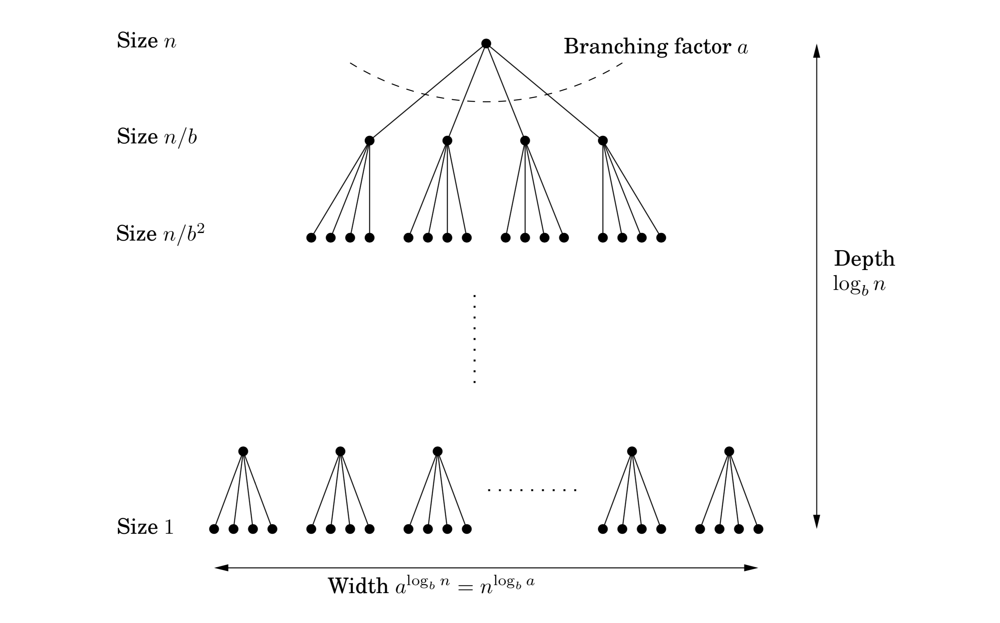

## 2.2 Recurrence Relations

Divide-and-conquer algorithms often follow a generic pattern: they tackle a problem of size $n$ by recursively solving, say, a subproblems of size $n / b$ and then combining these answers in $O(n^d)$ time, for some $a, b, d > 0$ (in the multiplication algorithm, $a = 3, b = 2$, and $d = 1$). Their running time can therefore be captured by the equation $T(n) = aT (\lceil n / b \rceil ) + O(n^d)$. We next derive a closed-form solution to this general recurrence so that we no longer have to solve it explicitly in each new instance.

**Master Theorem**[^1]
If $T(n) = aT(\lceil n / b \rceil ) + O(n^d)$ for some constants $a > 0, b > 1$, and $d \geq 0$, then

$$
T(n) = \begin{cases}
O(n^d) & \text{if}\ d > \log_{b}{a} \\
O(n^d \log{n}) & \text{if}\ d = \log_{b}{a} \\
O(n^{\log_{b}{a}}) & \text{if}\ d < \log_{b}{a}
\end{cases}.
$$

This single theorem tells us the running times of most of the divide-and-conquer procedures we are likely to use.

&nbsp;

*Proof.*
To prove the claim, let's start by assuming for the sake of convenience that $n$ is a power of $b$. This will not influence the final bound in any important way—after all, $n$ is at most a multiplicative factor of $b$ away from some power of $b$ (Exercise 2.2)—and it will allow us to ignore the rounding effect in $\lceil n / b \rceil $.

Next, notice that the size of the subproblems decreases by a factor of $b$ with each level of recursion, and therefore reaches the base case after $\log_{b}{n}$ levels. This is the height of the recursion tree. Its branching factor is $a$, so the $k$th level of the tree is made up of $a^k$ subproblems, each of size $n / b^k$ (Figure 2.3). The total work done at this level is

$$
a^k \times O(\frac{n}{b^k})^d = O(n^d) \times (\frac{a}{b^d})^{k}.
$$

As $k$ goes from $0$ (the root) to $\log_{b}{n}$ (the leaves), these numbers form a geometric series with ratio $a / b^d$. Finding the sum of such a series in big-$O$ notation is easy (Exercise 0.2), and comes down to three cases.

1. *The ratio is less than* $1$. Then the series is decreasing, and its sum is just given by its first term, $O(n^d)$.

2. *The ratio is greater than* $1$. The series is increasing and its sum is given by its last term, $O(n^{\log_{b}{a}})$:

$$
n^d (\frac{a}{b^d})^{\log_{b}{n}} = n^d (\frac{a^{\log_{b}{n}}}{(b^{\log_{b}{n}})^d}) = a^{\log_{b}{n}} = a^{(\log_{a}{n})(\log_{b}{a})} = n^{\log_{b}{a}}.
$$

3. *The ratio is exactly* $1$. In this case all $O(\log{n})$ terms of the series are equal to $O(n^d)$.

These cases translate directly into the three contingencies in the theorem statement. $\blacksquare$

&nbsp;

> **Binary Search**
>
> The ultimate divide-and-conquer algorithm is, of course, *binary* search: to find a key $k$ in a large file containing keys $z[0, 1, \cdots, n - 1]$ in sorted order, we first compare $k$ with $z[n / 2]$, and depending on the result we recurse either on the first half of the file, $z[0, \cdots , n / 2 - 1]$, or on the second half, $z[n / 2, \cdots, n - 1]$.
>
> The recurrence now is $T(n) = T (\lceil n / 2 \rceil ) + O(1)$, which is the case $a = 1, b = 2, d = 0$. Plugging into our master theorem we get the familiar solution: a running time of just $O(\log{n})$.

&nbsp;

[^1]: There are even more general results of this type, but we will not be needing them.
