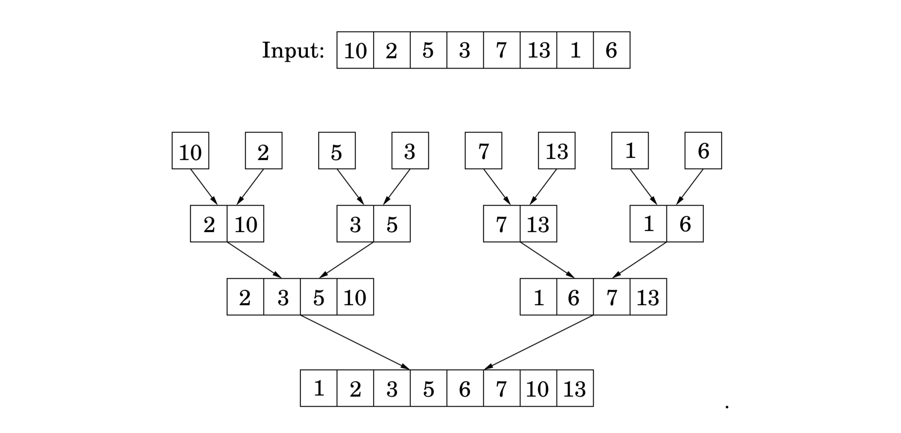

## 2.3 Mergesort

The problem of sorting a list of numbers lends itself immediately to a divide-and-conquer strategy: split the list into two halves, recursively sort each half, and then *merge* the two sorted sublists.

```python
def mergesort(a[1, ..., n]):
  """
  Input: an array of numbers a[1, ..., n]
  Output: a sorted version of this array
  """
  if n > 1:
    return merge(mergesort(a[1, ..., ⌊n/2⌋]), mergesort(a[⌊n/2⌋ + 1, ..., n]))
  else:
    return a
```

The correctness of this algorithm is self-evident, as long as a correct merge subroutine is specified. If we are given two sorted arrays $x[1, \cdots, k]$ and $y[1, \cdots, l]$, how do we efficiently merge them into a single sorted array $z[1, \cdots, k + l]$? Well, the very first element of $z$ is either $x[1]$ or $y[1]$, whichever is smaller. The rest of $z[\cdot]$ can then be constructed recursively.

```python
def merge(x[1, ..., k], y[1, ..., l]):

    if k = 0:
      return y[1, ..., l]
    if l = 0:
      return x[1, ..., k]

    if x[1] <= y[1]:
      return x[1] + merge(x[2, ..., k], y[1, ..., l])
    else:
      return y[1] + merge(x[1, ..., k], y[2, ..., l])
```

This merge procedure does a constant amount of work per recursive call (provided the required array space is allocated in advance), for a total running time of $O(k + l)$. Thus merge's are linear, and the overall time taken by $\text{mergesort}$ is

$$
T(n) = 2T(n / 2) + O(n),
$$

or $O(n \log{n})$.

&nbsp;



&nbsp;


Looking back at the $\text{mergesort}$ algorithm, we see that all the real work is done in merging, which doesn't start until the recursion gets down to singleton arrays. The singletons are merged in pairs, to yield arrays with two elements. Then pairs of these 2-tuples are merged, producing 4-tuples, and so on. Figure 2.4 shows an example.

This viewpoint also suggests how $\text{mergesort}$ might be made iterative. At any given moment, there is a set of “active” arrays—initially, the singletons—which are merged in pairs to give the next batch of active arrays. These arrays can be organized in a queue, and processed by repeatedly removing two arrays from the front of the queue, merging them, and putting the result at the end of the queue.

In the following pseudocode, the primitive operation inject adds an element to the end of the queue while eject removes and returns the element at the front of the queue.

```python
def iterative_mergesort(a[1, ..., n]):

  Q = [] (empty queue)

  for i = 1 to n:
    Q.add(a[i])

  while size(Q) > 1:
    Q.add(merge(Q.pop(), Q.pop()))

  return Q.pop()
```

&nbsp;

> **An $n \log{n}$ lower bound for sorting**
>
> Sorting algorithms can be depicted as trees. The one in the following figure sorts an array of three elements, $a_1, a_2, a_3$. It starts by comparing $a_1$ to $a_2$ and, if the first is larger, compares it with $a_3$; otherwise it compares $a_2$ and $a_3$. And so on.
>
> Eventually we end up at a leaf, and this leaf is labeled with the true order of the three elements as a permutation of $1, 2, 3$. For example, if $a_2 < a_1 < a_3$, we get the leaf labeled "$2 1 3$".
> 
> The *depth* of the tree—the number of comparisons on the longest path from root to leaf, in this case 3—is exactly the worst-case time complexity of the algorithm.
>
> This way of looking at sorting algorithms is useful because it allows one to argue that *mergesort is optimal*, in the sense that $\Omega(n\log{n})$ comparisons are necessary for sorting $n$ elements.
>
> Here is the argument: Consider any such tree that sorts an array of $n$ elements. Each of its leaves is labeled by a permutation of $\{ 1, 2, \cdot, n \}$. In fact, every permutation must appear as the label of a leaf.
>
> The reason is simple: if a particular permutation is missing, what happens if we feed the algorithm an input ordered according to this same permutation? And since there are $n!$ permutations of $n$ elements, it follows that the tree has at least $n!$ leaves.
>
> We are almost done: This is a binary tree, and we argued that it has at least $n!$ leaves. Recall now that a binary tree of depth $d$ has at most $2^d$ leaves (proof: an easy induction on $d$ ). So, the depth of our tree—and the complexity of our algorithm—must be at least $\log{(n!)}$.
>
> And it is well known that $\log{(n!)} \geq c \cdot n \log{n} for some $c > 0$. There are many ways to see this. The easiest is to notice that $n! \geq (n / 2)(n / 2)$ because $n! = 1 \cdot 2 \cdot \cdots \cdot n$ contains at least $n / 2$ factors larger than $n / 2$; and to then take logs of both sides.
>
> Another is to recall [Stirling's formula](https://en.wikipedia.org/wiki/Stirling%27s_approximation)
> $$n! \approx \sqrt{\pi (2n + \frac{1}{3})} \cdot n^n \cdot e^{-n}.$$
> Either way, we have established that any comparison tree that sorts $n$ elements must make, in the worst case, $\Omega(n\log{n})$ comparisons, and hence mergesort is optimal!
>
> Well, there is some fine print: this neat argument applies only to *algorithms that use comparisons*. Is it conceivable that there are alternative sorting strategies, perhaps using sophisticated numerical manipulations, that work in linear time? The answer is *yes*, under certain exceptional circumstances: the canonical such example is when the elements to be sorted are integers that lie in a small range (Exercise 2.20).

&nbsp;
