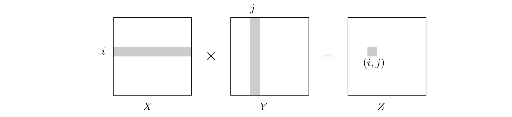

## 2.5 Matrix Multiplication

The product of two $n \times n$ matrices $X$ and $Y$ is a third $n \times n$ matrix $Z = XY$, with ($i, j$)th entry

$$
Z_{ij} = \sum_{k = 1}^{n} X_{ik}Y_{kj}.
$$

To make it more visual, $Z_{ij}$ is the dot product of the $i$th row of $X$ with the $j$th column of Y:

In general, $XY$ is not the same as $YX$; matrix multiplication is not commutative.

The preceding formula implies an $O(n^3)$ algorithm for matrix multiplication: there are $n^2$ entries to be computed, and each takes $O(n)$ time. For quite a while, this was widely believed to be the best running time possible, and it was even proved in certain models of computation no algorithm could do better.

It was therefore a source of great excitement when in 1969, the German mathematician [Volker Strassen](https://en.wikipedia.org/wiki/Volker_Strassen) announced a significantly more efficient algorithm based on upon divide-and-conquer.

Matrix multiplication is particularly easy to break into subproblems, because it can be performed *blockwise*. To see what this means, carve $X$ into four $n / 2 \times n / 2$ blocks, and also $Y$:

$$
X = \begin{bmatrix} A & B \\ C & D \end{bmatrix},
Y = \begin{bmatrix} E & F \\ G & H \end{bmatrix}.
$$

Their product can be expressed in terms of these blocks and is exactly as if the blocks were single elements (Exercise 2.11).

$$
XY = \begin{bmatrix} A & B \\ C & D \end{bmatrix}\begin{bmatrix} E & F \\ G & H \end{bmatrix} = \begin{bmatrix} AE + BG & AF + BH \\ CE + DG & CF + DH \end{bmatrix}
$$

We now have a divide-and-conquer strategy: to compute the size-$n$ product $XY$, recursively compute eight size-$n / 2$ products $AE, BG, AF, BH, CE, DH, CF, DH$, and do a few $O(n^2)$-time additions. The total running time is described by the recurrence relation

$$
T(n) = 8T(n / 2) + O(n^2).
$$

This comes out to an unimpressive $O(n^3)$, the same for the default algorithm. But the efficiency *can* be furthered improved, as with integer multiplication, the key is clever algebra. It turns out $XY$ can be computed from just *seven* $n / 2 \times n / 2$ subproblems, via a decomposition so tricky and intricate that one wonders how Strassen was ever able to discover it!

$$
XY = \begin{bmatrix} P_5 + P_4 - P_2 + P_6 & P_1 + P_2 \\ P_3 + P_4 & P_1 + P_5 - P_3 - P_7 \end{bmatrix}
$$

where

$$
\begin{aligned}
P_1 &= A(F - H) & P_5 &= (A + D)(E + H) \\
P_2 &= (A + B)H & P_6 &= (B - D)(G + H) \\
P_3 &= (C + D)E & P_7 &= (A - C)(E + F) \\
P_4 &= D(G - E) &                       \\
\end{aligned}
$$

The new running time is

$$
T(n) = 7T(n / 2) + O(n^2),
$$

which by the master theorem works out to $O(n^{\log_{2}{7}}) \approx O(n^{2.81})$.
