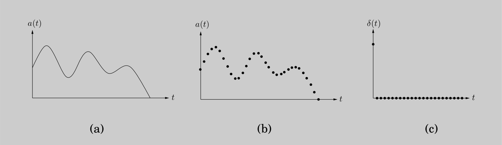
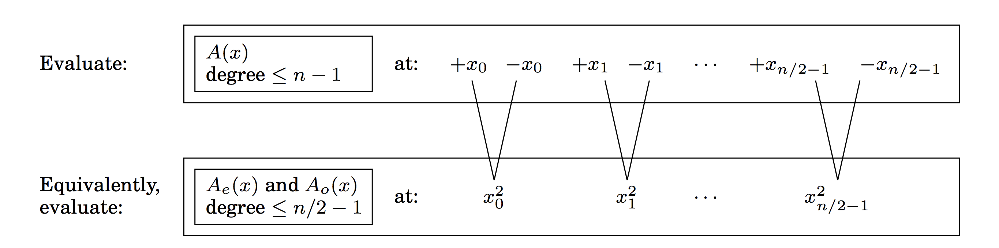
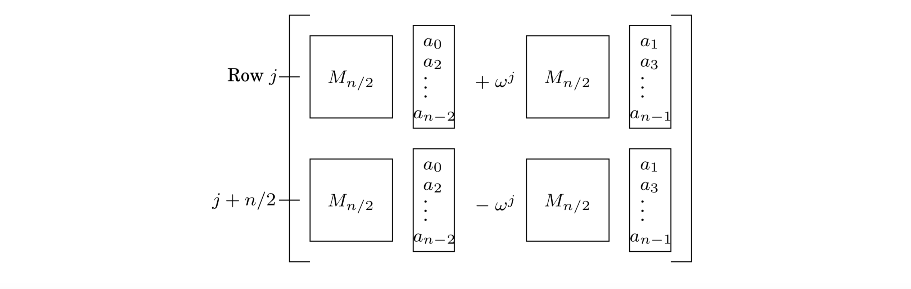

## 2.6 The Fast Fourier Transform

We have so far seen how divide-and-conquer gives fast algorithms for multiplying integers and matrices; our next target is *polynomials*. The product of two degree-$d$ is as polynomial of degree $2d$.

For example:

$$
(1 + 2x + 3x^2) \cdot (2 + x + 4x^2) = 2 + 5x + 12x^2 + 11x^3 + 12x^4.
$$

More generally, if $A(x) = a_0 + a_1 x + \cdots + a_d x^{d}$ and $B(x) = b_0 + b_1 x + \cdots + b_d x^{d}$, their product $C(x) = A(x) \cdot B(x) = c_0 + c_1 x + \cdots + c_{2d} x^{2d}$ has coefficients

$$
c_k = a_0 b_k + a_1 b_{k - 1} + \cdots + a_k b_0 = \sum_{i = 0}^{k} a_i b_{k - i}
$$

(for $i > d$, take $a_i$ and $b_i$ to be zero). Computing $c_k$ from this formula takes $O(k)$ steps, and finding all $2d + 1$ coefficients would therefore seem to require $\Theta(d^2)$ time.

*Can we possibly multiply polynomials faster that this?*

The solution we will develop, the fast Fourier Transform, has revolutionized—indeed, defined—the field of signal processing (sell the following box). Because of its huge importance, and its wealth of insights from different fields of study, we will approach it a little more leisurely than usual.

The reader who wants just the core algorithm can skip directly to Section 2.6.4.

&nbsp;

> **Why multiply polynomials?**
>
> For one thing, it turns out that the fastest algorithms we have for multiplying integers rely
heavily on polynomial multiplication; after all, polynomials and binary integers are quite
similar—just replace the variable $x$ by the base $2$, and watch out for carries. But perhaps
more importantly, multiplying polynomials is crucial for *signal processing*.
>
> A *signal* is any quantity that is a function of time (as in Figure (a)) or of position. It
might, for instance, capture a human voice by measuring fluctuations in air pressure close
to the speaker’s mouth, or alternatively, the pattern of stars in the night sky, by measuring
brightness as a function of angle.
>
> 
>
> In order to extract information from a signal, we need to first *digitize* it by sampling
(Figure (b))—and, then, to put it through a *system* that will transform it in some way. The
output is called the *response* of the system:
> $$ \text{signal} \ \longrightarrow \ \boxed{\text{SYSTEM}} \ \longrightarrow \ \text{response} $$
>
> An important class of systems are those that are *linear*—the response to the sum of two
signals is just the sum of their individual responses—and *time invariant*—shifting the input
signal by time $t$ produces the same output, also shifted by $t$. Any system with these properties
is completely characterized by its response to the simplest possible input signal: the
*unit impulse* $\delta(t)$, consisting solely of a "jerk" at $t = 0$ (Figure (c)). To see this, first consider
the close relative $\delta(t - i)$, a shifted impulse in which the jerk occurs at time $i$. Any signal
$a(t)$ can be expressed as a linear combination of these, letting $\delta(t - i)$ pick out its behavior
at time $i$,
> $$a(t) = \sum_{i = 0}^{T - 1} a(t) \delta(t - i)$$
> (if the signal consists of $T$ samples). By linearity, the system response to input $a(t)$ is determined
by the responses to the various $\delta(t-i)$. And by time invariance, these are in turn just
shifted copies of the *impulse response* $b(t)$, the response to $\delta(t)$.
>
> In other words, the output of the system at time $k$ is
> $$c(k) = \sum_{i = 0}^{k} a(i)b(k - i)$$
> exactly the formula for polynomial multiplication!

&nbsp;

### 2.6.1 An Alternative Representation of Polynomials

To arrive at a fast algorithm for polynomial multiplication we take inspiration from an important property of polynomials.

**Fact**
A degree-$d$ polynomial is uniquely characterized by its values at any $d + 1$ distinct points.

A familiar instance of this is that "any two points determine a line."" We will later see why the more general statement is true (page 72), but for the time being it gives us an alternative representation of polynomials. Fix any distinct points $x_0, \cdots, x_d$. We can specify a degree-$d$ polynomial $A(x) = a_0 + a_1 x + \cdots + a_d x^d$ by either one of the following:

1. Its coefficients $a_0, a_1, \cdots, a_d$

2. The values $A(x_0), A(x_1), \cdots, A(x_d)$


Of these two representations, the second is the more attractive for polynomial multiplication. Since the product $C(x)$ has degree $2d$, it is completely determined by its value at any $2d + 1$ points. And its value at any given point $z$ is easy enough to figure out, just $A(z)$ times $B(z)$. Thus *polynomial multiplication takes linear time in the value representation*.

The problem is that we expect the input polynomials, and also their product, to be specified by coefficients. So we need to first translate from coefficients to values—which is just a matter of *evaluating* the polynomial at the chosen points—then multiply in the value representation, and finally translate back to coefficients, a process called *interpolation*.


```python
def poly_mult(A, B):
    """
    Input: coefficients of two polynomials, A and B, of degree d
    Output: their product C = A * B
    """
    Selection
        pick some some points x_0, x_1, ..., x_{n - 1} where n >= 2d + 1
    Evaluation
        compute A(x_0), A(x_1), ..., A(x_{n - 1}) and B(x_0), B(x_1), ..., B(x_{n - 1})
    Multiplication
        compute C(x_k) = A(x_k)B(x_k) for all k = 0, ..., n - 1
    Interpolation
        recover C(x) = c_0 + c_1 x + ... + c_{2d} x^{2d}
```


The equivalence of the two polynomial representations makes it clear that this high-level approach is correct, but how efficient is it? Certainly the selection step and the $n$ multiplications are no trouble at all, just linear time.[^1] But (leaving aside interpolation, about which we know even less) how about evaluation? Evaluating a polynomial of degree $d \leq n$ at a single point takes $O(n)$ steps (Exercise 2.29), and so the baseline for $n$ points is $\Theta(n^2)$. We’ll now see that the fast Fourier transform (FFT) does it in just $O(n \log{n})$ time, for a particularly clever choice of $x_0, \cdots, x_{n-1}$ in which the computations required by the individual points overlap with one another and can be shared.


### 2.6.2 Evaluation by Divide-and-Conquer

Here’s an idea for how to pick the n points at which to evaluate a polynomial $A(x)$ of degree $\leq n - 1$. If we choose them to be positive-negative pairs, that is,

$$
\pm x_0, \pm x_1, \cdots, \pm x_{n / 2 - 1},
$$

then the computations required for each $A(x_i)$ and $A(-x_i)$ overlap a lot, because the even powers of $x_i$ coincide with those of $-x_i$.

To investigate this, we need to split $A(x)$ into its odd and even powers, for instance

$$
3 + 4x + 6x^2 + 2x^3 + x^4 + 10x^5 = (3 + 6x^2 + x^4) + x(4 + 2x^2 + 10x^4).
$$

Notice that the terms in parentheses are polynomials in $x^2$. More generally,

$$
A(x) = A_{e}(x^2) + xA_{o}(x^2),
$$

where $A_{e}(\cdot)$, with the even-numbered coefficients, and $A_{o}(\cdot)$, with the odd-numbered coefficients, are polynomials of degree $\leq n / 2 - 1$ (assume for convenience that $n$ is even). Given paired points $\pm x_i$, the calculations needed for $A(x_i)$ can be recycled toward computing $A(-x_i)$:

$$
A(x) = A_{e}(x_i^2) + x_i A_{o}(x_i^2)
$$
$$
A(-x) = A_{e}(x_i^2) - x_i A_{o}(x_i^2)
$$

In other words, evaluating $A(x)$ at $n$ paired points $\pm x_0, \cdots, \pm x_{n / 2 - 1}$ reduces to evaluating $A_{e}(x)$ and $A_{o}(x)$ (which each have half the degree of $A(x)$) at just $n / 2$ points, $x_0^2, \cdots, x_{n / 2 - 1}^2$.



The original problem of size $n$ is in this way recast as two subproblems of size $n / 2$, followed by some linear-time arithmetic. If we could recurse, we would get a divide-and-conquer procedure with running time

$$
T(n) = 2T(n / 2) + O(n),
$$

which is $O(n \log{n})$, exactly what we want.


But we have a problem: The plus-minus trick only works at the top level of the recursion. To recurse at the next level, we need the $n / 2$ evaluation points $x_0^2, \cdots, x_{n / 2 - 1}^2$ to be *themselves* plus-minus pairs. But how can a square be negative? The task seems impossible! Unless, of course, *we use complex numbers*.

Fine, but which complex numbers? To figure this out, let us "reverse engineer" the process. At the very bottom of the recursion, we have a single point. This point might as well be $1$, in which case the level above it must consist of its square roots, $\pm \sqrt{1} = \pm 1$.


The next level up then has $\pm \sqrt{+1} = \pm 1$ as well as the *complex* numbers $\pm \sqrt{-1} = \pm i$, where $i$ is the imaginary unit. By continuing in this manner, we eventually reach the initial set of $n$ points. Perhaps you have already guessed what they are: the *complex $n$th roots of unity*, that is, the $n$ complex solutions to the equation $z^n = 1$.

Figure 2.6 is a pictorial review of some basic facts about complex numbers. The third panel of this figure introduces the $n$th roots of unity: the complex numbers $1, \omega, \omega^2, \cdots, \omega^{n - 1}$, where $\omega = e^{2 \pi i / n}$. If $n$ is even,

1. The $n$th roots are plus-minus paired, $\omega^{n / 2 + j} = - \omega^{j}$.

2. Squaring them produces the ($n / 2$)nd roots of unity.


Therefore, if we start with these numbers for some n that is a power of $2$, then at successive levels of recursion we will have the ($n / 2^k$)th roots of unity, for $k = 0, 1, 2, 3, \cdots$. All these sets of numbers are plus-minus paired, and so our divide-and-conquer, as shown in the last panel, works perfectly. The resulting algorithm is the fast Fourier transform (Figure 2.7).

&nbsp;


&nbsp;

**Figure 2.7** The fast Fourier transform algorithm.

```python
def FFT(A, w):
    """
    Input: coefficient representation of a polynomial A with degree <= n - 1, where n is a power of 2
           w, an n-th root of unity
    Output: value representation of A(w^{0}), ..., A(w^{n - 1})
    """
    if w == 1:
        return A(1)
    else:
        express A(x) in form of A_e(x^2) + x A_o(x^2)

        FFT(A_e, w^2) to evaluate A_e at even powers of w
        FFT(A_o, w^2) to evaluate A_o at even powers of w

        for j = 0 to n - 1:
            compute A(w^j) = A_e(w^{2j}) + w^j A_o(w^{2j})

        return A(w^0), ..., A(w^{n - 1})
```

&nbsp;

### 2.6.3 Interpolation

Let’s take stock of where we are. We first developed a high-level scheme for multiplying polynomials (Figure 2.5), based on the observation that polynomials can be represented in two ways, in terms of their *coefficients* or in terms of their *values* at a selected set of points.


The value representation makes it trivial to multiply polynomials, but we cannot ignore the coefficient representation since it is the form in which the input and output of our overall algorithm are specified.


So we designed the $\text{FFT}$, a way to move from coefficients to values in time just $O(n \log{n})$, when the points $\{ x_i \}$ are complex $n$th roots of unity ($1, \omega, \omega^2, \cdots, \omega^{n - 1}$).

$$
\langle \text{values} \rangle = \text{FFT}(\langle \text{coefficients} \rangle , \omega).
$$


The last remaining piece of the puzzle is the inverse operation, interpolation. It will turn out, amazingly, that

$$
\langle \text{coefficients} \rangle = \frac{1}{n} \text{FFT}(\langle \text{values} \rangle , \omega^{-1}).
$$

Interpolation is thus solved in the most simple and elegant way we could possibly have hoped for—using the same $\text{FFT}$ algorithm, but called with $\omega^{-1}$ in place of $\omega$! This might seem like a miraculous coincidence, but it will make a lot more sense when we recast our polynomial operations in the language of linear algebra. Meanwhile, our $O(n \log{n})$ polynomial multiplication algorithm (Figure 2.5) is now fully specified.


**A Matrix Reformulation**

To get a clearer view of interpolation, let’s explicitly set down the relationship between our two representations for a polynomial $A(x)$ of degree $\leq n - 1$. They are both vectors of $n$ numbers, and one is a linear transformation of the other:

$$
\begin{bmatrix} A(x_0) \\ A(x_1) \\ \vdots \\ A(x_{n - 1}) \end{bmatrix}
=
\begin{bmatrix}
1      & x_0     &  x_0^2      & \cdots & x_0^{n - 1} \\
1      & x_1     &  x_1^2      & \cdots & x_1^{n - 1} \\
\vdots & \vdots  & \vdots      & \cdots & \vdots      \\
1      & x_{n-1} & x_{n - 1}^2 & \cdots & x_{n - 1}^{n - 1}
\end{bmatrix}
\begin{bmatrix} a_0 \\ a_1 \\ \vdots \\ a_{n - 1} \end{bmatrix}
$$


Call the matrix in the middle $M$. Its specialized format—a *Vandermonde matrix*—gives it many remarkable properties, of which the following is particularly relevant to us.

* If $x_0, \cdots, x_{n - 1}$ are distinct numbers, then $M$ is invertible.

The existence of $M^{-1}$ allows us to invert the preceding matrix equation so as to express coefficients in terms of values. In brief,

* Evaluation is multiplication by $M$, while interpolation is multiplication by $M^{-1}$.

This reformulation of our polynomial operations reveals their essential nature more clearly. Among other things, it finally justifies an assumption we have been making throughout, that $A(x)$ is uniquely characterized by its values at any $n$ points—in fact, we now have an explicit formula that will give us the coefficients of $A(x)$ in this situation.

Vandermonde matrices also have the distinction of being quicker to invert than more general matrices, in $O(n^2)$ time instead of $O(n^3)$. However, using this for interpolation would still not be fast enough for us, so once again we turn to our special choice of points—the complex roots of unity.


**Interpolation Resolved**

In linear algebra terms, the $\text{FFT}$ multiplies an arbitrary $n$-dimensional vector—which we have been calling the *coefficient representation*—by the $n \times n$ matrix

$$
M_n(\omega) =
\begin{bmatrix}
1      & 1     &  1      & \cdots & 1 \\
1      & \omega     &  \omega^2      & \cdots & \omega^{n - 1} \\
1 & \omega^2 & \omega^4 & \cdots & \omega^{2(n - 1)} \\
\vdots & \vdots  & \vdots      & \cdots & \vdots      \\
1 & \omega^{j} & \omega^{2j} & \cdots & \omega^{j(n - 1)} \\
\vdots & \vdots  & \vdots      & \cdots & \vdots      \\
1 & \omega^{(n - 1)} & \omega^{2(n - 1)} & \cdots & \omega^{(n - 1)(n - 1)}
\end{bmatrix}
\begin{matrix}
\longleftarrow & \text{row for}\ \omega^0 = 1 \\ \longleftarrow & \omega \\ \longleftarrow  & \omega^2 \\ & \vdots \\ \longleftarrow & \omega^{j} \\ & \vdots \\ \longleftarrow  & \omega^{n - 1}
\end{matrix}
$$

where $\omega$ is a complex $n$th root of unity, and $n$ is a power of $2$. Notice how simple this matrix is to describe: its ($j, k$)th entry (starting row- and column-count at zero) is $\omega^{jk}$.


Multiplication by $M = M_n(\omega)$ maps the $k$th coordinate axis (the vector with all zeros except for a $1$ at position $k$) onto the $k$th column of $M$. Now here’s the crucial observation, which we’ll prove shortly: *the columns of $M$ are orthogonal (at right angles) to each other*. Therefore they can be thought of as the axes of an alternative coordinate system, which is often called the *Fourier basis*.

&nbsp;


&nbsp;

The effect of multiplying a vector by $M$ is to rotate it from the standard basis, with the usual set of axes, into the Fourier basis, which is defined by the columns of $M$ (Figure 2.8). The FFT is thus a change of basis, a *rigid rotation*. The inverse of $M$ is the opposite rotation, from the Fourier basis back into the standard basis. When we write out the orthogonality condition precisely, we will be able to read off this inverse transformation with ease:

**Inversion formula**
$M_n(\omega)^{-1} = \frac{1}{n}M_n(\omega^{-1})$.

But $\omega^{-1}$ is also an $n$th root of unity, and so interpolation—or equivalently, multiplication by $M_n(\omega)^{-1}$—is itself just an $\text{FFT}$ operation, but with $\omega$ replaced by $\omega^{-1}$.

Now let’s get into the details. Take $\omega$ to be $e^{2 \pi i / n} for convenience, and think of the columns of $M$ as vectors in $\mathbb{C}^{n}$. Recall that the *angle* between two vectors $u = (u_0, \cdots, u_{n - 1})$ and $v = (v_0, \cdots, v_{n - 1})$ in $\mathbb{C}^{n}$ is just a scaling factor times their *inner product*

$$
u \cdot v^{\ast} = u_0 v_0^{\ast} + u_1 v_1^{\ast} + \cdots + u_{n - 1} v_{n - 1}^{\ast},
$$

where $z^{\ast}$ denotes the complex conjugate [^2] of $z$. This quantity is maximized when the vectors lie in the same direction and is zero when the vectors are orthogonal to each other.


The fundamental observation we need is the following.

**Lemma**
The columns of matrix $M$ are orthogonal to each other.

*Proof.*
Take the inner product of any columns $j$ and $k$ of matrix $M$,

$$
1 + \omega^{j - k} + \omega^{2(j - k)} + \cdots + \omega^{(n - 1)(j - k)}.
$$

This is a geometric series with first term $1$, last term $\omega^{(n - 1)(j - k)}$, and ratio $\omega^{(j - k)}$. Therefore it evaluates to $(1 - \omega^{n(j - k)}) / (1 - \omega^{(j - k)})$, which is $0$—except when $j = k$, in which case all terms
are $1$ and the sum is $n$. $\blacksquare$


The orthogonality property can be summarized in the single equation

$$
MM^{\ast} = nI,
$$

since $(MM^{\ast}){ij}$ is the inner product of the $i$th and $j$th columns of $M$ (do you see why?). This immediately implies $M^{-1} = \frac{1}{n} M^{\ast}$: we have an inversion formula! But is it the same formula we earlier claimed?

Let’s see—the ($j, k$)th entry of $M^{\ast}$ is the complex conjugate of the corresponding entry of $M$, in other words $\omega^{-jk}$.
Whereupon $M^{\ast} = M_n(\omega^{-1})$, and we’re done.


And now we can finally step back and view the whole affair geometrically. The task we need to perform, polynomial multiplication, is a lot easier in the Fourier basis than in the standard basis. Therefore, we first rotate vectors into the Fourier basis (*evaluation*), then perform the task (*multiplication*), and finally rotate back (*interpolation*). The initial vectors are *coefficient representations*, while their rotated counterparts are *value representations*. To efficiently switch between these, back and forth, is the province of the $\text{FFT}$.

&nbsp;

### 2.6.4 A Closer Look at the Fast Fourier Transform

Now that our efficient scheme for polynomial multiplication is fully realized, let’s hone in more closely on the core subroutine that makes it all possible, the fast Fourier transform.

```python
def FFT(a, w):
  """
  Input: an array a_0, a_1, ..., a_(n - 1), for n a power of 2
         a primitive nth root of unity, w
  Output: Mn(w)a
  """
  if w == 1:
    return a
  else:
    s_0, s_1, ..., s_{n / 2 - 1} = FFT((a_0, a_2, ..., a_{n - 2}), w^2)
    s^0, s^1, ..., s^{n / 2 - 1} = FFT((a_1, a_3, ..., a_{n - 1}), w^2)
    for i = 0 to n / 2 - 1:
      r_j = s_0 + w^j * s^0
      r_{j + n / 2} = s_0 - w^j * s^0
    return (r_0, r_1, ..., r_{n - 1})
```

**The definitive FFT algorithm**
The $\text{FFT}$ takes as input a vector $a = (a_0, \cdots, a_{n - 1})$ and a complex number $\omega$ whose powers $1, \omega, \omega^2, \cdots, \omega^{n - 1}$ are the complex $n$th roots of unity. It multiplies vector $a$ by the $n \times n$ matrix $M_{n}(\omega)$, which has ($j, k$)th entry (starting row- and column-count at zero) $\omega^{jk}$. The potential for using divide-and-conquer in this matrix-vector multiplication becomes apparent when $M$'s columns are segregated into evens and odds:


In the second step, we have simplified entries in the bottom half of the matrix using $\omega^{n / 2} = -1$ and $\omega^{n} = 1$. Notice that the top left $n / 2 \times n / 2$ submatrix is $M_{n/2}(\omega^2)$, as is the one on the bottom left. And the top and bottom right submatrices are almost the same as $M_{n/2}(\omega^2)$, but with their $j$th rows multiplied through by $\omega^{j}$ and $-\omega^{j}$, respectively. Therefore the final product is the vector



In short, the product of $M_{n}(\omega)$ with vector $a = (a_0, \cdots, a_{n - 1})$, a size-$n$ problem, can be expressed in terms of two size-$n / 2$ problems: the product of $M_{n / 2}(\omega^2)$ with $(a_0, a_2, \cdots, a_{n - 2})$ and with $(a_1, a_3, \cdots, a_{n - 1})$. This divide-and-conquer strategy leads to the definitive FFT algorithm of Figure 2.9, whose running time is $T(n) = 2T(n / 2) + O(n) = O(n \log{n})$.


**The fast Fourier transform unraveled**

Throughout all our discussions so far, the fast Fourier transform has remained tightly co- cooned within a divide-and-conquer formalism. To fully expose its structure, we now unravel the recursion.

The divide-and-conquer step of the FFT can be drawn as a very simple circuit. Here is how a problem of size $n$ is reduced to two subproblems of size $n / 2$ (for clarity, one pair of outputs ($j, j + n / 2$) is singled out):


We’re using a particular shorthand: the edges are wires carrying complex numbers from left to right. A weight of $j$ means "multiply the number on this wire by $\omega^{j}$." And when two wires come into a junction from the left, the numbers they are carrying get added up. So the two outputs depicted are executing the commands

$$
r_j = s_j + \omega^{j}s_j'
$$
$$
r_{j + n / 2} = s_j - \omega^{j}s_j'
$$

from the $\text{FFT}$ algorithm (Figure 2.9), via a pattern of wires known as a [*butterfly*](https://en.wikipedia.org/wiki/Butterfly_diagram).

Unraveling the FFT circuit completely for $n = 8$ elements, we get Figure 10.4. Notice the following.

1. For $n$ inputs there are $\log_{2}{n}$ levels, each with $n$ nodes, for a total of $n \log{n}$ operations.

2. The inputs are arranged in a peculiar order: $0, 4, 2, 6, 1, 5, 3, 7$.

Why? Recall that at the top level of recursion, we first bring up the even coefficients of the input and then move on to the odd ones. Then at the next level, the even coefficients of this first group (which therefore are multiples of $4$, or equivalently, have zero as their two least significant bits) are brought up, and so on. To put it otherwise, the inputs are arranged by increasing last bit of the binary representation of their index, resolving ties by looking at the next more significant bit(s). The resulting order in binary, $000,100,010,110,001,101,011,111$, is the same as the natural one, $000, 001, 010, 011, 100, 101, 110, 111$ except the bits are mirrored!

3. There is a unique path between each input $a_j$ and each output $A(\omega^{k})$.

This path is most easily described using the binary representations of $j$ and $k$ (shown in Figure 10.4 for convenience). There are two edges out of each node, one going up (the $0$-edge) and one going down (the $1$-edge). To get to $A(\omega^{k})$ from any input node, simply follow the edges specified in the bit representation of $k$, starting from the rightmost bit. (Can you similarly specify the path in the reverse direction?)

4. On the path between $a_j$ and $A(\omega^{k})$, the labels add up to $jk \pmod{8}$.

Since $\omega^8 = 1$, this means that the contribution of input $a_j$ to output $A(\omega^{k})$ is $a_j \omega^{jk}$, and therefore the circuit computes correctly the values of polynomial $A(x)$.

5. And finally, notice that the FFT circuit is a natural for parallel computation and direct implementation in hardware.

&nbsp;


&nbsp;

> **The Spread of a Fast Algorithm**
>
> In 1963, during a meeting of President Kennedy’s scientific advisors, John Tukey, a mathematician from Princeton, explained to IBM’s Dick Garwin a fast method for computing Fourier transforms. Garwin listened carefully, because he was at the time working on ways
to detect nuclear explosions from seismographic data, and Fourier transforms were the bottleneck of his method. When he went back to IBM, he asked John Cooley to implement Tukey’s algorithm; they decided that a paper should be published so that the idea could not
be patented.
>
> Tukey was not very keen to write a paper on the subject, so Cooley took the initiative. And this is how one of the most famous and most cited scientific papers was published in 1965, co-authored by Cooley and Tukey. The reason Tukey was reluctant to publish the FFT was not secretiveness or pursuit of profit via patents. He just felt that this was a simple observation that was probably already known. This was typical of the period: back then (and for some time later) algorithms were considered second-class mathematical objects, devoid of depth and elegance, and unworthy of serious attention.
>
> But Tukey was right about one thing: it was later discovered that British engineers had used the FFT for hand calculations during the late 1930s. And—to end this chapter with the same great mathematician who started it—a paper by Gauss in the early 1800s on (what else?) interpolation contained essentially the same idea in it! Gauss’s paper had remained a secret for so long because it was protected by an old-fashioned cryptographic technique: like most scientific papers of its era, it was written in Latin.

&nbsp;

[^1]: In a typical setting for polynomial multiplication, the coefficients of the polynomials are real numbers and, moreover, are small enough that basic arithmetic operations (adding and multiplying) take unit time. We will assume this to be the case without any great loss of generality; in particular, the time bounds we obtain are easily adjustable to situations with larger numbers.

[^2]: The complex conjugate of a complex number $z = r e^{i \theta}$ is $z^{\ast} = r e^{-i \theta}$. The complex conjugate of a vector (or matrix) is obtained by taking the complex conjugates of all its entries.
