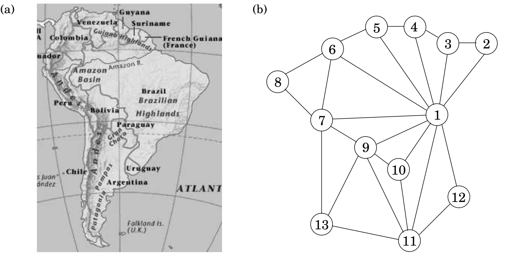

## 3.1 Why Graphs?

A wide range of problems can be expressed with clarity and precision in the concise pictorial language of graphs. For instance, consider the task of coloring a political map. What is the minimum number of colors needed, with the obvious restriction that neighboring countries should have different colors?

One of the difficulties in attacking this problem is that the map itself, even a stripped-down version like Figure 3.1(a), is usually cluttered with irrelevant information: intricate boundaries, border posts where three or more countries meet, open seas, and meandering rivers.

Such distractions are absent from the mathematical object of Figure 3.1(b), a graph with one vertex for each country (1 is Brazil, 11 is Argentina) and edges between neighbors. It contains exactly the information needed for coloring, and nothing more. The precise goal is now to assign a color to each vertex so that no edge has endpoints of the same color.

&nbsp;

Graph coloring is not the exclusive domain of map designers. Suppose a university needs to schedule examinations for all its classes and wants to use the fewest time slots possible. The only constraint is that two exams cannot be scheduled concurrently if some student will be taking both of them. To express this problem as a graph, use one vertex for each exam and put an edge between two vertices if there is a conflict, that is, if there is somebody taking both endpoint exams. Think of each time slot as having its own color. Then, assigning time slots is exactly the same as coloring this graph!

Some basic operations on graphs arise with such frequency, and in such a diversity of con- texts, that a lot of effort has gone into finding efficient procedures for them. This chapter is devoted to some of the most fundamental of these algorithms—those that uncover the basic connectivity structure of a graph.

Formally, a graph is specified by a set of vertices (also called *nodes*) $V$ and by edges $E$ between select pairs of vertices. In the map example, $V = \{ 1, 2, 3, \cdots,13 \}$ and $E$ includes, among many other edges, $\{ 1, 2 \}, \{ 9, 11 \}$, and $\{ 7, 13 \}$. Here an edge between $x$ and $y$ specifically means "$x$ shares a border with $y$". This is a symmetric relation—it implies also that $y$ shares a border with $x$—and we denote it using set notation, $e = \{ x, y \}$. Such edges are undirected and are part of an *undirected graph*.

Sometimes graphs depict relations that do not have this reciprocity, in which case it is necessary to use edges with directions on them. There can be directed edges $e$ from $x$ to $y$ (written $e = (x, y)$), or from $y$ to $x$ (written $(y, x)$), or both. A particularly enormous example of a directed graph is the graph of all links in the World Wide Web.

It has a vertex for each site on the Internet, and a directed edge $(u, v)$ whenever site $u$ has a link to site $v$: in total, billions of nodes and edges! Understanding even the most basic connectivity properties of the Web is of great economic and social interest. Although the size of this problem is daunting, we will soon see that a lot of valuable information about the structure of a graph can, happily, be determined in just linear time.

&nbsp;

### 3.1.1 How is a graph represented?

We can represent a graph by an **adjacency matrix**; if there are $n = |V|$ vertices $v_1, \cdots, v_n$, this is an $n \times n$ array whose ($i, j$)th entry is

$$
a_{ij} = \begin{cases} 1 & \text{if there is an edge from $v_i$ to $v_j$} \\ 0 & \text{otherwise.} \end{cases}
$$

For undirected graphs, the matrix is symmetric since an edge $\{ u, v \}$ can be taken in either direction.

The biggest convenience of this format is that the presence of a particular edge can be checked in constant time, with just one memory access. On the other hand the matrix takes up $O(n^2)$ space, which is wasteful if the graph does not have very many edges.

An alternative representation, with size proportional to the number of edges, is the **adjacency list**. It consists of $|V|$ linked lists, one per vertex. The linked list for vertex $u$ holds the names of vertices to which $u$ has an outgoing edge—that is, vertices $v$ for which $(u, v) \in E$.

Therefore, each edge appears in exactly one of the linked lists if the graph is directed or two of the lists if the graph is undirected. Either way, the total size of the data structure is $O(|E|)$. Checking for a particular edge $(u, v)$ is no longer constant time, because it requires sifting through $u$’s adjacency list. But it is easy to iterate through all neighbors of a vertex (by running down the corresponding linked list), and, as we shall soon see, this turns out to be a very useful operation in graph algorithms. Again, for undirected graphs, this representation has a symmetry of sorts: $v$ is in $u$'s adjacency list if and only if $u$ is in $v$'s adjacency list.

&nbsp;

> **How big is your graph?**
>
> Which of the two representations, adjacency matrix or adjacency list, is better? Well, it depends on the relationship between $|V|$, the number of nodes in the graph, and $|E|$, the number of edges. $|E|$ can be as small as $|V|$ (if it gets much smaller, then the graph degenerates—for example, has isolated vertices), or as large as $|V|^2$ (when all possible edges are present). When $|E|$ is close to the upper limit of this range, we call the graph *dense*. At the other extreme, if $|E|$ is close to $|V|$, the graph is *sparse*. As we shall see in this chapter and the next two chapters, *exactly where $|E|$ lies in this range is usually a crucial factor in selecting the right graph algorithm*.
>
> Or, for that matter, in selecting the graph representation. If it is the World Wide Web graph that we wish to store in computer memory, we should think twice before using an adjacency matrix: at the time of writing, search engines know of about eight billion vertices of this graph, and hence the adjacency matrix would take up *dozens of millions of terabits*. Again at the time we write these lines, it is not clear that there is enough computer memory in the whole world to achieve this. (And waiting a few years until there is enough memory is unwise: the Web will grow too and will probably grow faster.)
>
> With adjacency lists, representing the World Wide Web becomes feasible: there are only a few dozen billion hyperlinks in the Web, and each will occupy a few bytes in the adjacency list. You can carry a device that stores the result, a terabyte or two, in your pocket (it may soon fit in your earring, but by that time the Web will have grown too).
>
> The reason why adjacency lists are so much more effective in the case of the World Wide Web is that the Web is very sparse: the average Web page has hyperlinks to only about half a dozen other pages, out of the billions of possibilities.
