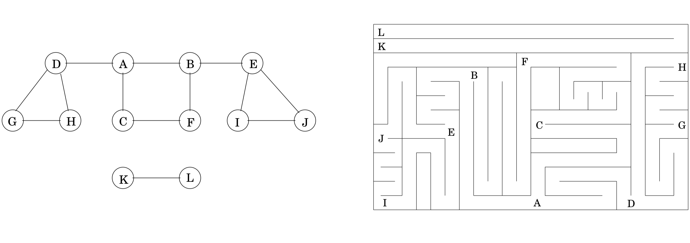
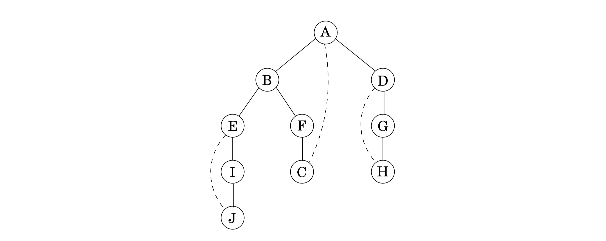
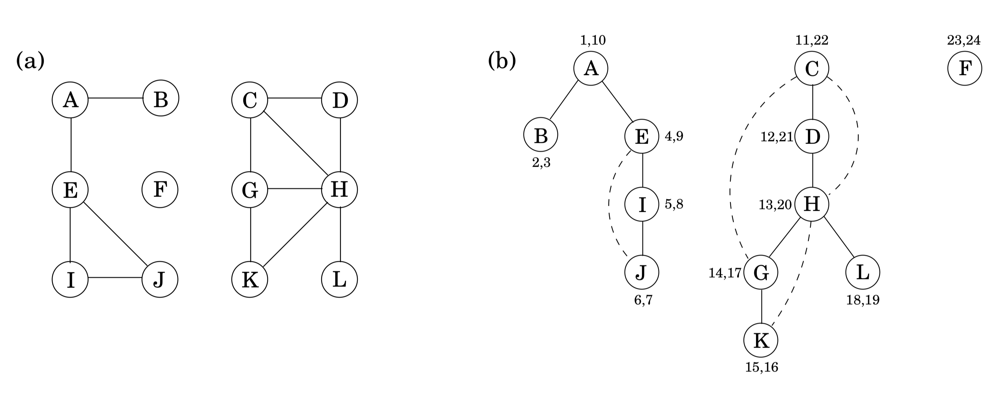

## 3.2 Depth-First Search in Undirected Graphs

### 3.2.1 Exploring Mazes

**Depth-first search** is a surprisingly versatile linear-time procedure that reveals a wealth of information about a graph. The most basic question it addresses is,

* What parts of the graph are reachable from a given vertex?

To understand this task, try putting yourself in the position of a computer that has just been given a new graph, say in the form of an adjacency list. This representation offers just one basic operation: finding the neighbors of a vertex. With only this primitive, the reachability problem is rather like exploring a labyrinth (Figure 3.2).



&nbsp;

You start walking from a fixed place and whenever you arrive at any junction (vertex) there are a variety of passages (edges) you can follow. A careless choice of passages might lead you around in circles or might cause you to overlook some accessible part of the maze. Clearly, you need to record some intermediate information during exploration.

This classic challenge has amused people for centuries. Everybody knows that all you need to explore a labyrinth is a ball of string and a piece of chalk. The chalk prevents looping, by marking the junctions you have already visited. The string always takes you back to the starting place, enabling you to return to passages that you previously saw but did not yet investigate.

How can we simulate these two primitives, chalk and string, on a computer? The chalk marks are easy: for each vertex, maintain a Boolean variable indicating whether it has been visited already. As for the ball of string, the correct cyberanalog is a *stack*. After all, the exact role of the string is to offer two primitive operations—*unwind* to get to a new junction (the stack equivalent is to *push* the new vertex) and *rewind* to return to the previous junction (*pop* the stack).

Instead of explicitly maintaining a stack, we will do so implicitly via recursion (which is implemented using a stack of activation records). The resulting algorithm is shown in Figure 3.3.[^1] The $\texttt{previsit}$ and $\texttt{postvisit}$ procedures are optional, meant for performing operations on a vertex when it is first discovered and also when it is being left for the last time. We will soon see some creative uses for them.

```python
def explore(G, v):
  """
  Input: G = (V,E) is a graph; v ∈ V
  Output: visited(u) is set to true for all nodes u reachable from v
  """

  visited(v) = true
  previsit(v)

  for each edge (v, u) ∈ E:
    if not visited(u): explore(u)
  postvisit(v)

  return visited
```

More immediately, we need to confirm that explore always works correctly. It certainly does not venture too far, because it only moves from nodes to their neighbors and can therefore never jump to a region that is not reachable from v. But does it find *all* vertices reachable from $v$? Well, if there is some $u$ that it misses, choose any path from $v$ to $u$, and look at the last vertex on that path that the procedure actually visited. Call this node $z$, and let $w$ be the node immediately after it on the same path.


So $z$ was visited but $w$ was not. This is a contradiction: while the $\texttt{explore}$ procedure was at node $z$, it would have noticed $w$ and moved on to it.

Incidentally, this pattern of reasoning arises often in the study of graphs and is in essence a streamlined induction. A more formal inductive proof would start by framing a hypothesis, such as "for any $k \geq 0$, all nodes within $k$ hops from $v$ get visited." The base case is as usual trivial, since $v$ is certainly visited. And the general case—showing that if all nodes $k$ hops away are visited, then so are all nodes $k + 1$ hops away—is precisely the same point we just argued.

Figure 3.4 shows the result of running $\texttt{explore}$ on our earlier example graph, starting at node $A$, and breaking ties in alphabetical order whenever there is a choice of nodes to visit. The solid edges are those that were actually traversed, each of which was elicited by a call to explore and led to the discovery of a new vertex. For instance, while $B$ was being visited, the edge $B − E$ was noticed and, since $E$ was as yet unknown, was traversed via a call to $\texttt{explore}(E)$.



&nbsp;

These solid edges form a tree (a connected graph with no cycles) and are therefore called **tree edges**. The dotted edges were ignored because they led back to familiar terrain, to vertices previously visited. They are called **back edges**.

&nbsp;


### 3.2.2 Depth-First Search

The $\texttt{explore}$ procedure visits only the portion of the graph reachable from its starting point. To examine the rest of the graph, we need to restart the procedure elsewhere, at some vertex that has not yet been visited. The algorithm of Figure 3.5, called **depth-first search** (DFS), does this repeatedly until the entire graph has been traversed.

```python
def dfs(G):

  for all v ∈ V:
    visited(v) = false

  for all v ∈ V :
    if not visited(v): explore(v)

```

The first step in analyzing the running time of DFS is to observe that each vertex is $\texttt{explore}$’d just once, thanks to the visited array (the chalk marks). During the exploration of a vertex, there are the following steps:

1. Some fixed amount of work—marking the spot as visited, and the $\texttt{pre / postvisit}$.

2. A loop in which adjacent edges are scanned, to see if they lead somewhere new.

This loop takes a different amount of time for each vertex, so let’s consider all vertices together. The total work done in step 1 is then $O(|V|)$. In step 2, over the course of the entire DFS, each edge $\{x, y\} \in E$ is examined exactly twice, once during $\texttt{explore}(x)$ and once during $\texttt{explore}(y)$. The overall time for step 2 is therefore $O(|E|)$ and so the depth-first search has a running time of $O(|V| + |E|)$, linear in the size of its input. This is as efficient as we could possibly hope for, since it takes this long even just to read the adjacency list.

Figure 3.6 shows the outcome of depth-first search on a $12$-node graph, once again breaking ties alphabetically (ignore the pairs of numbers for the time being). The outer loop of DFS calls explore three times, on $A, C,$ and finally $F$. As a result, there are three trees, each rooted at one of these starting points. Together they constitute a *forest*.



&nbsp;


### 3.2.3 Connectivity in Undirected Graphs

An undirected graph is *connected* if there is a path between any pair of vertices. The graph of Figure 3.6 is *not* connected because, for instance, there is no path from $A$ to $K$. However, it does have three disjoint connected regions, corresponding to the following sets of vertices:

$$\begin{matrix} \{A, B, E, I, J\} && \{C, D, G, H, K, L\} && \{F\} \end{matrix}$$

These regions are called **connected components**: each of them is a subgraph that is internally connected but has no edges to the remaining vertices. When $\text{explore}$ is started at a particular vertex, it identifies precisely the connected component containing that vertex. And each time the DFS outer loop calls $\text{explore}$, a new connected component is picked out.

Thus depth-first search is trivially adapted to check if a graph is connected and, more generally, to assign each node $v$ an integer $\texttt{ccnum}[v]$ identifying the connected component to which it belongs. All it takes is

```python
def previsit(v):
  ccnum[v] = cc
```

where $\texttt{cc}$ needs to be initialized to zero and to be incremented each time the DFS procedure calls $\texttt{explore}$.

&nbsp;


### 3.2.4 Previsit and Postvisit Orderings

We have seen how depth-first search—a few unassuming lines of code—is able to uncover the connectivity structure of an undirected graph in just linear time. But it is far more versatile than this. In order to stretch it further, we will collect a little more information during the exploration process: for each node, we will note down the times of two important events, the moment of first discovery (corresponding to $\texttt{previsit}$) and that of final departure ($\texttt{postvisit}$). Figure 3.6 shows these numbers for our earlier example, in which there are $24$ events. The fifth event is the discovery of $I$. The $21$st event consists of leaving $D$ behind for good.

One way to generate arrays $\texttt{pre}$ and $\texttt{post}$ with these numbers is to define a simple counter $\texttt{clock}$, initially set to $1$, which gets updated as follows.

```python

def previsit(v):
  pre[v] = clock
  clock  = clock + 1

def postvisit(v):
  post[v]= clock
  clock  = clock + 1

```

These timings will soon take on larger significance. Meanwhile, you might have noticed from Figure 3.4 that:

**Property** *For any nodes $u$ and $v$, the two intervals $[\texttt{pre}(u), \texttt{post}(u)]$ and $[\texttt{pre}(v), \texttt{post}(v)]$ are either disjoint or one is contained within the other.*

Why? Because $[\texttt{pre}(u), \texttt{post}(u)]$ is essentially the time during which vertex $u$ was on the stack. The last-in, first-out behavior of a stack explains the rest.

&nbsp;

[^1]: As with many of our graph algorithms, this one applies to both undirected and directed graphs. In such cases, we adopt the *directed notation* for edges, $(x, y)$. If the graph is undirected, then each of its edges should be thought of as existing in both directions: $(x, y)$ and $(y, x)$.
