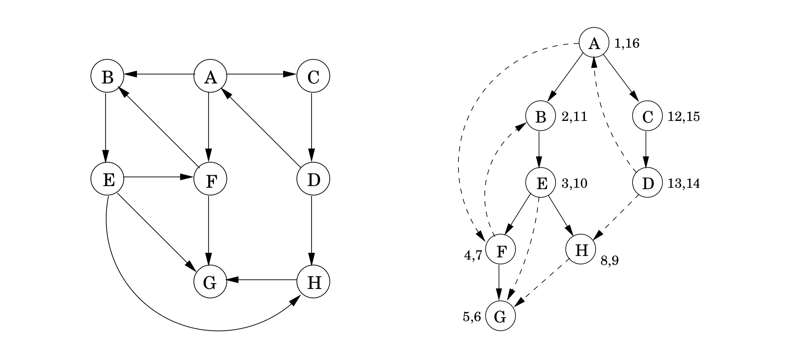

## 3.3 Depth-First Search in Directed Graphs

### 3.3.1 Types of Edges

Our depth-first search algorithm can be run verbatim on directed graphs, taking care to traverse edges only in their prescribed directions. Figure 3.7 shows an example and the search tree that results when vertices are considered in lexicographic order.

&nbsp;

In further analyzing the directed case, it helps to have terminology for important relationships between nodes of a tree. $A$ is the **root** of the search tree; everything else is its **descendant**. Similarly, $E$ has descendants $F, G,$ and $H$, and conversely, is an **ancestor** of these three nodes. The family analogy is carried further: $C$ is the **parent** of $D$, which is its **child**.

For undirected graphs we distinguished between tree edges and non-tree edges. In the directed case, there is a slightly more elaborate taxonomy:

* *tree edges* are actually part of the DFS forest.

* *forward edges* lead from a node to a nonchild descendant in the DFS tree.

* *back edges* lead to an ancestor in the DFS tree.

* *cross edges* lead to neither descendant nor ancestor; they therefore lead to a node that has already been completely explored (that is, already postvisited).

Figure 3.7 has two forward edges, two back edges, and two cross edges. Can you spot them?

Ancestor and descendant relationships, as well as edge types, can be read off directly from $\texttt{pre}$ and $\texttt{post}$ numbers. Because of the depth-first exploration strategy, vertex $u$ is an ancestor of vertex $v$ exactly in those cases where $u$ is discovered first and $v$ is discovered during $\texttt{explore}(u)$. This is to say $\texttt{pre}(u) < \texttt{pre}(v) < \texttt{post}(v) < \texttt{post}(u)$, which we can depict pictorially as two nested intervals:

$$\underset{u}{[} \hspace{1cm} \underset{v}{[} \hspace{1cm} \underset{v}{]} \hspace{1cm} \underset{u}{]}$$

The case of descendants is symmetric, since $u$ is a descendant of $v$ if and only if $v$ is an ancestor of $u$. And since edge categories are based entirely on ancestor-descendant relationships, it follows that they, too, can be read off from pre and post numbers.

Here is a summary of the various possibilities for an edge $(u, v)$:

$$\boxed{\begin{matrix} \text{$\texttt{pre/post}$ ordering for $(u, v)$} & \text{edge type} \\ \\
\underset{u}{[} \hspace{1cm} \underset{v}{[} \hspace{1cm} \underset{v}{]} \hspace{1cm} \underset{u}{]} & \text{tree/forward} \\
\underset{v}{[} \hspace{1cm} \underset{u}{[} \hspace{1cm} \underset{u}{]} \hspace{1cm} \underset{v}{]} & \text{back}         \\
\underset{v}{[} \hspace{1cm} \underset{v}{]} \hspace{1cm} \underset{u}{[} \hspace{1cm} \underset{u}{]} & \text{cross}        \\
\end{matrix}}$$

You can confirm each of these characterizations by consulting the diagram of edge types. Do you see why no other orderings are possible?

&nbsp;

### 3.3.2 Directed Acyclic Graphs

A *cycle* in a directed graph is a circular path $v_0 \rightarrow v_1 \rightarrow v_2 \rightarrow \cdots \rightarrow v_k \rightarrow v_0$. Figure 3.7 has quite a few of them, for example, $B \rightarrow E \rightarrow F \rightarrow B$. A graph without cycles is **acyclic**. It turns out we can test for acyclicity in linear time, with a single depth-first search.

**Property** *A directed graph has a cycle if and only if its depth-first search reveals a back edge.*

*Proof.* One direction is quite easy: if $(u, v)$ is a back edge, then there is a cycle consisting of this edge together with the path from v to u in the search tree.

Conversely, if the graph has a cycle $v_0 \rightarrow v_1 \rightarrow \cdots \rightarrow v_k \rightarrow v_0$, look at the first node on this cycle to be discovered (the node with the lowest $\texttt{pre}$ number). Suppose it is $v_i$. All the other $v_j$ on the cycle are reachable from it and will therefore be its descendants in the search tree. In particular, the edge $v_{i−1} \rightarrow v_i$ (or $v_k \rightarrow v_0$ if $i = 0$) leads from a node to its ancestor and is thus by definition a back edge. $\blacksquare$

**Directed acyclic graphs**, or $\text{DAGs}$ for short, come up all the time. They are good for modeling relations like causalities, hierarchies, and temporal dependencies. For example, suppose that you need to perform many tasks, but some of them cannot begin until certain others are completed (you have to wake up before you can get out of bed; you have to be out of bed, but not yet dressed, to take a shower; and so on). The question then is, what is a valid order in which to perform the tasks?

Such constraints are conveniently represented by a directed graph in which each task is a node, and there is an edge from $u$ to $v$ if $u$ is a precondition for $v$. In other words, before performing a task, all the tasks pointing to it must be completed. If this graph has a cycle, there is no hope: no ordering can possibly work.

If on the other hand the graph is a $\text{DAG}$, we would like if possible to *linearize* (or *topologically sort*) it, to order the vertices one after the other in such a way that each edge goes from an earlier vertex to a later vertex, so that all precedence constraints are satisfied. In Figure 3.8, for instance, one valid ordering is $B, A, D, C, E, F$. (Can you spot the other three?)

&nbsp;

What types of $\text{DAGs}$ can be linearized? Simple: *all of them*. And once again depth-first search tells us exactly how to do it: simply perform tasks in *decreasing* order of their post numbers. After all, the only edges $(u, v)$ in a graph for which $\texttt{post}(u) < \texttt{post}(v)$ are back edges (recall the table of edge types on page 100)—and we have seen that a $\text{DAG}$ cannot have back edges. Therefore:

**Property** *In a $\text{DAG}$, every edge leads to a vertex with a lower $\texttt{post}$ number.*

This gives us a linear-time algorithm for ordering the nodes of a $\text{DAG}$. And, together with our earlier observations, it tells us that three rather different-sounding properties—acyclicity, linearizability, and the absence of back edges during a depth-first search—are in fact one and the same thing.

Since a $\text{DAG}$ is linearized by decreasing $\texttt{post}$ numbers, the vertex with the smallest $\texttt{post}$ number comes last in this linearization, and it must be a **sink**—no outgoing edges. Symmetrically, the one with the highest post is a **source**, a node with no incoming edges.

**Property** *Every $\text{DAG}$ has at least one source and at least one sink.*

The guaranteed existence of a source suggests an alternative approach to linearization:

* Find a source, output it, and delete it from the graph.

* Repeat until the graph is empty.

Can you see why this generates a valid linearization for any $\text{DAG}$? What happens if the graph has cycles? And, how can this algorithm be implemented in linear time? (Exercise 3.14.)
