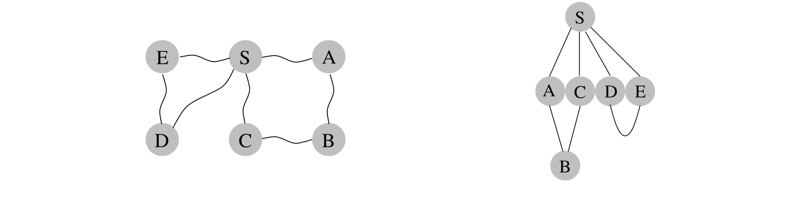

## 4.1 Distances

Depth-first search readily identifies all the vertices of a graph that can be reached from a designated starting point. It also finds explicit paths to these vertices, summarized in its search tree (Figure 4.1). However, these paths might not be the most economical ones possible. In the figure, vertex $C$ is reachable from $S$ by traversing just one edge, while the DFS tree shows a path of length $3$. This chapter is about algorithms for finding *shortest paths in graphs*.

&nbsp;

Path lengths allow us to talk quantitatively about the extent to which different vertices of a graph are separated from each other:

* The *distance* between two nodes is the length of the shortest path between them.

To get a concrete feel for this notion, consider a physical realization of a graph that has a ball for each vertex and a piece of string for each edge. If you lift the ball for vertex $s$ high enough, the other balls that get pulled up along with it are precisely the vertices reachable from $s$. And to find their distances from $s$, you need only measure how far below $s$ they hang.

&nbsp;

In Figure 4.2 for example, vertex $B$ is at distance $2$ from $S$, and there are two shortest paths to it. When $S$ is held up, the strings along each of these paths become taut. On the other hand, edge $(D, E)$ plays no role in any shortest path and therefore remains slack.
