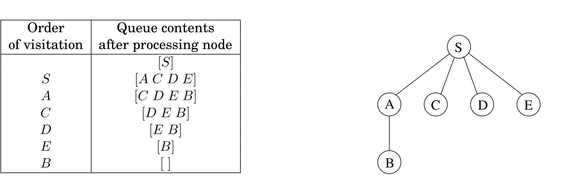

## 4.2 Breadth-First Search

In Figure 4.2, the lifting of $s$ partitions the graph into layers: $s$ itself, the nodes at distance $1$ from it, the nodes at distance $2$ from it, and so on. A convenient way to compute distances from $s$ to the other vertices is to proceed layer by layer. Once we have picked out the nodes at distance $0, 1, 2, \ldots, d$, the ones at $d + 1$ are easily determined: they are precisely the as-yet- unseen nodes that are adjacent to the layer at distance $d$.

This suggests an iterative algorithm in which two layers are active at any given time: some layer $d$, which has been fully identified, and $d + 1$, which is being discovered by scanning the neighbors of layer $d$.

Breadth-first search (BFS) directly implements this simple reasoning (Figure 4.3). Initially the queue $Q$ consists only of $s$, the one node at distance $0$. And for each subsequent distance $d = 1, 2, 3, \ldots$, there is a point in time at which $Q$ contains all the nodes at distance $d$ and nothing else. As these nodes are processed (ejected off the front of the queue), their as-yet-unseen neighbors are injected into the end of the queue.


**Figure 4.3** Breadth-first search.

```python
def bfs(G, s):
  """
  Input: a graph G = (V, E), directed or undirected; vertex s ∈ V
  Output: for all vertices u reachable from s, dist(u) is set to the distance from s to u.
  """
  for all u ∈ V:
    dist(u) = ∞

  dist(s) = 0
  ## Initialize queue to contain just s
  Q = [s]

  while Q is not empty:
    u = eject(Q)

    for all edges (u, v) ∈ E:
      if dist(v) = ∞
        inject(Q, v)
        dist(v) = dist(u) + 1

  return dist
```

&nbsp;

Let's try out this algorithm on our earlier example (Figure 4.1) to confirm that it does the right thing. If $S$ is the starting point and the nodes are ordered alphabetically, they get visited in the sequence shown in Figure 4.4. The breadth-first search tree, on the right, contains the edges through which each node is initially discovered. Unlike the DFS tree we saw earlier, it has the property that all its paths from $S$ are the shortest possible. It is therefore a *shortest-path tree*.



&nbsp;


### Correctness and Efficiency

We have developed the basic intuition behind breadth-first search. In order to check that the algorithm works correctly, we need to make sure that it faithfully executes this intuition. What we expect, precisely, is that

* For each $d = 0, 1, 2, \ldots,$ there is a moment at which

    1.  all nodes at distance $\leq d$ from $s$ have their distances correctly set;

    2.  all other nodes have their distances set to $\infty$; and

    3.  the queue contains exactly the nodes at distance $d$.

This has been phrased with an inductive argument in mind. We have already discussed both the base case and the inductive step. Can you fill in the details?

The overall running time of this algorithm is linear, $O(|V| + |E|)$, for exactly the same reasons as depth-first search. Each vertex is put on the queue exactly once, when it is first encountered, so there are $2|V|$ queue operations. The rest of the work is done in the algorithm's innermost loop. Over the course of execution, this loop looks at each edge once (in directed graphs) or twice (in undirected graphs), and therefore takes $O(|E|)$ time.

Now that we have both BFS and DFS before us: how do their exploration styles compare? Depth-first search makes deep incursions into a graph, retreating only when it runs out of new nodes to visit. This strategy gives it the wonderful, subtle, and extremely useful properties we saw in the Chapter 3. But it also means that DFS can end up taking a long and convoluted route to a vertex that is actually very close by, as in Figure 4.1.

Breadth-first search makes sure to visit vertices in increasing order of their distance from the starting point. This is a broader, shallower search, rather like the propagation of a wave upon water. And it is achieved using almost exactly the same code as DFS—but with a queue in place of a stack.

Also notice one stylistic difference from DFS: since we are only interested in distances from $s$, we do not restart the search in other connected components. Nodes not reachable from $s$ are simply ignored.
