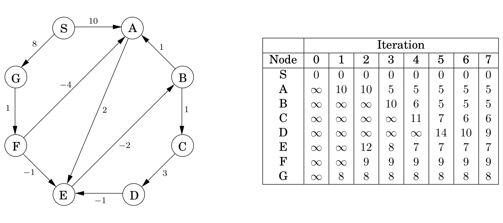

## 4.6 Shortest Paths in the Presence of Negative Edges

### 4.6.1 Negative Edges

Dijkstra's algorithm works in part because the shortest path from the starting point s to any node $v$ must pass exclusively through nodes that are closer than $v$. This no longer holds when edge lengths can be negative. In Figure 4.12, the shortest path from $S$ to $A$ passes through $B$, a node that is further away!


&nbsp;

What needs to be changed in order to accommodate this new complication? To answer this, let's take a particular high-level view of Dijkstra's algorithm. A crucial invariant is that the $\texttt{dist}$ values it maintains are always either overestimates or exactly correct. They start off at $\infty$, and the only way they ever change is by updating along an edge:

```python
def update((u, v) ∈ E):
  dist(v) = min(dist(v), dist(u) + l(u, v))
```

This *update* operation is simply an expression of the fact that the distance to $v$ cannot possibly be more than the distance to $u$, plus $l(u, v)$. It has the following properties.

1.  It gives the correct distance to $v$ in the particular case where $u$ is the second-last node in the shortest path to $v$, and $\texttt{dist}(u)$ is correctly set.

2. It will never make $\texttt{dist(v)}$ too small, and in this sense it is safe. For instance, a slew of extraneous update's can't hurt.

This operation is extremely useful: it is harmless, and if used carefully, will correctly set distances. In fact, Dijkstra's algorithm can be thought of simply as a sequence of $\texttt{update}$'s. We know this particular sequence doesn't work with negative edges, but is there some other sequence that does? To get a sense of the properties this sequence must possess, let's pick a node $t$ and look at the shortest path to it from $s$.


This path can have at most $|V| - 1$ edges (do you see why?). If the sequence of updates performed includes $(s, u_1), (u_1, u_2), (u_2, u_3), \ldots, (u_k, t)$, *in that order* (though not necessarily consecutively), then by the first property the distance to $t$ will be correctly computed. It doesn't matter what other updates occur on these edges, or what happens in the rest of the graph, because updates are *safe*.

But still, if we don't know all the shortest paths beforehand, how can we be sure to update the right edges in the right order? Here is an easy solution: simply update all the edges, $|V| - 1$ times! The resulting $O(|V| \cdot |E|)$ procedure is called the Bellman-Ford algorithm and is shown in Figure 4.13, with an example run in Figure 4.14.

A note about implementation: for many graphs, the maximum number of edges in any shortest path is substantially less than $|V| - 1$, with the result that fewer rounds of updates are needed. Therefore, it makes sense to add an extra check to the shortest-path algorithm, to make it terminate immediately after any round in which no update occurred.

&nbsp;

**Figure 4.13** The Bellman-Ford algorithm for single-source shortest paths in general graphs.

```python
def shortest_paths(G, l, s):
  """
  Input: Directed graph G = (V, E);
         edge lengths {l_e : e ∈ E} with no negative cycles;
         vertex s ∈ V
  Output: For all vertices u reachable from s, dist(u) is set to the distance from s to u.
  """
  for all u ∈ V:
    dist(u) = ∞
    prev(u) = nil

  dist(s) = 0
  repeat |V| - 1 times:
    for all e ∈ E:
      update(e)

  return dist
```

&nbsp;



&nbsp;


### 4.6.2 Negative Cycles

If the length of edge $(E, B)$ in Figure 4.14 were changed to $-4$, the graph would have a *negative* cycle $A \rightarrow E \rightarrow B \rightarrow A$. In such situations, it doesn't make sense to even ask about shortest paths. There is a path of length $2$ from $A$ to $E$. But going round the cycle, there's also a path of length $1$, and going round multiple times, we find paths of lengths $0, -1, -2,$ and so on.

The shortest-path problem is ill-posed in graphs with negative cycles. As might be expected, our algorithm from Section 4.6.1 works only in the absence of such cycles. But where did this assumption appear in the derivation of the algorithm? Well, it slipped in when we asserted the *existence* of a shortest path from $s$ to $t$.

Fortunately, it is easy to automatically detect negative cycles and issue a warning. Such a cycle would allow us to endlessly apply rounds of update operations, reducing $\texttt{dist}$ estimates every time. So instead of stopping after $|V| - 1$ iterations, perform one extra round. There is a negative cycle if and only if some $\texttt{dist}$ value is reduced during this final round.
