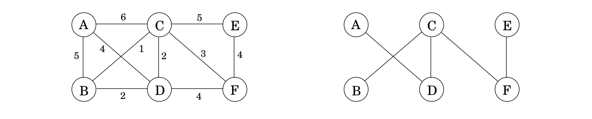
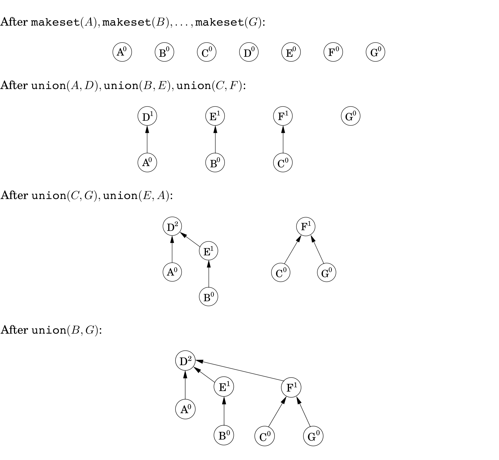
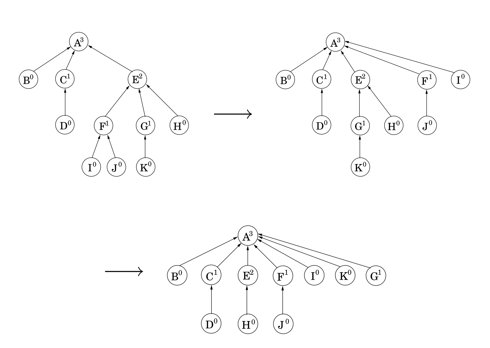
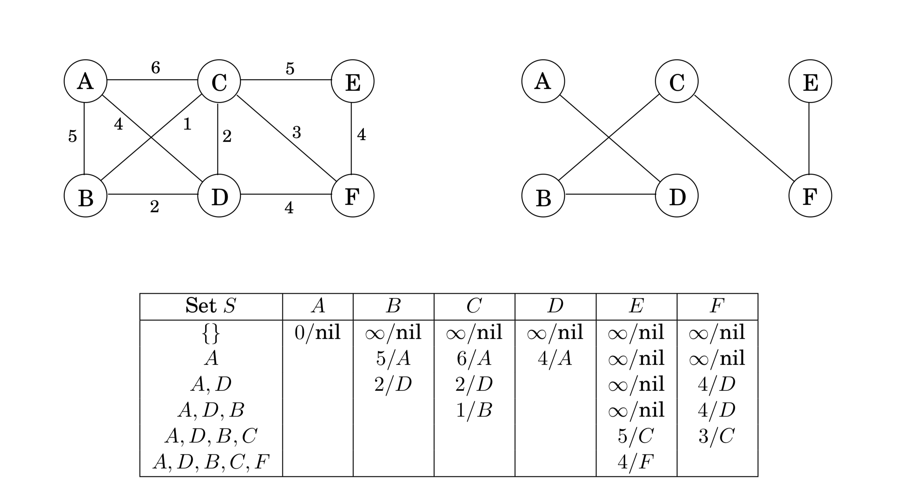

## 5.1 Minimum Spanning Trees

Suppose you are asked to network a collection of computers by linking selected pairs of them. This translates into a graph problem in which nodes are computers, undirected edges are potential links, and the goal is to pick enough of these edges that the nodes are connected. But this is not all; each link also has a maintenance cost, reflected in that edge's weight. What is the cheapest possible network?


One immediate observation is that the optimal set of edges cannot contain a cycle, because removing an edge from this cycle would reduce the cost without compromising connectivity:

**Property 1** *Removing a cycle edge cannot disconnect a graph.*

So the solution must be connected and acyclic: undirected graphs of this kind are called *trees*. The particular tree we want is the one with minimum total weight, known as the *minimum spanning tree*. Here is its formal definition.

* *input*: an undirected graph $G = (V, E)$; edge weights $w_e$.

* *output*: a tree $T = (V, E')$, with $E' \subseteq E$, that minimizes $$\text{weight}(T) = \sum_{e \in E'} w_e.$$

In the preceding example, the minimum spanning tree has a cost of $16$:


However, this is not the only optimal solution. Can you spot another?

&nbsp;


### 5.1.1 A Greedy Approach

Kruskal's minimum spanning tree algorithm starts with the empty graph and then selects edges from $E$ according to the following rule.

* Repeatedly add the next lightest edge that doesn't produce a cycle.

In other words, it constructs the tree edge by edge and, apart from taking care to avoid cycles, simply picks whichever edge is cheapest at the moment. This is a *greedy* algorithm: every decision it makes is the one with the most obvious immediate advantage.



&nbsp;

Figure 5.1 shows an example. We start with an empty graph and then attempt to add edges in increasing order of weight (ties are broken arbitrarily):
$$B - C, C - D, B - D, C - F, D - F, E - F, A - D, A - B, C - E, A - C.$$

The first two succeed, but the third, $B - D$, would produce a cycle if added. So we ignore it and move along. The final result is a tree with cost $14$, the minimum possible.

The correctness of Kruskal's method follows from a certain *cut property*, which is general enough to also justify a whole slew of other minimum spanning tree algorithms.


&nbsp;

> **Trees**
>
> A *tree* is an undirected graph that is connected and acyclic. Much of what makes trees so useful is the simplicity of their structure. For instance,
>
> **Property 2** *A tree on $n$ nodes has $n - 1$ edges.*
>
> This can be seen by building the tree one edge at a time, starting from an empty graph. Initially each of the n nodes is disconnected from the others, in a connected component by itself. As edges are added, these components merge. Since each edge unites two different components, exactly $n - 1$ edges are added by the time the tree is fully formed.
>
> In a little more detail: When a particular edge $\{u, v\}$ comes up, we can be sure that $u$ and $v$ lie in separate connected components, for otherwise there would already be a path between them and this edge would create a cycle. Adding the edge then merges these two components, thereby reducing the total number of connected components by one. Over the course of this incremental process, the number of components decreases from $n$ to one, meaning that $n - 1$ edges must have been added along the way.
>
> The converse is also true.
>
> **Property 3** *Any connected, undirected graph $G = (V, E)$ with $|E| = |V| - 1$ is a tree.*
>
> We just need to show that $G$ is acyclic. One way to do this is to run the following iterative procedure on it: while the graph contains a cycle, remove one edge from this cycle. The process terminates with some graph $G' = (V, E'), E' \subseteq E$, which is acyclic and, by Property 1 (from page 133), is also connected. Therefore $G'$ is a tree, whereupon $|E'| = |V| - 1$ by Property 2. So $E' = E$, no edges were removed, and $G$ was acyclic to start with.
>
> In other words, we can tell whether a connected graph is a tree just by counting how many edges it has. Here's another characterization.
>
> **Property 4** *An undirected graph is a tree if and only if there is a unique path between any pair of nodes.*
>
> In a tree, any two nodes can only have one path between them; for if there were two paths, the union of these paths would contain a cycle.
>
> On the other hand, if a graph has a path between any two nodes, then it is connected. If these paths are unique, then the graph is also acyclic (since a cycle has two paths between any pair of nodes).

&nbsp;


### 5.1.2 The Cut Property

Say that in the process of building a minimum spanning tree ($\text{MST}$), we have already chosen some edges and are so far on the right track. Which edge should we add next? The following lemma gives us a lot of flexibility in our choice.

**Cut property** *Suppose edges $X$ are part of a minimum spanning tree of $G = (V, E)$. Pick any subset of nodes $S$ for which $X$ does not cross between $S$ and $V - S$, and let $e$ be the lightest edge across this partition. Then $X \cup \{e\}$ is part of some $\text{MST}$.*

A **cut** is any partition of the vertices into two groups, $S$ and $V - S$. What this property says is that it is always safe to add the lightest edge across any cut (that is, between a vertex in $S$ and one in $V - S$), provided $X$ has no edges across the cut.


&nbsp;

Let's see why this holds. Edges $X$ are part of some $\text{MST} T$; if the new edge $e$ also happens to be part of $T$, then there is nothing to prove. So assume $e$ is not in $T$. We will construct a different $\text{MST} T'$ containing $X \cup \{e\}$ by altering $T$ slightly, changing just one of its edges.

Add edge $e$ to $T$. Since $T$ is connected, it already has a path between the endpoints of $e$, so adding $e$ creates a cycle. This cycle must also have some other edge $e'$ across the cut $(S, V - S)$ (Figure 8.3). If we now remove this edge, we are left with $T' = T \cup \{e\} - \{e'\}$, which we will show to be a tree. $T'$ is connected by Property 1, since $e'$ is a cycle edge. And it has the same number of edges as $T$; so by Properties 2 and 3, it is also a tree.

Moreover, $T'$ is a minimum spanning tree. Compare its weight to that of $T$:
$$\text{weight}(T') = \text{weight}(T) + w(e) - w(e').$$

Both $e$ and $e'$ cross between $S$ and $V - S$, and $e$ is specifically the lightest edge of this type. Therefore $w(e) \leq w(e')$, and $\text{weight}(T') \leq \text{weight}(T)$. Since $T$ is an $\text{MST}$, it must be the case that $\text{weight}(T') = \text{weight}(T)$ and that $T'$ is also an $\text{MST}$.

Figure 5.3 shows an example of the cut property. Which edge is $e'$?


&nbsp;


### 5.1.3 Kruskal's Algorithm

We are ready to justify Kruskal's algorithm. At any given moment, the edges it has already chosen form a partial solution, a collection of connected components each of which has a tree structure. The next edge $e$ to be added connects two of these components; call them $T_1$ and $T_2$. Since $e$ is the lightest edge that doesn't produce a cycle, it is certain to be the lightest edge between $T_1$ and $V - T_1$ and therefore satisfies the cut property.

Now we fill in some implementation details. At each stage, the algorithm chooses an edge to add to its current partial solution. To do so, it needs to test each candidate edge $u - v$ to see whether the endpoints $u$ and $v$ lie in different components; otherwise the edge produces a cycle. And once an edge is chosen, the corresponding components need to be merged. What kind of data structure supports such operations?

We will model the algorithm's state as a collection of *disjoint sets*, each of which contains the nodes of a particular component. Initially each node is in a component by itself:
$$\texttt{makeset}(x): \text{create a singleton set containing just $x$.}$$

We repeatedly test pairs of nodes to see if they belong to the same set.
$$\texttt{find}(x): \text{to which set does $x$ belong?}$$

And whenever we add an edge, we are merging two components.
$$\texttt{union}(x, y): \text{merge the sets containing $x$ and $y$.}$$

The final algorithm is shown in Figure 5.4. It uses $|V| \texttt{makeset}, 2|E| \texttt{find}$, and $|V| - 1 \texttt{union}$ operations.


```python
def Kruskal(G, w):
  """
  Input: a connected graph G = (V, E) with edge weights w_e
  Output: a minimum spanning tree defined by the edges X
  """

  for all u ∈ V :
    makeset(u)

  X = {}
  sort the edges E by weight

  for all edges {u, v} ∈ E, in increasing order of weight:
    if find(u) != find(v):
      add edge {u, v} to X
      union(u, v)

  return X
```

&nbsp;


### 5.1.4 A Data Structure for Disjoint Sets

**Union by Rank**

One way to store a set is as a directed tree (Figure 5.5). Nodes of the tree are elements of the set, arranged in no particular order, and each has parent pointers that eventually lead up to the root of the tree. This root element is a convenient *representative*, or *name*, for the set. It is distinguished from the other elements by the fact that its parent pointer is a self-loop.


In addition to a parent pointer $\pi$, each node also has a *rank* that, for the time being, should be interpreted as the height of the subtree hanging from that node.

```python
def makeset(x):
  π(x) = x
  rank(x) = 0

def find(x):
  while x != π(x):
    x = π(x)
  return x
```

As can be expected, $\texttt{makeset}$ is a constant-time operation. On the other hand, $\texttt{find}$ follows parent pointers to the root of the tree and therefore takes time proportional to the height of the tree. The tree actually gets built via the third operation, $\texttt{union}$, and so we must make sure that this procedure keeps trees shallow.

Merging two sets is easy: make the root of one point to the root of the other. But we have a choice here. If the representatives (roots) of the sets are $r_x$ and $r_y$, do we make $r_x$ point to $r_y$ or the other way around?

Since tree height is the main impediment to computational efficiency, a good strategy is to *make the root of the shorter tree point to the root of the taller tree*. This way, the overall height increases only if the two trees being merged are equally tall. Instead of explicitly computing heights of trees, we will use the rank numbers of their root nodes—which is why this scheme is called *union by rank*.

```python
def union(x, y):
  r_x = find(x)
  r_y = find(y)

  if r_x = r_y:
    return

  if rank(r_x) > rank(r_y):
    π(r_y) = r_x

  else:
    π(r_x) = r_y
    if rank(r_x) = rank(r_y):
       rank(r_y) =  rank(r_y) + 1
```

See Figure 5.6 for an example.



&nbsp;

By design, the *rank* of a node is exactly the height of the subtree rooted at that node. This means, for instance, that as you move up a path toward a root node, the rank values along the way are strictly increasing.

**Property 1** *For any $x, \text{rank}(x) < \text{rank}(\pi(x))$.*

A root node with rank $k$ is created by the merger of two trees with roots of rank $k - 1$. It follows by induction (try it!) that

**Property 2** *Any root node of rank $k$ has at least $2^k$ nodes in its tree.*

This extends to internal (nonroot) nodes as well: a node of rank $k$ has at least $2^k$ descendants. After all, any internal node was once a root, and neither its rank nor its set of descendants has changed since then. Moreover, different rank-$k$ nodes cannot have common descendants, since by Property 1 any element has at most one ancestor of rank $k$. Which means

**Property 3** *If there are $n$ elements overall, there can be at most $n / 2^k$ nodes of rank $k$.*

This last observation implies, crucially, that the maximum rank is $\log{n}$. Therefore, all the trees have height $\leq \log{n}$, and this is an upper bound on the running time of $\texttt{find}$ and $\texttt{union}$.

&nbsp;


**Path Compression**

With the data structure as presented so far, the total time for Kruskal's algorithm becomes $O(|E| \log{|V|})$ for sorting the edges (remember, $\log{}|E|} \approx \log{|V|}$) plus another $O(|E|\log{|V|})$ for the $\texttt{union}$ and $\texttt{find}$ operations that dominate the rest of the algorithm. So there seems to be little incentive to make our data structure any more efficient.

But what if the edges are given to us sorted? Or if the weights are small (say, $O(|E|)$) so that sorting can be done in linear time? Then the data structure part becomes the bottleneck, and it is useful to think about improving its performance beyond $\log{n}$ per operation. As it turns out, the improved data structure is useful in many other applications.

But how can we perform $\texttt{union}$'s and $\texttt{find}$'s faster than $\log{n}$? The answer is, by being a little more careful to maintain our data structure in good shape. As any housekeeper knows, a little extra effort put into routine maintenance can pay off handsomely in the long run, by forestalling major calamities.

We have in mind a particular maintenance operation for our union-find data structure, intended to keep the trees short—during each $\texttt{find}$, when a series of parent pointers is followed up to the root of a tree, we will change all these pointers so that they point directly to the root (Figure 5.7). This *path compression* heuristic only slightly increases the time needed for a find and is easy to code.

```python
def find(x):
  if x != π(x):
    π(x) = find(π(x))
  return π(x)
```



The benefit of this simple alteration is long-term rather than instantaneous and thus necessitates a particular kind of analysis: we need to look at *sequences* of $\texttt{find}$ and $\texttt{union}$ operations, starting from an empty data structure, and determine the average time per operation. This *amortized cost* turns out to be just barely more than $O(1)$, down from the earlier $O(\log{n})$.

Think of the data structure as having a "top level" consisting of the root nodes, and below it, the insides of the trees. There is a division of labor: $\texttt{find}$ operations (with or without path compression) only touch the insides of trees, whereas $\texttt{union}$'s only look at the top level. Thus path compression has no effect on $\texttt{union}$ operations and leaves the top level unchanged.

We now know that the ranks of root nodes are unaltered, but what about *non-root* nodes? The key point here is that once a node ceases to be a root, it never resurfaces, and its rank is forever fixed. Therefore the ranks of all nodes are unchanged by path compression, even though these numbers can no longer be interpreted as tree heights. In particular, properties 1–3 still hold.

If there are $n$ elements, their rank values can range from $0$ to $\log{n}$ by Property 3. Let's divide the non-zero part of this range into certain carefully chosen intervals, for reasons that will soon become clear:
$$\{1\}, \{2\}, \{3, 4\}, \{5, 6, \ldots, 16\}, \{17, 18, \ldots, 2^16 = 65536\}, \{65537, 65538, \ldots, 2^{65536}\}, \ldots$$

Each group is of the form $\{k + 1, k + 2, \cdots, 2^k\}$, where $k$ is a power of $2$. The number of groups is $\log^{\star}{n}$, which is defined to be the number of successive $\log$ operations that need to be applied to $n$ to bring it down to $1$ (or below $1$). For instance, $\log^{\star}{1000} = 4$ since $\log \log \log \log{1000} \leq 1$. In practice there will just be the first five of the intervals shown; more are needed only if $n \geq 265536$, in other words never.

In a sequence of $\texttt{find}$ operations, some may take longer than others. We'll bound the overall running time using some creative accounting. Specifically, we will give each node a certain amount of pocket money, such that the total money doled out is at most $n \log^{\star}{n}$ dollars. We will then show that each find takes $O(\log^{\star}{n})$ steps, plus some additional amount of time that can be "paid for" using the pocket money of the nodes involved—one dollar per unit of time. Thus the overall time for $m \texttt{find}$'s is $O(m \log^{\star}{n})$ plus at most $O(n \log^{\star}{n})$.

In more detail, a node receives its allowance as soon as it ceases to be a root, at which point its rank is fixed. If this rank lies in the interval $\{k + 1, \ldots, 2^k\}$, the node receives $2^k$ dollars. By Property 3, the number of nodes with rank $> k$ is bounded by
$$\frac{n}{2^{k + 1}} + \frac{n}{2^{k + 2}} + \cdots \leq \frac{n}{2^{k}}.$$

Therefore the total money given to nodes in this particular interval is at most $n$ dollars, and since there are $\log^{\star}{n}$ intervals, the total money disbursed to all nodes is $\leq n \log^{\star}{n}$.

Now, the time taken by a specific find is simply the number of pointers followed. Consider the ascending rank values along this chain of nodes up to the root. Nodes $x$ on the chain fall into two categories: either the rank of $\pi(x)$ is in a higher interval than the rank of $x$, or else it lies in the same interval.

There are at most $\log^{\star}{n}$ nodes of the first type (do you see why?), so the work done on them takes $O(\log^{\star}{n})$ time. The remaining nodes—whose parents' ranks are in the same interval as theirs—have to pay a dollar out of their pocket money for their processing time.

This only works if the initial allowance of each node $x$ is enough to cover all of its payments in the sequence of $\texttt{find}$ operations. Here's the crucial observation: each time $x$ pays a dollar, its parent changes to one of higher rank. Therefore, if $x$'s rank lies in the interval $\{k + 1, \ldots, 2^k\}$, it has to pay at most $2^k$ dollars before its parent's rank is in a higher interval; whereupon it never has to pay again.

&nbsp;

> **A Randomized Algorithm for Minimum Cut**
>
> We have already seen that spanning trees and cuts are intimately related. Here is another connection. Let's remove the last edge that Kruskal's algorithm adds to the spanning tree; this breaks the tree into two components, thus defining a cut $(S, \bar{S})$ in the graph. What can we say about this cut? Suppose the graph we were working with was unweighted, and that its edges were ordered uniformly at random for Kruskal's algorithm to process them.
>
> Here is a remarkable fact: with probability at least $1 / n^2$, $(S, \bar{S})$ is the minimum cut in the graph, where the size of a cut $(S, \bar{S})$ is the number of edges crossing between $S$ and $\bar{S}$. This means that repeating the process $O(n^2)$ times and outputting the smallest cut found yields the minimum cut in $G$ with high probability: an $O(m n^2 \log{n})$ algorithm for unweighted minimum cuts. Some further tuning gives the $O(n^2 \log{n})$ minimum cut algorithm, invented by David Karger, which is the [fastest known algorithm for this important problem](https://en.wikipedia.org/wiki/Karger%27s_algorithm).
>
> So let us see why the cut found in each iteration is the minimum cut with probability at least $1 / n^2$. At any stage of Kruskal's algorithm, the vertex set $V$ is partitioned into connected components. The only edges eligible to be added to the tree have their two endpoints in distinct components. The number of edges incident to each component must be at least $C$, the size of the minimum cut in $G$ (since we could consider a cut that separated this component from the rest of the graph).
>
> So if there are $k$ components in the graph, the number of eligible edges is at least $kC / 2$ (each of the $k$ components has at least $C$ edges leading out of it, and we need to compensate for the double-counting of each edge). Since the edges were randomly ordered, the chance that the next eligible edge in the list is from the minimum cut is at most $C / (kC / 2) = 2 / k$.
>
> Thus, with probability at least $1 - 2 / k = (k - 2) / k$, the choice leaves the minimum cut intact. But now the chance that Kruskal's algorithm leaves the minimum cut intact all the way up to the choice of the last spanning tree edge is at least
> $$\frac{n - 2}{n} \cdot \frac{n - 3}{n - 1} \cdot \frac{n - 4}{n - 2} \cdots \frac{2}{4} \cdot \frac{1}{3} = \frac{1}{n(n - 1)}.$$

&nbsp;


### 5.1.5 Prim's algorithm

Let's return to our discussion of minimum spanning tree algorithms. What the cut property tells us in most general terms is that any algorithm conforming to the following greedy schema is guaranteed to work.

```python
def Prim_draft(G):

  # set of edges picked so far
  X = {}

  repeat until |X| = |V| - 1:
    pick a set S ⊂ V for which X has no edges between S and V - S
    let e ∈ E be the minimum-weight edge between S and V - S
    X = X ∪ {e}

  return X
```

A popular alternative to Kruskal's algorithm is Prim's, in which the intermediate set of edges $X$ always forms a subtree, and $S$ is chosen to be the set of this tree's vertices.


On each iteration, the subtree defined by $X$ *grows* by one edge, namely, the lightest edge between a vertex in $S$ and a vertex outside $S$ (Figure 5.8). We can equivalently think of $S$ as growing to include the vertex $v \not\in S$ of smallest cost:
$$\texttt{cost}(v) = \min_{v \in S} w(u, v).$$

This is strongly reminiscent of Dijkstra's algorithm, and in fact the pseudocode (Figure 5.9) is almost identical. The only difference is in the key values by which the priority queue is ordered.

In Prim's algorithm, the value of a node is the weight of the lightest incoming edge from set $S$, whereas in Dijkstra's it is the length of an entire path to that node from the starting point. Nonetheless, the two algorithms are similar enough that they have the same running time, which depends on the particular priority queue implementation.
Figure 5.9 shows Prim's algorithm at work, on a small six-node graph.

Notice how the final $\text{MST}$ is completely specified by the $\texttt{prev}$ array.

&nbsp;

**Figure 5.9** *Top*: Prim's minimum spanning tree algorithm. *Below*: An illustration of Prim's algorithm, starting at node $A$. Also shown are a table of $\texttt{cost}, \texttt{prev}$ values, and the final MST.

```python
def Prim(G, w):
  """
  Input: a connected undirected graph G = (V, E) with edge weights w_e
  Output: a minimum spanning tree defined by the array prev
  """

  for all u ∈ V:
    cost(u) = ∞
    prev(u) = nil

  pick any initial node u_0:
    cost(u_0) = 0

  # priority queue using cost-values as keys
  H = make_queue(V)

  while H is not empty:
    v = delete_min(H)

    for each {v, z} ∈ E:

      if cost(z) > w(v, z):
         cost(z) = w(v, z)
         prev(z) = v
         decrease_key(H, z)

  return prev
```


