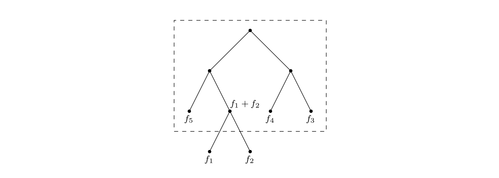

## 5.2 Huffman encoding

In the MP3 audio compression scheme, a sound signal is encoded in three steps.

1. It is digitized by sampling at regular intervals, yielding a sequence of real numbers $s_1, s_2, \ldots, s_T$. For instance, at a rate of $44,100$ samples per second, a $50$-minute symphony would correspond to $T = 50 \times 60 \times 44,100 \approx 130$ million measurements.[^1]

2. Each real-valued sample $s_t$ is *quantized*: approximated by a nearby number from a finite set $\Gamma$. This set is carefully chosen to exploit human perceptual limitations, with the intention that the approximating sequence is indistinguishable from $s_1, s_2, \ldots, s_T$ by the human ear.

3. The resulting string of length $T$ over alphabet $\Gamma$ is encoded in binary.

It is in the last step that Huffman encoding is used. To understand its role, let's look at a toy example in which $T$ is $130$ million and the alphabet $\Gamma$ consists of just four values, denoted by the symbols $A, B, C, D$. What is the most economical way to write this long string in binary? The obvious choice is to use $2$ bits per symbol—say codeword $00$ for $A$, $01$ for $B$, $10$ for $C$, and $11$ for $D$—in which case $260$ megabits are needed in total. Can there possibly be a better encoding than this?

In search of inspiration, we take a closer look at our particular sequence and find that the four symbols are not equally abundant.
$$\begin{array}{c r} \text{symbol} & \text{frequency} \\ \begin{matrix} A \\ B \\ C \\ D \end{matrix} & \begin{matrix} \text{$70$ million} \\ \text{$3$ million} \\\text{$20$ million} \\ \text{$37$ million} \end{matrix} \end{array}$$

Is there some sort of *variable-length encoding*, in which just one bit is used for the frequently occurring symbol A, possibly at the expense of needing three or more bits for less common symbols?

A danger with having codewords of different lengths is that the resulting encoding may not be uniquely decipherable. For instance, if the codewords are $\{0, 01, 11, 001\}$, the decoding of strings like $001$ is ambiguous. We will avoid this problem by insisting on the *prefix-free property*: no codeword can be a prefix of another codeword.

Any prefix-free encoding can be represented by a *full* binary tree—that is, a binary tree in which every node has either zero or two children—where the symbols are at the leaves, and where each codeword is generated by a path from root to leaf, interpreting left as $0$ and right as $1$ (Exercise 5.28).

Figure 5.10 shows an example of such an encoding for the four symbols $A, B, C, D$. Decoding is unique: a string of bits is decrypted by starting at the root, reading the string from left to right to move downward, and, whenever a leaf is reached, outputting the corresponding symbol and returning to the root. It is a simple scheme and pays off nicely for our toy example, where (under the codes of Figure 5.10) the total size of the binary string drops to $213$ megabits, a $17\%$ improvement.


In general, how do we find the optimal coding tree, given the frequencies $f_1, f_2, \ldots, f_n$ of $n$ symbols? To make the problem precise, we want a tree whose leaves each correspond to a symbol and which minimizes the overall length of the encoding (the number of bits required for a symbol is exactly its depth in the tree):
$$\text{cost of tree} = \sum_{i = 1}^{n} f_i \cdot (\text{depth of $i$th symbol in tree})$$

There is another way to write this cost function that is very helpful. Although we are only given frequencies for the leaves, we can define the frequency of any *internal* node to be the sum of the frequencies of its descendant leaves; this is, after all, the number of times the internal node is visited during encoding or decoding. During the encoding process, each time we move down the tree, one bit gets output for every non-root node through which we pass. So the total cost—the total number of bits which are output—can also be expressed thus:

* The cost of a tree is the sum of the frequencies of all leaves and internal nodes, except the root.

The first formulation of the cost function tells us that the *two symbols with the smallest frequencies must be at the bottom of the optimal tree*, as children of the lowest internal node (this internal node has two children since the tree is *full*). Otherwise, swapping these two symbols with whatever is lowest in the tree would improve the encoding.

This suggests that we start constructing the tree *greedily*: find the two symbols with the smallest frequencies, say $i$ and $j$, and make them children of a new node, which then has frequency $f_i + f_j$. To keep the notation simple, let's just assume these are $f_1$ and $f_2$. By the second formulation of the cost function, any tree in which $f_1$ and $f_2$ are sibling-leaves has cost $f_1 + f_2$ plus the cost for a tree with $n - 1$ leaves of frequencies $(f_1 + f_2), f_3, f_4, \ldots, f_n$:


The latter problem is just a smaller version of the one we started with. So we pull $f_1$ and $f_2$ off the list of frequencies, insert $(f_1 + f_2)$, and loop. The resulting algorithm can be described in terms of priority queue operations (as defined on page 114) and takes $O(n \log{n})$ time if a binary heap (Section 4.5.2) is used.

```python
def Huffman(f):
  """
  Input: an array f [1 ··· n] of frequencies
  Output: an encoding tree with n leaves
  """

  let H be a priority queue of integers ordered by f

  for i = 1 to n:
    insert(H, i)

  for k = n + 1 to 2n - 1:
    i = deletemin(H), j = deletemin(H)
    create a node numbered k with children i, j
    f[k] = f[i] + f[j]
    insert(H, k)

  return H
```

Returning to our toy example: can you tell if the tree of Figure 5.10 is optimal?

&nbsp;


> **Entropy**
>
> The annual county horse race is bringing in three thoroughbreds who have never competed against one another. Excited, you study their past $200$ races and summarize these as probability distributions over four outcomes: $\texttt{first}$ ("first place"), $\texttt{second, third}$, and $\texttt{other}$.
> $$\begin{array}{c c c c} \text{outcome} & \text{Aurora} & \text{Whirlwind} & \text{Phantasm} \\ \begin{matrix} \texttt{first} \\ \texttt{second} \\ \texttt{third} \\ \texttt{other} \end{matrix} & \begin{matrix} 0.15 \\ 0.10 \\ 0.70 \\ 0.05 \end{matrix} & \begin{matrix} 0.30 \\ 0.05 \\ 0.25 \\ 0.40 \end{matrix} & \begin{matrix} 0.20 \\ 0.30 \\ 0.30 \\ 0.20 \end{matrix} \end{array}$$
>
> Which horse is the most predictable? One quantitative approach to this question is to look at *compressibility*. Write down the history of each horse as a string of $200$ values ($\texttt{first, second, third, other}$). The total number of bits needed to encode these track-record strings can then be computed using Huffman's algorithm. This works out to $290$ bits for Aurora, $380$ for Whirlwind, and $420$ for Phantasm (check it!). Aurora has the shortest encoding and is therefore in a strong sense the most predictable.
>
> The inherent unpredictability, or *randomness*, of a probability distribution can be measured by the extent to which it is possible to compress data drawn from that distribution.
> $$\text{more compressible} \equiv \text{less random} \equiv \text{more predictable}$$
>
> Suppose there are $n$ possible outcomes, with probabilities $p_1, p_2, \ldots, p_n$. If a sequence of $m4$ values is drawn from the distribution, then the $i$th outcome will pop up roughly $m p_i$ times (if $m$ is large). For simplicity, assume these are exactly the observed frequencies, and moreover that the $p_i$'s are all powers of $2$ (that is, of the form $1 / 2^k$). It can be 􏰑seen by induction (Exercise 5.19) that the number of bits needed to encode the sequence is $$\sum_{i = 1}^n m p_i \log{\frac{1}{p_i}}.$$ Thus the average number of bits needed to encode a single draw from the distribution is $$\sum_{i = 1}^n p_i \log{\frac{1}{p_i}}.$$
>
> This is the [entropy](https://en.wikipedia.org/wiki/Entropy_(information_theory)) of the distribution, a measure of how much randomness it contains.
>
> For example, a fair coin has two outcomes, each with probability $1 / 2$. So its entropy is $$\frac{1}{2} \log{2} + \frac{1}{2} \log{2} = 1.$$
>
> This is natural enough: the coin flip contains one bit of randomness. But what if the coin is not fair, if it has a 3/4 chance of turning up heads? Then the entropy is $$\frac{3}{4} \log{\frac{4}{3}} + \frac{1}{4} \log{4} = 0.81.$$
>
> A biased coin is more predictable than a fair coin, and thus has lower entropy. As the bias becomes more pronounced, the entropy drops toward zero.
>
> We explore these notions further in Exercise 5.18 and 5.19.


[^1]: For stereo sound, two channels would be needed, doubling the number of samples.
