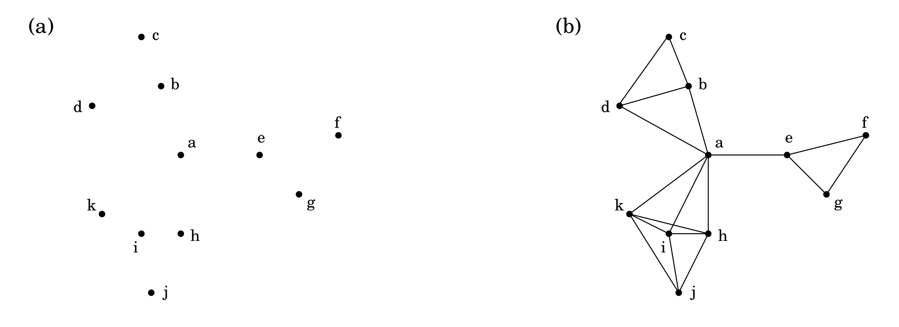
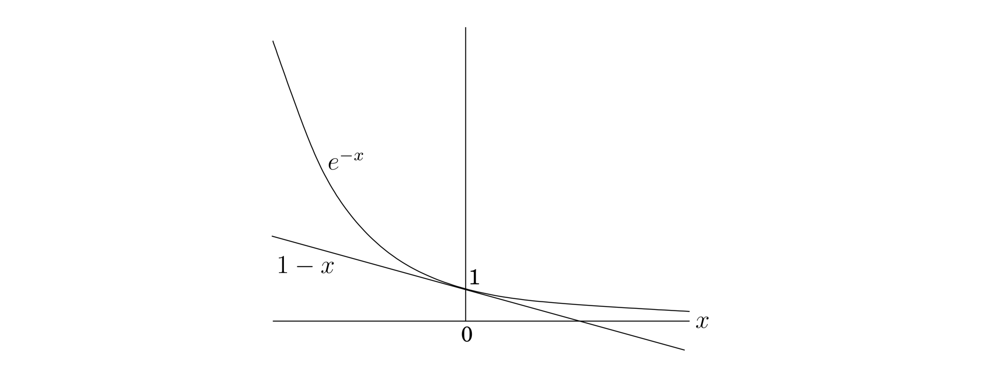

## 5.4 Set Cover

The dots in Figure 5.11 represent a collection of towns. This county is in its early stages of planning and is deciding where to put schools. There are only two constraints: each school should be in a town, and no one should have to travel more than $30$ miles to reach one of them. What is the minimum number of schools needed?



&nbsp;


This is a typical **set cover** problem. For each town $x$, let $S_x$ be the set of towns within $30$ miles of it. A school at $x$ will essentially "cover" these other towns. The question is then, how many sets $S_x$ must be picked in order to cover all the towns in the county?

&nbsp;

  $\text{Set Cover}$

* *input*: a set of elements $B$; sets $S_1, \ldots, S_m \subseteq B$.

* *output*: a selection of the $S_i$ whose union is $B$.

* *cost*: number of sets picked.

&nbsp;

In our example, the elements of $B$ are the towns. This problem lends itself immediately to a greedy solution:

```python
Repeat until all elements of B are covered:
    Pick the set S_i with the largest number of uncovered elements.
```

This is extremely natural and intuitive. Let's see what it would do on our earlier example: It would first place a school at town $a$, since this covers the largest number of other towns. Thereafter, it would choose three more schools—$c, j,$ and either $f$ or $g$—for a total of four. However, there exists a solution with just three schools, at $b, e,$ and $i$. The greedy scheme is not optimal!

But luckily, it isn't too far from optimal.

**Claim** Suppose $B$ contains $n$ elements and that the optimal cover consists of $k$ sets. Then the greedy algorithm will use at most $k \ln{n}$ sets.[^1]

Let $n_t$ be the number of elements still not covered after $t$ iterations of the greedy algorithm (so $n_0 = n$). Since these remaining elements are covered by the optimal $k$ sets, there must be some set with at least $n_t / k$ of them. Therefore, the greedy strategy will ensure that
$$n_{t + 1} \leq n_t - \frac{n_t}{k} = n_t (1 - \frac{1}{k}),$$

which by repeated application implies $n_t ≤ n_0 (1 - \frac{1}{k})^t. A more convenient bound can be obtained from the useful inequality
$$1 - x \leq e^{-x} \ \ \text{for all $x$, with equality if and only if $x = 0$,}$$

which is most easily proved by a picture: 

Thus $$n_t \leq n_0 (1 - \frac{1}{k})^t < n_0 (e^{-1 / k})^t = ne^{-t / k}.$$

At $t = k \ln{n}$, therefore, $n_t$ is strictly less than $n e^{-\ln{n}} = 1$, which means no elements remain to be covered.

The ratio between the greedy algorithm's solution and the optimal solution varies from input to input but is always less than $\ln{n}$. And there are certain inputs for which the ratio is very close to $\ln{n}$ (Exercise 5.33). We call this maximum ratio the *approximation factor* of the greedy algorithm.

There seems to be a lot of room for improvement, but in fact such hopes are unjustified: it turns out that under certain widely-held complexity assumptions (which will be clearer when we reach Chapter 8), there is provably no polynomial-time algorithm with a smaller approximation factor.

&nbsp;


[^1]: $\ln$ means "natural logarithm," that is, to the base $e$.
