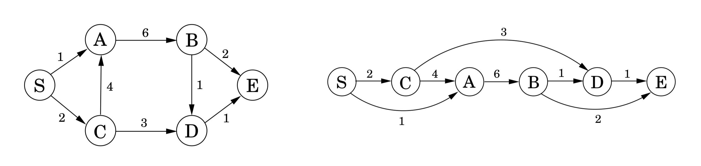

## 6.1 Shortest Paths in a DAG, Revisited

At the conclusion of our study of shortest paths (Chapter 4), we observed that the problem is especially easy in directed acyclic graphs ($\text{DAGs}$). Let’s recapitulate this case, because it lies at the heart of dynamic programming.

The special distinguishing feature of a $\text{DAG}$ is that its nodes can be *linearized*; that is, they can be arranged on a line so that all edges go from left to right (Figure 6.1). To see why this helps with shortest paths, suppose we want to figure out distances from node $S$ to the other nodes. For concreteness, let’s focus on node $D$. The only way to get to it is through its predecessors, $B$ or $C$; so to find the shortest path to $D$, we need only compare these two routes:
$$\texttt{dist}(D) = \min \{\texttt{dist}(B) + 1, \texttt{dist}(C) + 3\}.$$

A similar relation can be written for every node. If we compute these $\texttt{dist}$ values in the left-to-right order of Figure 6.1, we can always be sure that by the time we get to a node $v$, we already have all the information we need to compute $\texttt{dist}(v)$.



&nbsp;


We are therefore able to compute all distances in a single pass:

```python
def shortest_paths():
  initialize all all dist(·) values to ∞
  dist(s) = 0
  for each v ∈ V / {s}, in linearized order:
    dist(v) = min_{(u,v) ∈ E} {dist(u) + l(u, v)}
```

Notice that this algorithm is solving a collection of subproblems, $\{\texttt{dist}(u) : u \in V \}$. We start with the smallest of them, $\texttt{dist}(s)$, since we immediately know its answer to be $0$. We then proceed with progressively "larger" subproblems—distances to vertices that are further and further along in the linearization—where we are thinking of a subproblem as large if we need to have solved a lot of other subproblems before we can get to it.

This is a very general technique. At each node, we compute some function of the values of the node’s predecessors. It so happens that our particular function is a minimum of sums, but we could just as well make it a *maximum*, in which case we would get *longest* paths in the $\text{DAG}$. Or we could use a product instead of a sum inside the brackets, in which case we would end up computing the path with the smallest product of edge lengths.

**Dynamic programming** is a very powerful algorithmic paradigm in which a problem is solved by identifying a collection of subproblems and tackling them one by one, smallest first, using the answers to small problems to help figure out larger ones, until the whole lot of them is solved.

In dynamic programming we are not given a $\text{DAG}$; the $\text{DAG}$ is *implicit*. Its nodes are the subproblems we define, and its edges are the dependencies between the subproblems: if to solve subproblem $B$ we need the answer to subproblem $A$, then there is a (conceptual) edge from $A$ to $B$. In this case, $A$ is thought of as a smaller subproblem than $B$—and it will always be smaller, in an obvious sense.

But it’s time we saw an example.
