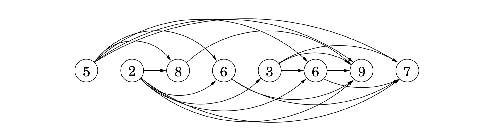

## 6.2 Longest Increasing Subsequences

In the *longest increasing subsequence* problem, the input is a sequence of numbers $a_1, \ldots, a_n$. A subsequence is any subset of these numbers taken in order, of the form $a_{i_1}, a_{i_2}, \ldots, a_{i_k}$ where $1 \leq i_1 < i_2 < \cdots < i_k \leq n$, and an *increasing* subsequence is one in which the numbers are getting strictly larger. The task is to find the increasing subsequence of greatest length. For instance, the longest increasing subsequence of $5, 2, 8, 6, 3, 6, 9, 7$ is $2, 3, 6, 9$:


In this example, the arrows denote transitions between consecutive elements of the optimal solution. More generally, to better understand the solution space, let’s create a graph of *all* permissible transitions: establish a node $i$ for each element $a_i$, and add directed edges $(i, j)$ whenever it is possible for $a_i$ and $a_j$ to be consecutive elements in an increasing subsequence, that is, whenever $i < j$ and $a_i < a_j$ (Figure 6.2).



&nbsp;

Notice that

1. this graph $G = (V, E)$ is a $\text{DAG}$, since all edges $(i, j)$ have $i < j$, and

2. there is a one-to-one correspondence between increasing subsequences and paths in this $\text{DAG}$.

Therefore, our goal is simply to find the longest path in the $\text{DAG}$!

Here is the algorithm:
```python
def longest_path_DAG(G):
  for j = 1, 2, ..., n:
    L(j) = 1 + max{L(i): (i,j) ∈ E}
  return max_j L(j)
```

&nbsp;

$L(j)$ is the length of the longest path—the longest increasing subsequence—ending at $j$ (plus $1$, since strictly speaking we need to count nodes on the path, not edges). By reasoning in the same way as we did for shortest paths, we see that any path to node $j$ must pass through one of its predecessors, and therefore $L(j)$ is $1$ plus the maximum $L(\cdot)$ value of these predecessors. If there are no edges into $j$, we take the maximum over the empty set, zero. And the final answer is the *largest* $L(j)$, since any ending position is allowed.

This is dynamic programming. In order to solve our original problem, we have defined a collection of subproblems $\{L(j) : 1 \leq j \leq n\}$ with the following key property that allows them to be solved in a single pass:

* There is an ordering on the subproblems, and a relation that shows how to solve a subproblem given the answers to "smaller" subproblems, that is, subproblems that appear earlier in the ordering.

In our case, each subproblem is solved using the relation $$L(j) = 1 + \max\{L(i): (i, j) \in E\},$$ an expression which involves only smaller subproblems. How long does this step take? It requires the predecessors of $j$ to be known; for this the adjacency list of the reverse graph $G^R$, constructible in linear time (recall Exercise 3.5), is handy. The computation of $L(j)$ then takes time proportional to the indegree of $j$, giving an overall running time linear in $|E|$. This is at most $O(n^2)$, the maximum being when the input array is sorted in increasing order. Thus the dynamic programming solution is both simple and efficient.

There is one last issue to be cleared up: the $L$-values only tell us the *length* of the optimal subsequence, so how do we recover the subsequence itself? This is easily managed with the same bookkeeping device we used for shortest paths in Chapter 4. While computing $L(j)$, we should also note down $\texttt{prev}(j)$, the next-to-last node on the longest path to $j$. The optimal subsequence can then be reconstructed by following these backpointers.

&nbsp;


> **Recursion? No, thanks.**
>
> Returning to our discussion of longest increasing subsequences: the formula for $L(j)$ also suggests an alternative, recursive algorithm. Wouldn’t that be even simpler?
>
> Actually, recursion is a very bad idea: the resulting procedure would require exponential time! To see why, suppose that the $\text{DAG}$ contains edges $(i, j)$ for *all* $i < j$—that is, the given sequence of numbers $a_1, a_2, \ldots, a_n$ is sorted. In that case, the formula for subproblem $L(j)$ becomes $$L(j) = 1 + \max\{L(1), L(2), \ldots, L(j - 1)\}.$$
>
> The following figure unravels the recursion for $L(5)$. Notice that the same subproblems get solved over and over again!
>
> 
>
> For $L(n)$ this tree has exponentially many nodes (can you bound it?), and so a recursive solution is disastrous.
>
> Then why did recursion work so well with divide-and-conquer? The key point is that in divide-and-conquer, a problem is expressed in terms of subproblems that are *substantially smaller*, say half the size. For instance, $\texttt{mergesort}$ sorts an array of size $n$ by recursively sorting two subarrays of size $n / 2$. Because of this sharp drop in problem size, the full recursion tree has only logarithmic depth and a polynomial number of nodes.
>
> In contrast, in a typical dynamic programming formulation, a problem is reduced to subproblems that are only slightly smaller—for instance, $L(j)$ relies on $L(j - 1)$. Thus the full recursion tree generally has polynomial depth and an exponential number of nodes. However, it turns out that most of these nodes are repeats, that there are not too many *distinct* subproblems among them. Efficiency is therefore obtained by explicitly enumerating the distinct subproblems and solving them in the right order.

&nbsp;


> **Programming?**
>
> The origin of the term *dynamic programming* has very little to do with writing code. It was first coined by Richard Bellman in the 1950s, a time when computer programming was an esoteric activity practiced by so few people as to not even merit a name. Back then programming meant "planning", and "dynamic programming" was conceived to optimally plan multistage processes.
> The $\text{DAG}$ of Figure 6.2 can be thought of as describing the possible ways in which such a process can evolve: each node denotes a state, the leftmost node is the starting point, and the edges leaving a state represent possible actions, leading to different states in the next unit of time.
>
> The etymology of *linear programming*, the subject of Chapter 7, is similar.

&nbsp;
