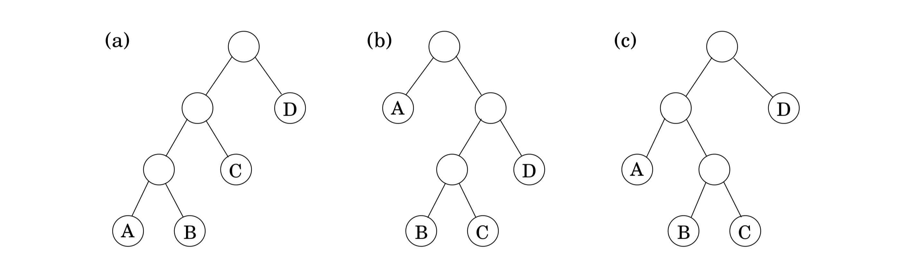

## 6.5 Chain Matrix Multiplication


Suppose that we want to multiply four matrices, $A \times B \times C \times D$, of dimensions $50 \times 20, 20 \times 1, 1 \times 10$, and $10 \times 100$, respectively (Figure 6.6).


&nbsp;

This will involve iteratively multiplying two matrices at a time. Matrix multiplication is not commutative (in general, $A \times B \neq B \times A$), but it is associative, which means for instance that $A \times (B \times C) = (A \times B) \times C$. Thus we can compute our product of four matrices in many different ways, depending on how we parenthesize it. Are some of these better than others?

Multiplying an $m \times n$ matrix by an $n \times p$ matrix takes $mnp$ multiplications, to a good enough approximation. Using this formula, let's compare several different ways of evaluating $A \times B \times C \times D$:

$$\begin{array}{c | c | c}
\text{parenthesization} & \text{cost computation} & \text{cost} \\
A \times ((B \times C) \times D) & 20 \cdot 1 \cdot 10 + 20 \cdot 10 \cdot 100 + 50 \cdot 20 \cdot 100 & 120,200 \\
(A \times (B \times C)) \times D & 20 \cdot 1 \cdot 10 + 50 \cdot 20 \cdot 10 + 50 \cdot 10 \cdot 100 & 60,200 \\
(A \times B) \times (C \times D) & 50 \cdot 20 \cdot 1 + 1 \cdot 10 \cdot 100 + 50 \cdot 1 \cdot 100 & 7,000 \\
\end{array}$$

As you can see, the order of multiplications makes a big difference in the final running time! Moreover, the natural greedy approach, to always perform the cheapest matrix multiplication available, leads to the second parenthesization shown here and is therefore a failure.

How do we determine the optimal order, if we want to compute $A_1 \times A_2 \times \cdots \times A_n$, where the $A_i$'s are matrices with dimensions $m_0 \times m_1, m_1 \times m_2, \ldots, m_{n-1} \times m_n$, respectively?

The first thing to notice is that a particular parenthesization can be represented very naturally by a binary tree in which the individual matrices correspond to the leaves, the root is the final product, and interior nodes are intermediate products (Figure 6.7).



&nbsp;

The possible orders in which to do the multiplication correspond to the various full binary trees with $n$ leaves, whose number is exponential in $n$ (Exercise 2.13). We certainly cannot try each tree, and with brute force thus ruled out, we turn to dynamic programming. The binary trees of Figure 6.7 are suggestive: for a tree to be optimal, its subtrees must also be optimal.

What are the subproblems corresponding to the subtrees? They are products of the form $A_i \times A_{i+1} \times \cdots \times A_j$. Let's see if this works: for $1 \leq i \leq j \leq n$, define
$$C(i, j) = \text{minimum cost of multiplying $A_i \times A_{i+1} \times \cdots \times A_j$}.$$

The size of this subproblem is the number of matrix multiplications, $|j - i|$. The smallest subproblem is when $i = j$, in which case there's nothing to multiply, so $C(i, i) = 0$. For $j > i$, consider the optimal subtree for $C(i, j)$. The first branch in this subtree, the one at the top, will split the product in two pieces, of the form $A_i \times \cdots \times A_k$ and $A_{k+1} \times \cdots \times A_j$, for some $k$ between $i$ and $j$.

The cost of the subtree is then the cost of these two partial products, plus the cost of combining them: $C(i, k) + C(k + 1, j) + m_{i-1} \cdot m_k \cdot m_j$. And we just need to find the splitting point k for which this is smallest:
$$C(i, j) = \min_{i \leq k < j} \{C(i, k) + C(k + 1, j) + m_{i-1} \cdot m_k \cdot m_j\}.$$

We are ready to code! In the following, the variable $s$ denotes subproblem size.

```python
def cost():
  for i = 1 to n:
    C(i, i) = 0
  for s = 1 to n - 1:
    for i = 1 to n - s:
      j = i + s
      C(i, j) = min(C(i, k) + C(k + 1, j) + m_{i-1} · m_k · m_j : i ≤ k < j)
  return C(1, n)
```

The subproblems constitute a two-dimensional table, each of whose entries takes $O(n)$ time to compute. The overall running time is thus $O(n^3)$.
