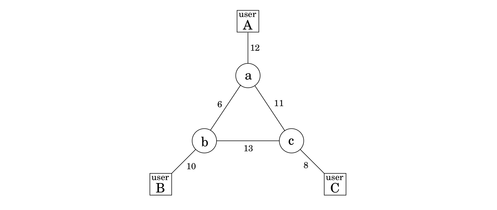

## An Introduction to Linear Programming

In a linear programming problem we are given a set of variables, and we want to assign real values to them so as to

1. satisfy a set of linear equations and/or linear inequalities involving these variables and

2. maximize or minimize a given linear objective function.

&nbsp;


### 7.1.1 Example: profit maximization

A boutique chocolatier has two products: its flagship assortment of triangular chocolates, called *Pyramide*, and the more decadent and deluxe *Pyramide Nuit*. How much of each should it produce to maximize profits? Let's say it makes $x_1$ boxes of Pyramide per day, at a profit of $\$1$ each, and $x_2$ boxes of Nuit, at a more substantial profit of $\$6$ apiece; $x_1$ and $x_2$ are unknown values that we wish to determine.

But this is not all; there are also some constraints on $x_1$ and $x_2$ that must be accommodated (besides the obvious one, $x_1, x_2 \geq 0$). First, the daily demand for these exclusive chocolates is limited to at most $200$ boxes of Pyramide and $300$ boxes of Nuit. Also, the current workforce can produce a total of at most $400$ boxes of chocolate per day. What are the optimal levels of production?

We represent the situation by a **linear program**, as follows.

$$\begin{matrix}
\text{Objective function} & \max\ x_1 + 6x_2   \\
\text{constraints}        & x_1 \leq 200       \\
                          & x_2 \leq 300       \\
                          & x_1 + x_2 \leq 400 \\
                          & x_1, x_2 \geq 0    \\
\end{matrix}$$

A linear equation in $x_1$ and $x_2$ defines a line in the two-dimensional ($2D$) plane, and a linear inequality designates a **half-space**, the region on one side of the line. Thus the set of all **feasible solutions** of this linear program, that is, the points $(x_1, x_2)$ which satisfy all constraints, is the intersection of five half-spaces. It is a convex polygon, shown in Figure 7.1.


We want to find the point in this polygon at which the objective function—the profit—is maximized. The points with a profit of $c$ dollars lie on the line $x_1 + 6x_2 = c$, which has a slope of $-1 / 6$ and is shown in Figure 7.1 for selected values of $c$. As $c$ increases, this "profit line" moves parallel to itself, up and to the right. Since the goal is to maximize $c$, we must move the line as far up as possible, while still touching the feasible region.

The optimum solution will be the very last feasible point that the profit line sees and must therefore be a vertex of the polygon, as shown in the figure. If the slope of the profit line were different, then its last contact with the polygon could be an entire edge rather than a single vertex. In this case, the optimum solution would not be unique, but there would certainly be an optimum vertex.

It is a general rule of linear programs that the optimum is achieved at a vertex of the feasible region. The only exceptions are cases in which there is no optimum; this can happen in two ways:

1. The linear program is *infeasible*; that is, the constraints are so tight that it is impossible to satisfy all of them. For instance,
$$x \leq 1, x \geq 2.$$

2. The constraints are so loose that the feasible region is unbounded, and it is possible to achieve arbitrarily high objective values. For instance,
$$\begin{matrix} \max\ x_1 + x_2 \\ x_1, x_2 \geq 0 \end{matrix}.$$


### Solving Linear Programs

Linear programs $(\text{LP})$ can be solved by the **simplex method**, devised by George Dantzig in 1947. We shall explain it in more detail in Section 7.6, but briefly, this algorithm starts at a vertex, in our case perhaps $(0, 0)$, and repeatedly looks for an adjacent vertex (connected by an edge of the feasible region) of better objective value. In this way it does *hill-climbing* on the vertices of the polygon, walking from neighbor to neighbor so as to steadily increase profit along the way. Here's a possible trajectory.


Upon reaching a vertex that has no better neighbor, simplex declares it to be optimal and halts. Why does this *local* test imply *global* optimality? By simple geometry—think of the profit line passing through this vertex. Since all the vertex's neighbors lie below the line, the rest of the feasible polygon must also lie below this line.


### More Products

Encouraged by consumer demand, the chocolatier decides to introduce a third and even more exclusive line of chocolates, called *Pyramide Luxe*. One box of these will bring in a profit of $\$13$.

Let $x_1, x_2, x_3$ denote the number of boxes of each chocolate produced daily, with $x_3$ referring to Luxe. The old constraints on $x_1$ and $x_2$ persist, although the labor restriction now extends to $x_3$ as well: the sum of all three variables can be at most $400$. What's more, it turns out that Nuit and Luxe require the same packaging machinery, except that Luxe uses it three times as much, which imposes another constraint $x_2 + 3x_3 \leq 600$.

What are the best possible levels of production?

Here is the update linear program.

$$\begin{matrix}
\text{Objective function} & \max\ x_1 + 6x_2 + 13x_3 \\
\text{constraints}        & x_1 \leq 200             \\
                          & x_2 \leq 300             \\
                          & x_1 + x_2 + x_3 \leq 400 \\
                          & x_2 + 3_x3 \leq 600      \\
                          & x_1, x_2, x_3 \geq 0     \\
\end{matrix}$$

The space of solutions is now three-dimensional. Each linear equation defines a $3D$ plane, and each inequality a half-space on one side of the plane. The feasible region is an intersection of seven half-spaces, a polyhedron (Figure 7.2). Looking at the figure, can you decipher which inequality corresponds to each face of the polyhedron?


A profit of $c$ corresponds to the plane $x_1 + 6x_2 + 13x_3 = c$. As $c$ increases, this profit-plane moves parallel to itself, further and further into the positive orthant until it no longer touches the feasible region. The point of final contact is the optimal vertex: $(0, 300, 100)$, with total profit $\$3100$.

How would the simplex algorithm behave on this modified problem? As before, it would move from vertex to vertex, along edges of the polyhedron, increasing profit steadily. A possible trajectory is shown in Figure 7.2, corresponding to the following sequence of vertices and profits:

$$\begin{matrix} (0, 0, 0) \\ \$0 \end{matrix} \longrightarrow \begin{matrix} (200, 0, 0) \\ \$200 \end{matrix} \longrightarrow \begin{matrix} (200, 200, 0) \\ \$2800 \end{matrix}  \longrightarrow \begin{matrix} (0, 300, 100) \\ \$3100 \end{matrix} $$

Finally, upon reaching a vertex with no better neighbor, it would stop and declare this to be the optimal point. Once again by basic geometry, if all the vertex's neighbors lie on one side of the profit-plane, then so must the entire polyhedron.

What if we add a fourth line of chocolates, or hundreds more of them? Then the problem becomes high-dimensional, and hard to visualize. Simplex continues to work in this general setting, although we can no longer rely upon simple geometric intuitions for its description and justification. We will study the full-fledged simplex algorithm in Section 7.6.

In the meantime, we can rest assured in the knowledge that there are many professional, industrial-strength packages that implement simplex and take care of all the tricky details like numeric precision. In a typical application, the main task is therefore to correctly express the problem as a linear program. The package then takes care of the rest.

With this in mind, let's look at a high-dimensional application.

&nbsp;

> **A Magic Trick called Duality**
>
> Here is why you should believe that $(0, 300, 100)$, with a total profit of $\$3100$, is the optimum: Look back at the linear program. Add the second inequality to the third, and add to them the fourth multiplied by $4$. The result is the inequality $x_1 + 6x_2 + 13x_3 \leq 3100$.
>
> Do you see? This inequality says that no feasible solution (values $x_1, x_2, x_3$ satisfying the constraints) can possibly have a profit greater than $3100$. So we must indeed have found the optimum! The only question is, where did we get these mysterious multipliers $(0, 1, 1, 4)$ for the four inequalities?
>
> In Section 7.4 we'll see that it is always possible to come up with such multipliers by solving another $\text{LP}$! Except that (it gets even better) we do not even need to solve this other $\text{LP}$, because it is in fact so intimately connected to the original one—it is called the *dual*—that solving the original $\text{LP}$ solves the dual as well! But we are getting far ahead of our story.

&nbsp;


### 7.1.2 Example: production planning

This time, our company makes handwoven carpets, a product for which the demand is extremely seasonal. Our analyst has just obtained demand estimates for all months of the next calendar year: $d_1, d_2, \cdots, d_{12}$. As feared, they are very uneven, ranging from $440$ to $920$.

Here's a quick snapshot of the company. We currently have $30$ employees, each of whom makes $20$ carpets per month and gets a monthly salary of $\$2,000$. We have no initial surplus of carpets.

How can we handle the fluctuations in demand? There are three ways:

1. Overtime, but this is expensive since overtime pay is $80\%$ more than regular pay. Also, workers can put in at most $30\%$ overtime.

2. Hiring and firing, but these cost $\$320$ and $\$400$, respectively, per worker.

3. Storing surplus production, but this costs $\$8$ per carpet per month. We currently have no stored carpets on hand, and we must end the year without any carpets stored.

This rather involved problem can be formulated and solved as a linear program!

A crucial first step is defining the variables.

$$\begin{aligned}
w_i &= \text{number of workers during $i$th month}; w_0 = 30. \\
x_i &= \text{number of carpets made during $i$th month.} \\
o_i &= \text{number of carpets made by overtime in month $i$.} \\
h_i, f_i &= \text{number of workers hired and fired, respectively, at beginning of month $i$.} \\
s_i &= \text{number of carpets stored at each month $i$}; s_0 = 0. \\
\end{aligned}$$

All in all, there are $72$ variables ($74$ if you count $w_0$ and $s_0$).

We now write the constraints. First, all variables must be nonnegative:
$$w_i, x_i, o_i, h_i, f_i, s_i \geq 0, \ \ i = 1, \cdots, 12.$$

The total number of carpets made per month consists of regular production plus overtime (one constraint for each $i = 1, \cdots, 12$):
$$x_i = 20w_i + o_i.$$

The number of workers can potentially change at the start of each month:
$$w_i = w_{i-1} + h_i - f_i.$$

The number of carpets stored at the end of each month is what we started with, plus the number we made, minus the demand for the month:
$$s_i = s_{i-1} + x_i - d_i.$$

And overtime is limited:
$$o_i \leq 6w_i$$

Finally, what is the objective function? It is to minimize the total cost, a linear function of the variables:
$$\min\ 2000 \sum_i w_i + 320 \sum_i h_i + 400 \sum_i f_i + 8 \sum_i s_i + 180 \sum_i o_i.$$

Solving this linear program by simplex should take less than a second and will give us the optimum business strategy for our company.

Well, almost. The optimum solution might turn out to be *fractional*; for instance, it might involve hiring $10.6$ workers in the month of March. This number would have to be rounded to either $10$ or $11$ in order to make sense, and the overall cost would then increase correspondingly.

In the present example, most of the variables take on fairly large (double-digit) values, and thus rounding is unlikely to affect things too much. There are other $\text{LP}$s, however, in which rounding decisions have to be made very carefully in order to end up with an integer solution of reasonable quality.

In general, there is a tension in linear programming between the ease of obtaining fractional solutions and the desirability of integer ones. As we shall see in Chapter 8, finding the optimum integer solution of an $\text{LP}$ is an important but very hard problem, called *integer linear programming*.

&nbsp;

### 7.1.3 Example: optimum bandwidth allocation

Next we turn to a miniaturized version of the kind of problem a network service provider might face.

Suppose we are managing a network whose lines have the bandwidths shown in Figure 7.3, and we need to establish three connections: between users $A$ and $B$, between $B$ and $C$, and between $A$ and $C$. Each connection requires at least two units of bandwidth, but can be assigned more. Connection $A-B$ pays $\$3$ per unit of bandwidth, and connections $B-C$ and $A-C$ pay $\$2$ and $\$4$, respectively.

Each connection can be routed in two ways, a long path and a short path, or by a combination: for instance, two units of bandwidth via the short route, one via the long route. How do we route these connections to maximize our network's revenue?



This is a linear program. We have variables for each connection and each path (long or short); for example, $x_{AB}$ is the short-path bandwidth allocated to the connection between $A$ and $B$, and $x_{AB}'$ the long-path bandwidth for this same connection. We demand that no edge's bandwidth is exceeded and that each connection gets a bandwidth of at least $2$ units.

$$\begin{matrix}
\text{Objective function} & \max \ 3x_{AB} + 3x_{AB}' + 2x_{BC} + 2x_{BC}' + 4x_{AC} + 4x_{AC}' & \\
\text{constraints}        & x_{AB} + x_{AB}' + x_{BC} + x_{BC}' \leq 10 & [\text{edge} (b, B)]  \\
                          & x_{AB} + x_{AB}' + x_{AC} + x_{AC}' \leq 12 & [\text{edge} (a, A)]  \\
                          & x_{BC} + x_{BC}' + x_{AC} + x_{AC}' \leq  8 & [\text{edge} (c, C)]  \\
                          & x_{AB} + x_{BC}' + x_{AC}' \leq  6 & [\text{edge} (a, b)]  \\
                          & x_{AB}'+ x_{BC}  + x_{AC}' \leq 13 & [\text{edge} (b, c)]  \\
                          & x_{AB}'+ x_{BC}' + x_{AC}  \leq 11 & [\text{edge} (a, c)]  \\
                          & x_{AB} + x_{AB}' \geq 2 & \\
                          & x_{BC} + x_{BC}' \geq 2 & \\
                          & x_{AC} + x_{AC}' \geq 2 & \\
 \end{matrix}$$

 Even a tiny example like this one is hard to solve on one's own (try it!), and yet the optimal solution is obtained instantaneously via simplex:
 $$x_{AB} = 0, x_{AB}' = 7, x_{BC} = x_{BC}' = 1.5, x_{AC} = 0.5, x_{AC}' = 4.5.$$

 This solution is not integral, but in the present application we don't need it to be, and thus no rounding is required. Looking back at the original network, we see that every edge except $a-c$ is used at full capacity.

 One cautionary observation: our $\text{LP}$ has one variable for every possible path between the users. In a larger network, there could easily be exponentially many such paths, and therefore this particular way of translating the network problem into an $\text{LP}$ will not scale well. We will see a cleverer and more scalable formulation in Section 7.2.

 Here's a parting question for you to consider. Suppose we removed the constraint that each connection should receive at least two units of bandwidth. Would the optimum change?

 &nbsp;

 > **Reductions**
 >
 > Sometimes a computational task is sufficiently general that any subroutine for it can also be used to solve a variety of other tasks, which at first glance might seem unrelated. For instance, we saw in Chapter 6 how an algorithm for finding the longest path in a $\text{DAG}$ can, surprisingly, also be used for finding longest increasing subsequences. We describe this phenomenon by saying that the longest increasing subsequence problem reduces to the longest path problem in a $\text{DAG}$. In turn, the longest path in a $\text{DAG}$ reduces to the shortest path in a $\text{DAG}$; here's how a subroutine for the latter can be used to solve the former:
 >
 > ```python
 > function LONGEST PATH(G)
 >   negate all edge weights of G
 >   return SHORTEST PATH(G)
 > ```
 >
 > Let's step back and take a slightly more formal view of reductions. If any subroutine for task $Q$ can also be used to solve $P$, we say $P$ reduces to $Q$. Often, $P$ is solvable by a single call to $Q$'s subroutine, which means any instance $x$ of $P$ can be transformed into an instance $y$ of $Q$ such that $P (x)$ can be deduced from $Q(y)$:
 >
 > 
 >
 > (Do you see that the reduction from $P = \text{LONGEST PATH}$ to $Q = \text{SHORTEST PATH}$ follows this schema?) If the pre- and post-processing procedures are efficiently computable then this creates an efficient algorithm for $P$ out of *any* efficient algorithm for $Q$!
 >
 > Reductions enhance the power of algorithms: Once we have an algorithm for problem $Q$ (which could be shortest path, for example) we can use it to solve other problems. In fact, most of the computational tasks we study in this book are considered core computer science problems precisely because they arise in so many different applications, which is another way of saying that many problems reduce to them. This is especially true of linear programming.
 >

 &nbsp;


### 7.1.4 Variants of Linear Programming

As evidenced in our examples, a general linear program has many degrees of freedom.

1. It can be either a maximization or a minimization problem.

2. Its constraints can be equations and/or inequalities.

3. The variables are often restricted to be nonnegative, but they can also be unrestricted in sign.


We will now show that these various $\text{LP}$ options can all be reduced to one another via simple transformations. Here's how.

1. To turn a maximization problem into a minimization (or vice versa), just multiply the coefficients of the objective function by $-1$.

2. To turn an inequality constraint like  $$\sum_{i=1}^n a_i x_i \leq b$$  into an equation, introduce a new variable $s$ and use $$\begin{aligned} \sum_{i=1}^{n} a_i x_i + s \ &= b \\ s \ &\geq 0. \\ \end{aligned}$$  

    This $s$ is called the *slack variable* for the inequality. As justification, observe that a vector $(x_1, \cdots, x_n)$ satisfies the original inequality constraint if and only if there is some $s \geq 0$ for which it satisfies the new equality constraint.

3. To change an equality constraint into inequalities is easy: rewrite $ax = b$ as the equivalent pair of constraints $ax \leq b$ and $ax \geq b$.

4. Finally, to deal with a variable $x$ that is unrestricted in sign, do the following:

    * Introduce two nonnegative variables, $x^+, x^- \geq 0$.

    * Replace $x$, wherever it occurs in the constraints or the objective function, by $x^+ - x^-$.

    This way, $x$ can take on any real value by appropriately adjusting the new variables. More precisely, any feasible solution to the original $\text{LP}$ involving $x$ can be mapped to a feasible solution of the new $\text{LP}$ involving $x^+$, $x^-$, and vice versa.


By applying these transformations we can reduce any $\text{LP}$ (maximization or minimization, with both inequalities and equations, and with both nonnegative and unrestricted variables) into an $\text{LP}$ of a much more constrained kind that we call the standard form, in which the variables are all nonnegative, the constraints are all equations, and the objective function is to be minimized.

For example, our first linear program gets rewritten thus:

$$\begin{matrix} \max\ x_1 + 6x_2 \\ x_1 \leq 200 \\ x_2 \leq 300 \\ x_1 + x_2 \leq 400 \\ x_1, x_2 \geq 0 \end{matrix} \ \Longrightarrow\ \begin{matrix} \min\ -x_1 - 6x_2 \\ x_1 + s_1 = 200 \\ x_2 + s_2 = 300 \\ x_1 + x_2 + s_3 = 400 \\ x_1, x_2, s_1, s_2, s_3 \geq 0 \end{matrix}$$

The original was also in a useful form: maximize an objective subject to certain inequalities. Any $\text{LP}$ can likewise be recast in this way, using the reductions given earlier.

&nbsp;

> **Matrix-vector notation**
>
> A linear function like $x_1 + 6x_2$ can be written as the dot product of two vectors $$\textbf{c} = \begin{bmatrix} 1 \\ 6 \end{bmatrix}\ \text{and}\ \textbf{x} = \begin{bmatrix} x_1 \\ x_2 \end{bmatrix},$$ denoted
$\textbf{c} \cdot \textbf{x}$ or $\textbf{c}^{\top}\textbf{x}$. Similarly, linear constraints can be compiled into matrix-vector form:
$$\begin{matrix} x_1 & & & \leq 200 \\ & & x_2 & \leq 300 \\ x_1 & + & x_2 & \leq 400 \end{matrix} \ \Longrightarrow\ \underbrace{\begin{bmatrix} 1 & 0 \\ 0 & 1 \\ 1 & 1 \end{bmatrix}}_{\textbf{A}} \begin{bmatrix} x_1 \\ x_2 \end{bmatrix} \leq \underbrace{\begin{bmatrix} 200 \\ 300 \\ 400 \end{bmatrix}}_{\textbf{b}}.$$
>
> Here each row of matrix $\textbf{A}$ corresponds to one constraint: its dot product with $\textbf{x}$ is at most the value in the corresponding row of $\textbf{b}$. In other words, if the rows of $\textbf{A}$ are the vectors $\textbf{a}_1, \cdots, \textbf{a}_m$, then the statement $\textbf{A}\textbf{x} \leq \textbf{b}$ is equivalent to
$$a_i \cdot \textbf{x} \leq b_i \ \forall i = 1, \cdots, m$$
>
> With these notational conveniences, a generic $\text{LP}$ can be expressed simply as
$$\begin{matrix} \max\ \textbf{c}^{\top} \textbf{x} \\ \textbf{Ax} \leq \textbf{b} \\ \textbf{x} \geq 0. \end{matrix}$$
>
