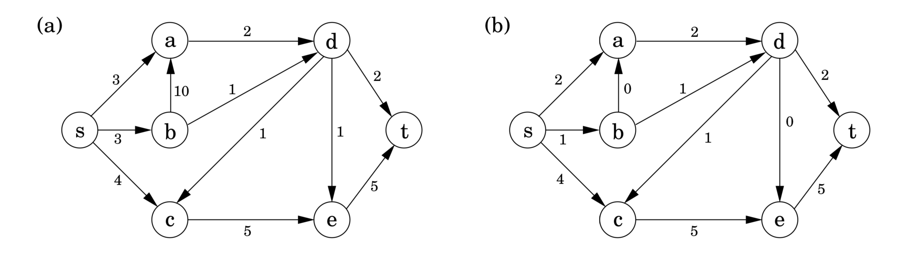
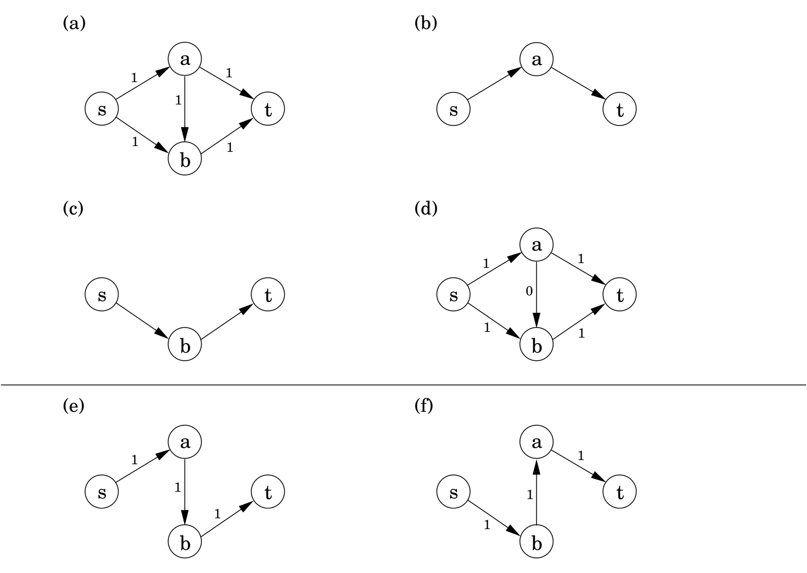
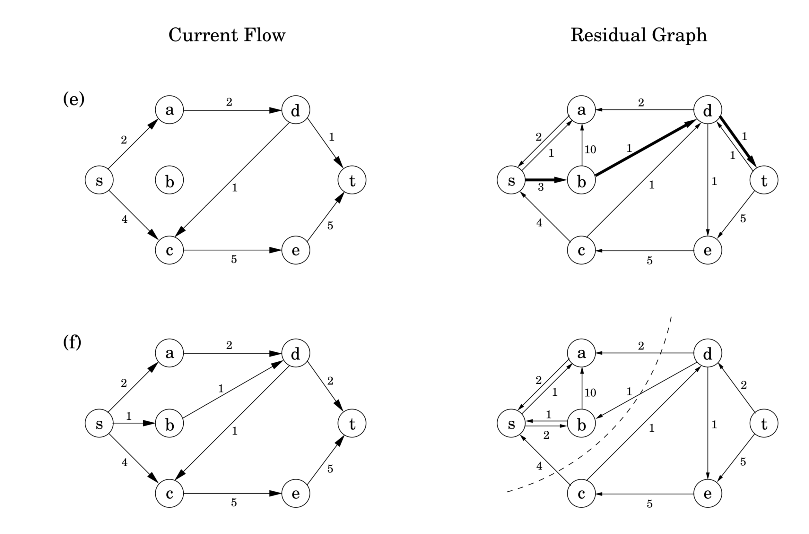

## 7.2 Flows in Networks

&nbsp;

### 7.2.1 Example: shipping oil

Figure 7.4(a) shows a directed graph representing a network of pipelines along which oil can be sent. The goal is to ship as much oil as possible from the *source* $s$ to the *sink* $t$. Each pipeline has a maximum *capacity* it can handle, and there are no opportunities for storing oil en route. Figure 7.4(b) shows a possible *flow* from $s$ to $t$, which ships $7$ units in all. Is this the best that can be done?

&nbsp;

### 7.2.2 Maximizing Flow

The networks we are dealing with consist of a directed graph $G = (V, E)$; two special nodes $s, t \in V$, which are respectively a source and sink of $G$ and *capacities* $c_e > 0$ on the edges.

We would like to send as much oil as possible from $s$ to $t$ without exceeding the capacities of any of the edges. A particular shipping scheme is called a *flow* and consists of a variable $f_e$ for each edge $e$ of the network, satisfying the following two properties:

1. It doesn't violate edge capacities: $0 \leq f_e \leq c_e$ for all $e \in E$.

2. For all nodes $u$ except $s$ and $t$, the amount of flow entering $u$ equals the amount leaving $u$: $$\sum_{(w, u) \in E} f_{wu} = \sum_{(u, z) \in E} f_{uz}.$$

In other words, flow is *conserved*.

The *size* of a flow is the total quantity sent from $s$ to $t$ and, by the conservation principle, is equal to the quantity leaving $s$: $$\text{size}(f) = \sum_{(s, u) \in E} f_{su}.$$

In short, our goal is to assign values to $\{f_e : e \in E\}$ that will satisfy a set of linear constraints and maximize a linear objective function. But this is a linear program! *The maximum-flow problem reduces to linear programming.*

For example, for the network of Figure 7.4 the $\text{LP}$ has $11$ variables, one per edge. It seeks to maximize $f_{sa} + f_{sb} + f_{sc}$ subject to a total of $27$ constraints: $11$ for nonnegativity (such as $f_{sa} \geq 0$), $11$ for capacity (such as $f_{sa} \leq 3$), and $5$ for flow conservation (one for each node of the graph other than $s$ and $t$, such as $f_{sc} + f_{dc} = f_{ce}$). Simplex would take no time at all to correctly solve the problem and to confirm that, in our example, a flow of $7$ is in fact optimal.

&nbsp;

### 7.2.3 A Closer Look at the Algorithm

All we know so far of the simplex algorithm is the vague geometric intuition that it keeps making local moves on the surface of a convex feasible region, successively improving the objective function until it finally reaches the optimal solution. Once we have studied it in more detail (Section 7.6), we will be in a position to understand exactly how it handles flow $\text{LP}$s, which is useful as a source of inspiration for designing *direct* max-flow algorithms.

It turns out that in fact the behavior of simplex has an elementary interpretation:

1. Start with zero flow.

2. Repeat: choose an appropriate path from $s$ to $t$, and increase flow along the edges of this path as much as possible.

Figure 7.5(a)-(d) shows a small example in which simplex halts after two iterations. The final flow has size $2$, which is easily seen to be optimal.

There is just one complication. What if we had initially chosen a different path, the one in Figure 7.5(e)? This gives only one unit of flow and yet seems to block all other paths. Simplex gets around this problem by also allowing paths to *cancel existing flow*. In this particular case, it would subsequently choose the path of Figure 7.5(f). Edge $(b, a)$ of this path isn't in the original network and has the effect of canceling flow previously assigned to edge $(a, b)$.

To summarize, in each iteration simplex looks for an $s-t$ path whose edges $(u, v)$ can be of two types:

1. $(u, v)$ is in the original network, and is not yet at full capacity.

2. The reverse edge $(v, u)$ is in the original network, and there is some flow along it.

If the current flow is $f$,then in the first case, edge $(u,v)$ can handle up to $c_{uv} - f_{uv}$ additional units of flow, and in the second case, up to $f_{vu}$ additional units (canceling all or part of the existing flow on $(v, u)$). These flow-increasing opportunities can be captured in a *residual network* $G^f=(V, E^f)$, which has exactly the two types of edges listed, with residual capacities:
$$c^f = \begin{cases} c_{uv} - f_{uv} & \text{if $(u, v) \in E$ and $f_{uv} < c_{uv}$} \\ f_{uv} & \text{if $(v, u) \in E$ and $f_{uv} > 0$} \end{cases}$$

Thus we can equivalently think of simplex as choosing an $s-t$ path in the residual network.

By simulating the behavior of simplex, we get a direct algorithm for solving max-flow. It proceeds in iterations, each time explicitly constructing $G^f$ , finding a suitable $s-t$ path in $G^f$ by using, say, a linear-time breadth-first search, and halting if there is no longer any such path along which flow can be increased.

Figure 7.6 illustrates the algorithm on our oil example.

&nbsp;

### 7.2.4 A Certificate of Optimality

Now for a truly remarkable fact: not only does simplex correctly compute a maximum flow, but it also generates a short proof of the optimality of this flow!

Let's see an example of what this means. Partition the nodes of the oil network (Figure 7.4) into two groups, $L = \{s, a, b\}$ and $R = \{c, d, e, t\}$:

Any oil transmitted must pass from $L$ to $R$. Therefore, no flow can possibly exceed the total capacity of the edges from $L$ to $R4, which is $7$. But this means that the flow we found earlier, of size $7$, must be optimal!

More generally, an $(s, t)$-cut partitions the vertices into two disjoint groups $L$ and $R$ such that $s$ is in $L$ and $t$ is in $R$. Its capacity is the total capacity of the edges from $L$ to $R$, and as argued previously, is an upper bound on any flow:

* Pick any flow $f$ and any $(s, t)$-cut $(L, R)$. Then $\text{size}(f) \leq \text{capacity}(L, R)$.

Some cuts are large and give loose upper bounds—cut $(\{s, b, c\}, \{a, d, e, t\})$ has a capacity of $19$. But there is also a cut of capacity $7$, which is effectively a *certificate of optimality* of the maximum flow. This isn't just a lucky property of our oil network; such a cut *always* exists.

&nbsp;

### Max-flow Min-Cut Theorem

**Max-flow Min-Cut Theorem** The size of the maximum flow in a network equals the capacity of the smallest $(s, t)$-cut.

Moreover, our algorithm automatically finds this cut as a by-product!

Let's see why this is true. Suppose $f$ is the final flow when the algorithm terminates. We know that node $t$ is no longer reachable from $s$ in the residual network $G^f$ . Let $L$ be the nodes that are reachable from $s$ in $G^f$, and let $R = V - L$ be the rest of the nodes. Then $(L, R)$ is a cut in the graph $G$:

We claim $$\text{size}(f) = \text{capacity}(L, R).$$

To see this, observe that by the way $L$ is defined, any edge going from $L$ to $R$ must be at full capacity (in the current flow $f$), and any edge from $R$ to $L$ must have zero flow. (So, in the figure, $f_{e} = c_{e}$ and $f_{e'} = 0$.) Therefore the net flow across $(L, R)$ is exactly the capacity of the cut.

&nbsp;

### Efficiency

Each iteration of our maximum-flow algorithm is efficient, requiring $O(|E|)$ time if a depth-first or breadth-first search is used to find an $s-t$ path. But how many iterations are there?

Suppose all edges in the original network have *integer* capacities $\leq C$. Then an inductive argument shows that on each iteration of the algorithm, the flow is always an integer and increases by an integer amount. Therefore, since the maximum flow is at most $C|E|$ (why?), it follows that the number of iterations is at most this much. But this is hardly a reassuring bound: what if $C$ is in the millions?

We examine this issue further in Exercise 7.31. It turns out that it is indeed possible to construct bad examples in which the number of iterations is proportional to $C$, *if* $s - t$ paths are not carefully chosen. However, if paths are chosen in a sensible manner—in particular, by using a breadth-first search, which finds the path with the fewest edges—then the number of iterations is at most $O(|V | \cdot |E|)$, no matter what the capacities are. This latter bound gives an overall running time of $O(|V | \cdot |E|^2)$ for maximum flow.
