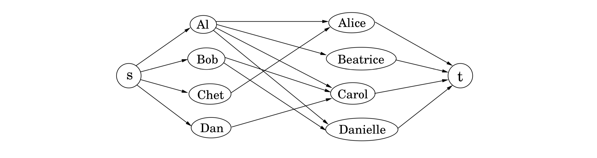

## 7.3 Bipartite Matching

Figure 7.7 shows a graph with four nodes on the left representing boys and four nodes on the right representing girls.[^1] There is an edge between a boy and girl if they like each other (for instance, Al likes all the girls). Is it possible to choose couples so that everyone has exactly one partner, and it is someone they like? In graph-theoretic jargon, is there a *perfect matching*?

&nbsp;

This matchmaking game can be reduced to the maximum-flow problem, and thereby to linear programming! Create a new source node, $s$, with outgoing edges to all the boys; a new sink node, $t$, with incoming edges from all the girls; and direct all the edges in the original bipartite graph from boy to girl (Figure 7.8). Finally, give every edge a capacity of $1$. Then there is a perfect matching if and only if this network has a flow whose size equals the number of couples. Can you find such a flow in the example?

Actually, the situation is slightly more complicated than just stated: what is easy to see is that the optimum *integer-valued* flow corresponds to the optimum matching. We would be at a bit of a loss interpreting a flow that ships 0.7 units along the edge Al-Carol, for instance! Fortunately, the maximum-flow problem has the following property: *if all edge capacities are integers, then the optimal flow found by our algorithm is integral*. We can see this directly from the algorithm, which in such cases would increment the flow by an integer amount on each iteration.

Hence integrality comes for free in the maximum-flow problem. Unfortunately, this is the exception rather than the rule: as we will see in Chapter 8, it is a very difficult problem to find the optimum solution (or for that matter, *any* solution) of a general linear program, if we also demand that the variables be integers.

[^1]: This kind of graph, in which the nodes can be partitioned into two groups such that all edges are *between* the groups, is called *bipartite*.
