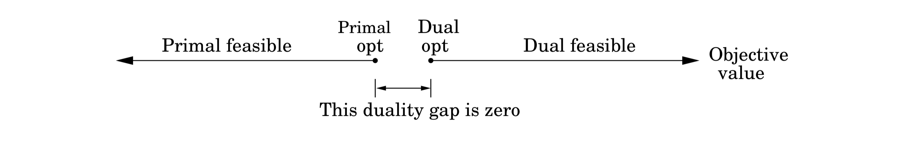

## 7.4 Duality

We have seen that in networks, flows are smaller than cuts, but the maximum flow and minimum cut exactly coincide and each is therefore a certificate of the other's optimality. Remarkable as this phenomenon is, we now generalize it from maximum flow to *any* problem that can be solved by linear programming! It turns out that every linear maximization problem has a *dual* minimization problem, and they relate to each other in much the same way as flows and cuts.

To understand what duality is about, recall our introductory $\text{LP}$ with the two types of chocolate:

$$\begin{aligned}
\max\ x_1 &+\ 6x_2  \\
x_1       &\leq 200 \\
x_2       &\leq 300 \\
x_1 + x_2 &\leq 400 \\
x_1, x_2  &\geq 0   \\
\end{aligned}$$

Simplex declares the optimum solution to be $(x_1, x_2) = (100, 300)$, with objective value $1900$. Can this answer be checked somehow? Let's see: suppose we take the first inequality and add it to six times the second inequality. We get $$x_1 + 6x_2 \leq 2000.$$

This is interesting, because it tells us that it is impossible to achieve a profit of more than $2000$. Can we add together some other combination of the $\text{LP}$ constraints and bring this upper bound even closer to $1900$? After a little experimentation, we find that multiplying the three inequalities by $0, 5,$ and $1$, respectively, and adding them up yields $$x_1 + 6x_2 \leq 1900.$$

So $1900$ must indeed be the best possible value! The multipliers $(0, 5, 1)$ magically constitute a *certificate of optimality*! It is remarkable that such a certificate exists for this $\text{LP}$—and even if we knew there were one, how would we systematically go about finding it?

Let's  investigate the issue by describing what we expect of these three multipliers, call them $y_1, y_2, y_3$.

$$
\begin{array}{c c}
\text{Multiplier} & \text{Inequality} \\
\begin{matrix} y_1 \\ y_2 \\ y_3 \\ \end{matrix} &
\begin{matrix}
& & x_1 &   &     & \leq 200  \\
& &     &   & x_2 & \leq 300  \\
& & x_1 & + & x_2 & \leq 400  \\
\end{matrix}
\end{array}
$$

To start with, these $y_i$'s must be nonnegative, for otherwise they are unqualified to multiply inequalities (multiplying an inequality by a negative number would flip the $\leq$ to $\geq$). After the multiplication and addition steps, we get the bound: $$(y_1 + y_3)x_2 + (y_2 + y_3)x_2 \leq 200y_1 + 300y_2 + 400y_3.$$

We want the left-hand side to look like our objective function $x_1$ + $6x_2$ so that the right-hand side is an upper bound on the optimum solution. For this we need $y_1 + y_3$ to be $1$ and $y_2 + y_3$ to be $6$. Come to think of it, it would be fine if $y_1 + y_3$ were larger than $1$—the resulting certificate would be all the more convincing.

Thus, we get an upper bound
$$x_1 + 6x_2 \leq 200y_1 + 300y_3 + 400y_3$$
if
$$\begin{aligned}
y_1 + y_3    &\geq 1 \\
y_2 + y_3    &\geq 6 \\
y_1,y_2, y_3 &\geq 0
\end{aligned}$$

We can easily find $y$'s that satisfy the inequalities on the right by simply making them large enough, for example $(y1, y2, y3) = (5, 3, 6)$. But these particular multipliers would tell us that the optimum solution of the $\text{LP}$ is at most $200 \cdot 5 + 300 \cdot 3 + 400 \cdot 6 = 4300$, a bound that is far too loose to be of interest.

What we want is a bound that is as tight as possible, so we should minimize $200y_1 + 300y_2 + 400y_3$ subject to the preceding inequalities. *And this is a new linear program!*

Therefore, finding the set of multipliers that gives the best upper bound on our original $\text{LP}$ is tantamount to solving a new $\text{LP}$:
$$\begin{aligned}
\min\ 200y_1 + 300&y_2 + 400y_3 \\
y_1 + y_3 &\geq 1 \\
y_2 + y_3 &\geq 6 \\
y_1, y_2, y_3 &\geq 0
\end{aligned}$$

By design, any feasible value of this *dual* $\text{LP}$ is an upper bound on the original *primal* $\text{LP}$. So if we somehow find a pair of primal and dual feasible values that are equal, then they must both be optimal. Here is just such a pair:
$$\begin{matrix}\text{Primal}: (x_1, x_2) = (100, 300); & \text{Dual}: (y_1, y_2, y_3) = (0, 5, 1) \end{matrix}$$

They both have value $1900$, and therefore they certify each other's optimality (Figure 7.9).

Amazingly, this is not just a lucky example, but a general phenomenon. To start with, the preceding construction—creating a multiplier for each primal constraint; writing a constraint in the dual for every variable of the primal, in which the sum is required to be above the objective coefficient of the corresponding primal variable; and optimizing the sum of the multipliers weighted by the primal right-hand sides—can be carried out for any $\text{LP}$, as shown in Figure 7.10, and in even greater generality in Figure 7.11.

**Figure 7.10** A generic primal $\text{LP}$ in matrix-vector form, and its dual.

$$
\begin{array}{ccccc|ccccc}
&& \text{primal LP} &&&& \text{dual LP} && \\
\hline \\
&&
\begin{aligned}
\max\        &\textbf{c}^{\top}\textbf{x} \\
\text{s.t.}\ &\textbf{Ax} \leq \textbf{b} \\
​             & \phantom{\textbf{A}}\textbf{x} \geq 0
\\\end{aligned}
&&&&
\begin{aligned}
\min\        &\textbf{y}^{\top}\textbf{b} \\
\text{s.t.}\ &\textbf{y}^\top\textbf{A} \geq \textbf{c}^\top \\
​             & \phantom{\textbf{A}^\top}\textbf{y} \geq 0
\\\end{aligned}
&& \\
\\\end{array}
$$

**Figure 7.11** In the most general case of linear programming, we have a set $I$ of inequalities and a set $E$ of equalities (a total of $m = |I| + |E|$ constraints) over $n$ variables, of which a subset $N$ are constrained to be nonnegative. The dual has $m = |I| + |E|$ variables, of which only those corresponding to $I$ have non-negativity constraints.

$$
\begin{array}{ccccc|ccccc}
&& \text{primal LP} &&&& \text{dual LP} &&\\
\hline \\
&&
\begin{aligned}
\max\        &c_1x_1\phantom{i} + \cdots + c_nx_n \\
\text{s.t.}\ &a_{i1}x_1 + \cdots + a_{in}x_n \leq b_i,\ \forall i \in I \\
             &a_{i1}x_1 + \cdots + a_{in}x_n = b_i,\ \forall i \in E \\
             &x_j \geq 0,\ \forall j \in N \\
\\\end{aligned}
&&&&
\begin{aligned}
\min\        &b_1y_1\phantom{i} + \cdots + b_my_m \\
\text{s.t.}\ &a_{1j}y_1 + \cdots + a_{mj}y_m \geq c_j,\ \forall j \in N \\
             &a_{1j}y_1 + \cdots + a_{mj}y_m = c_j,\ \forall j \not\in N \\
             &y_i \geq 0,\ \forall i \in I \\
\\\end{aligned}
&& \\
\\\end{array}
$$

The second figure has one noteworthy addition: if the primal has an equality constraint, then the corresponding multiplier (or *dual variable*) need not be nonnegative, because the validity of equations is preserved when multiplied by negative numbers.

So, the multipliers of equations are unrestricted variables. Notice also the simple symmetry between the two $\text{LP}$s, in that the matrix $A = (a_{ij})$ defines one primal constraint with each of its *rows*, and one dual constraint with each of its *columns*.

By construction, any feasible solution of the dual is an upper bound on any feasible solution of the primal. But moreover, their optima coincide!

 &nbsp;

### Duality Theorem

**Duality Theorem**
If a linear program has a bounded optimum, then so does its dual, and the two optimum values coincide.

When the primal is the $\text{LP}$ that expresses the max-flow problem, it is possible to assign interpretations to the dual variables that show the dual to be none other than the minimum-cut problem (Exercise 7.25). The relation between flows and cuts is therefore just a specific instance of the duality theorem. And in fact, the proof of this theorem falls out of the simplex algorithm, in much the same way as the max-flow min-cut theorem fell out of the analysis of the max-flow algorithm.

&nbsp;

> **Visualizing Duality**
>
> One can solve the shortest-path problem by the following “analog” device: Given a weighted undirected graph, build a *physical model* of it in which each edge is a string of length equal to the edge's weight, and each node is a knot at which the appropriate endpoints of strings are tied together. Then to find the shortest path from $s$ to $t$, just pull $s$ away from $t$ until the gadget is taut. It is intuitively clear that this finds the shortest path from $s$ to $t$.
>
> 
>
> There is nothing remarkable or surprising about all this until we notice the following: the shortest-path problem is a *minimization problem*, right? Then why are we *pulling* $s$ away from $t$, an act whose purpose is, obviously, *maximization*? Answer: By pulling $s$ away from $t$ we solve the *dual* of the shortest-path problem! This dual has a very simple form (Exercise 7.28), with one variable $x_u$ for each node $u$: $$\begin{gathered} \max\ x_s - x_t \\ |x_u - x_v| \leq w_{uv} \ \text{for all edges $\{u, v\}$}\end{gathered}$$
>
> In words, the dual problem is to stretch $s$ and $t$ as far apart as possible, subject to the constraint that the endpoints of any edge $\{u, v\}$ are separated by a distance of at most $w_{uv}$.
