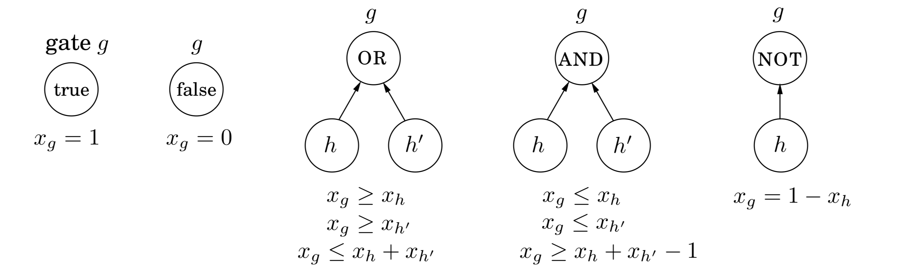

## 7.7 Postscript: Circuit Evaluation

The importance of linear programming stems from the astounding variety of problems that reduce to it and thereby bear witness to its expressive power. In a sense, this next one is the *ultimate* application.

We are given a *Boolean circuit*, that is, a $\text{DAG}$ of gates of the following types.

* *Input gates* have indegree zero, with value $\texttt{true}$ or $\texttt{false}$.

* $\text{AND}$ gates and $\text{OR}$ gates have indegree $2$.

* $\text{NOT}$ gates have indegree $1$.

* $\text{NOT}$ gates have indegree $1$.

In addition, one of the gates is designated as the *output*. Here's an example.

&nbsp;

The $\text{CIRCUIT VALUE}$ problem is the following: when the laws of Boolean logic are applied to the gates in topological order, does the output evaluate to $\texttt{true}$?

There is a simple, automatic way of translating this problem into a linear program. Create a variable $x_g$ for each gate $g$, with constraints $0 \leq x_g \leq 1$. Add additional constraints for each type of gate:

&nbsp;

These constraints force all the gates to take on exactly the right values—$0$ for $\texttt{false}$, and $1$ for $\texttt{true}$. We don't need to maximize or minimize anything, and we can read the answer off from the variable $x_o$ corresponding to the output gate.

This is a straightforward reduction to linear programming, from a problem that may not seem very interesting at first. However, the $\text{CIRCUIT VALUE}$ problem is in a sense *the most general problem solvable in polynomial time!* After all, any algorithm will eventually run on a computer, and the computer is ultimately a Boolean combinational circuit implemented on a chip.

If the algorithm runs in polynomial time, it can be rendered as a Boolean circuit consisting of polynomially many copies of the computer's circuit, one per unit of time, with the values of the gates in one layer used to compute the values for the next. Hence, the fact that $\text{CIRCUIT VALUE}$ reduces to linear programming means that *all problems that can be solved in polynomial time do!*

In our next topic, $\textbf{NP}$-completeness, we shall see that many *hard* problems reduce, much the same way, to *integer linear programming*, linear programming's difficult twin.

Another parting thought: by what other means can the circuit evaluation problem be solved? Let's think—a circuit is a $\text{DAG}$. And what algorithmic technique is most appropriate for solving problems on $\text{DAGs}$? That's right: dynamic programming! Together with linear programming, the world's two most general algorithmic techniques.
