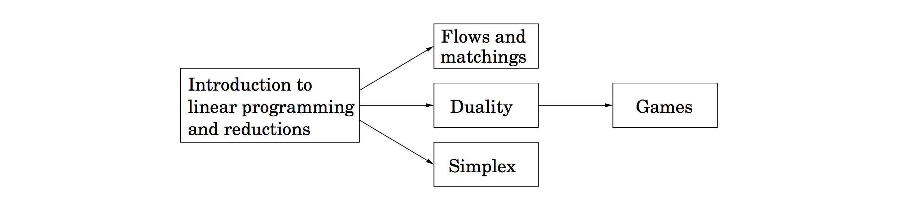

### Chapter 7
# Linear Programming and Reductions

Many of the problems for which we want algorithms are optimization tasks: the shortest path, the cheapest spanning tree, the longest increasing subsequence, and so on. In such cases, we seek a solution that

1. satisfies certain constraints (for instance, the path must use edges of the graph and lead from $s$ to $t$, the tree must touch all nodes, the subsequence must be increasing); and

2. is the best possible, with respect to some well-defined criterion, among all solutions that satisfy these constraints.

Linear programming describes a broad class of optimization tasks in which both the constraints and the optimization criterion are linear functions. It turns out an enormous number of problems can be expressed in this way. Given the vastness of its topic, this chapter is divided into several parts, which can be read separately subject to the following dependencies.

## Contents
1. [An Introduction To Linear Programming](/algorithms/Chapter7/7.1)
2. [Flows in Networks](/algorithms/Chapter7/7.2)
3. [Bipartite Matching](/algorithms/Chapter7/7.3)
4. [Duality](/algorithms/Chapter7/7.4)
5. [Zero-Sum Games](/algorithms/Chapter7/7.5)
6. [The Simplex Algorithm](/algorithms/Chapter7/7.6)
7. [Postscript: Circuit Evaluation](/algorithms/Chapter7/7.7)
8. [Exercises](/algorithms/Chapter7/7-ex.pdf)
