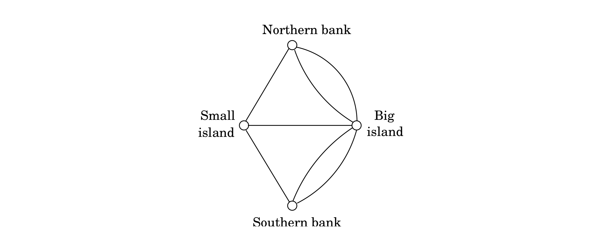
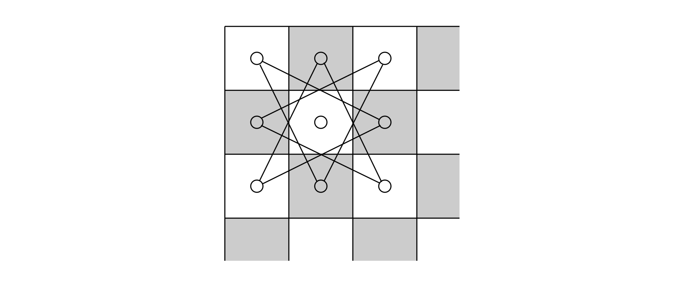
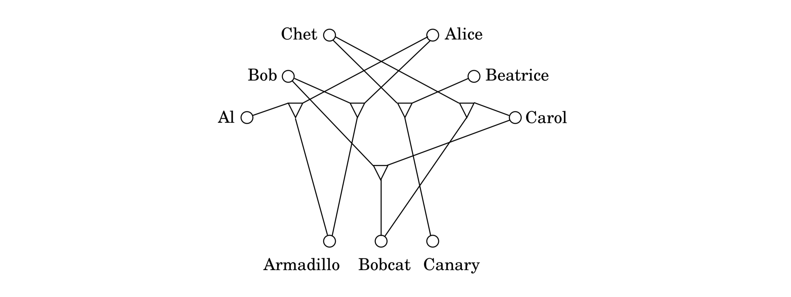
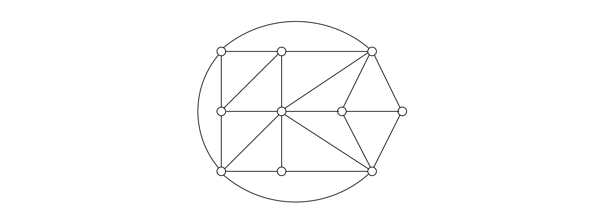

## 8.1 Search Problems

Over the past seven chapters we have developed algorithms for finding shortest paths and minimum spanning trees in graphs, matchings in bipartite graphs, maximum increasing subsequences, maximum flows in networks, and so on. All these algorithms are *efficient*, because in each case their time requirement grows as a polynomial function (such as $n$, $n^2$, or $n^3$) of the size of the input.

To better appreciate such efficient algorithms, consider the alternative: In all these problems we are searching for a solution (path, tree, matching, etc.) from among an *exponential* population of possibilities. Indeed, $n$ boys can be matched with $n$ girls in $n!$ different ways, a graph with $n$ vertices has $n^{n-2}$ spanning trees, and a typical graph has an exponential number of paths from $s$ to $t$.

All these problems could in principle be solved in exponential time by checking through all candidate solutions, one by one. But an algorithm whose running time is $2^{n}$, or worse, is all but useless in practice (see the next box). The quest for efficient algorithms is about finding clever ways to bypass this process of exhaustive search, using clues from the input in order to dramatically narrow down the search space.

So far in this book we have seen the most brilliant successes of this quest, algorithmic techniques that defeat the specter of exponentiality: greedy algorithms, dynamic programming, linear programming (while divide-and-conquer typically yields faster algorithms for problems we can already solve in polynomial time). Now the time has come to meet the quest's most embarrassing and persistent failures.

We shall see some other "search problems", in which again we are seeking a solution with particular properties among an exponential chaos of alternatives. But for these new problems no shortcut seems possible. The fastest algorithms we know for them are all exponential—not substantially better than an exhaustive search. We now introduce some important examples.

> **The Story of Sissa and Moore**
>
> According to the legend, the game of chess was invented by the Brahmin Sissa to amuse and teach his king. Asked by the grateful monarch what he wanted in return, the wise man requested that the king place one grain of rice in the first square of the chessboard, two in the second, four in the third, and so on, doubling the amount of rice up to the 64th square. The king agreed on the spot, and as a result he was the first person to learn the valuable—albeit humbling—lesson of *exponential growth*. Sissa's request amounted to $2^64 - 1 = 18,446,744,073,709,551,615$ grains of rice, enough rice to pave all of India several times over!
>
> All over nature, from colonies of bacteria to cells in a fetus, we see systems that grow exponentially—for a while. In 1798, the British philosopher T. Robert Malthus published an essay in which he predicted that the exponential growth (he called it "geometric growth") of the human population would soon deplete linearly growing resources, an argument that influenced Charles Darwin deeply. Malthus knew the fundamental fact that an exponential sooner or later takes over any polynomial.
>
> In 1965, computer chip pioneer Gordon E. Moore noticed that transistor density in chips had doubled every year in the early 1960s, and he predicted that this trend would continue. This prediction, moderated to a doubling every 18 months and extended to computer speed, is known as *Moore's law*. It has held remarkably well for 40 years. And these are the two root causes of the explosion of information technology in the past decades: *Moore's law and efficient algorithms*.
>
> It would appear that Moore's law provides a disincentive for developing polynomial algorithms. After all, if an algorithm is exponential, why not wait it out until Moore's law makes it feasible? But in reality the exact opposite happens: Moore's law is a huge incentive for developing efficient algorithms, because such algorithms are needed in order to take advantage of the exponential increase in computer speed.
>
> Here is why. If, for example, an $O(2^n)$ algorithm for Boolean satisfiability ($\text{SAT}$) were given an hour to run, it would have solved instances with 25 variables back in 1975, 31 variables on the faster computers available in 1985, 38 variables in 1995, and about 45 variables with today's machines. Quite a bit of progress—except that each extra variable requires a year and a half's wait, while the appetite of applications (many of which are, ironically, related to computer design) grows much faster.
>
> In contrast, the size of the instances solved by an $O(n)$ or $O(n\log{n})$ algorithm would be multiplied by a factor of about 100 each decade. In the case of an $O(n^2)$ algorithm, the instance size solvable in a fixed time would be multiplied by about 10 each decade. Even an $O(n^6)$ algorithm, polynomial yet unappetizing, would more than double the size of the instances solved each decade. When it comes to the growth of the size of problems we can attack with an algorithm, we have a reversal: *exponential algorithms make polynomially slow progress, while polynomial algorithms advance exponentially fast!* For Moore's law to be reflected in the world we *need* efficient algorithms.
>
> As Sissa and Malthus knew very well, exponential expansion cannot be sustained in- definitely in our finite world. Bacterial colonies run out of food; chips hit the atomic scale. Moore's law will stop doubling the speed of our computers within a decade or two. And then progress will depend on algorithmic ingenuity—or otherwise perhaps on novel ideas such as *quantum computation*, explored in Chapter 10.

### Satisfiability

$\text{SATISFIABILITY}$, or $\text{SAT}$ (recall Exercise 3.28 and Section 5.3), is a problem of great practical importance, with applications ranging from chip testing and computer design to image analysis and software engineering. It is also a canonical hard problem. Here's what an instance of $\text{SAT}$ looks like:

$$(x \vee y \vee z)(x \vee \hat{y})(y \vee \hat{z})(z \vee \hat{x})(\hat{x} \vee \hat{y} \vee \hat{z}).$$

This is a *Boolean formula* in **conjunctive normal form (CNF)**. It is a collection of clauses (the parentheses), each consisting of the disjunction (logical *or*, denoted $\vee$) of several literals, where a literal is either a Boolean variable (such as $x$) or the negation of one (such as $\hat{x}$). A satisfying truth assignment is an assignment of false or true to each variable so that every clause contains a literal whose value is true. The $\text{SAT}$ problem is the following: given a Boolean formula in conjunctive normal form, either find a satisfying truth assignment or else report that none exists.

In the instance shown previously, setting all variables to $\texttt{true}$, for example, satisfies every clause except the last. Is there a truth assignment that satisfies *all* clauses?

With a little thought, it is not hard to argue that in this particular case no such truth assignment exists. (Hint: The three middle clauses constrain all three variables to have the same value.) But how do we decide this in general? Of course, we can always search through all truth assignments, one by one, but for formulas with $n$ variables, the number of possible assignments is exponential, $2^n$.

$\text{SAT}$ is a typical *search problem*. We are given an instance $I$ (that is, some input data specifying the problem at hand, in this case a Boolean formula in conjunctive normal form), and we are asked to find a *solution* $S$ (an object that meets a particular specification, in this case an assignment that satisfies each clause). If no such solution exists, we must say so.

More specifically, a search problem must have the property that any proposed solution $S$ to an instance $I$ can be quickly checked for correctness. What does this entail? For one thing, $S$ must at least be concise (quick to read), with length polynomially bounded by that of $I$. This is clearly true in the case of $\text{SAT}$, for which $S$ is an assignment to the variables. To formalize the notion of quick checking, we will say that there is a polynomial-time algorithm that takes as input $I$ and $S$ and decides whether or not $S$ is a solution of $I$. For $\text{SAT}$, this is easy as it just involves checking whether the assignment specified by $S$ indeed satisfies every clause in $I$.

Later in this chapter it will be useful to shift our vantage point and to think of this efficient algorithm for checking proposed solutions as *defining* the search problem. Thus:

* A search problem is specified by an algorithm $C$ that takes two inputs, an instance $I$ and a proposed solution $S$, and runs in time polynomial in $|I|$. We say $S$ is a solution to $I$ if and only if $C(I, S) = \texttt{true}$.

Given the importance of the $\text{SAT}$ search problem, researchers over the past 50 years have tried hard to find efficient ways to solve it, but without success. The fastest algorithms we have are still exponential on their worst-case inputs.

Yet, interestingly, there are two natural variants of $\text{SAT}$ for which we do have good algorithms. If all clauses contain at most one positive literal, then the Boolean formula is called a *Horn formula*, and a satisfying truth assignment, if one exists, can be found by the greedy algorithm of Section 5.3. Alternatively, if all clauses have only two literals, then graph theory comes into play, and $\text{SAT}$ can be solved in linear time by finding the strongly connected components of a particular graph constructed from the instance (recall Exercise 3.28). In fact, in Chapter 9, we'll see a different polynomial algorithm for this same special case, which is called $\text{2SAT}$ .

On the other hand, if we are just a little more permissive and allow clauses to contain *three* literals, then the resulting problem, known as $\text{3SAT}$  (an example of which we saw earlier), once again becomes hard to solve!

### The Traveling Salesman Problem

In the traveling salesman problem ($\text{TSP}$) we are given $n$ vertices $1, \cdots, n$ and all $n(n - 1)/2$ distances between them, as well as a *budget* $b$. We are asked to find a tour, a cycle that passes through every vertex exactly once, of total cost $b$ or less—or to report that no such tour exists. That is, we seek a permutation $\tau(1), \cdots, \tau(n)$ of the vertices such that when they are toured in this order, the total distance covered is at most $b$:

$$d_{\tau(1), \tau(2)} + d_{\tau(2), \tau(3)} + \cdots + d_{\tau(n), \tau(1)} \leq b.$$

See Figure 8.1 for an example (only some of the distances are shown; assume the rest are very large).

Notice how we have defined the $\text{TSP}$ as a *search problem*: given an instance, find a tour within the budget (or report that none exists). But why are we expressing the traveling salesman problem in this way, when in reality it is an *optimization problem*, in which the *shortest* possible tour is sought? Why dress it up as something else?

For a good reason. Our plan in this chapter is to compare and relate problems. The framework of search problems is helpful in this regard, because it encompasses optimization problems like the $\text{TSP}$ in addition to true search problems like SAT.

Turning an optimization problem into a search problem does not change its difficulty at all, because the two versions *reduce to one another*. Any algorithm that solves the optimization $\text{TSP}$ also readily solves the search problem: find the optimum tour and if it is within budget, return it; if not, there is no solution.

Conversely, an algorithm for the search problem can also be used to solve the optimization problem. To see why, first suppose that we somehow knew the cost of the optimum tour; then we could find this tour by calling the algorithm for the search problem, using the optimum
cost as the budget. Fine, but how do we find the optimum cost? Easy: By binary search! (See Exercise 8.1.)

Incidentally, there is a subtlety here: *Why do we have to introduce a budget?* Isn't any optimization problem also a search problem in the sense that we are searching for a solution that has the property of being optimal? The catch is that the solution to a search problem should be easy to recognize, or as we put it earlier, polynomial-time checkable. Given a potential solution to the $\text{TSP}$, it is easy to check the properties "is a tour" (just check that each vertex is visited exactly once) and "has total length $\leq b$." But how could one check the property "is optimal"?

As with SAT, there are no known polynomial-time algorithms for the $\text{TSP}$, despite much effort by researchers over nearly a century. Of course, there is an exponential algorithm for solving it, by trying all $(n - 1)!$ tours, and in Section 6.6 we saw a faster, yet still exponential, dynamic programming algorithm.

The minimum spanning tree (MST) problem, for which we *do* have efficient algorithms, provides a stark contrast here. To phrase it as a search problem, we are again given a distance matrix and a bound $b$, and are asked to find a tree $T$ with total weight $(i,j) \in T,\ d_{ij} \leq b$. The $\text{TSP}$ can be thought of as a tough cousin of the MST problem, in which the tree is not allowed to branch and is therefore a path.[^1] This extra restriction on the structure of the tree results in a much harder problem.

### Euler and Rudrata

In the summer of 1735 Leonhard Euler (pronounced "Oiler"), the famous Swiss mathematician, was walking the bridges of the East Prussian town of Konigsberg. After a while, he noticed in frustration that, no matter where he started his walk, no matter how cleverly he continued, it was impossible to cross each bridge exactly once. And from this silly ambition, the field of graph theory was born.

Euler identified at once the roots of the park's deficiency. First, you turn the map of the park into a graph whose vertices are the four land masses (two islands, two banks) and whose edges are the seven bridges:

This graph has multiple edges between two vertices—a feature we have not been allowing so far in this book, but one that is meaningful for this particular problem, since each bridge must be accounted for separately. We are looking for a path that goes through each edge exactly once (the path is allowed to repeat vertices). In other words, we are asking this question: *When can a graph be drawn without lifting the pencil from the paper?*

The answer discovered by Euler is simple, elegant, and intuitive: If and only if (a) the graph is connected and (b) every vertex, with the possible exception of two vertices (the start and final vertices of the walk), has even degree (Exercise 3.26). This is why Konigsberg's park was impossible to traverse: all four vertices have odd degree.

To put it in terms of our present concerns, let us define a search problem called $\text{EULER PATH}$: given a graph, find a path that contains each edge exactly once. It follows from Euler's observation, and a little more thinking, that this search problem can be solved in polynomial time.

Almost a millennium before Euler's fateful summer in East Prussia, a Kashmiri poet named Rudrata had asked this question: *Can one visit all the squares of the chessboard, without repeating any square, in one long walk that ends at the starting square and at each step makes a legal knight move?* This is again a graph problem: the graph now has 64 vertices, and two squares are joined by an edge if a knight can go from one to the other in a single move (that is, if their coordinates differ by 2 in one dimension and by 1 in the other). See Figure 8.2 for the portion of the graph corresponding to the upper left corner of the board. Can you find a knight's tour on your chessboard?

This is a different kind of search problem in graphs: we want a cycle that goes through all vertices (as opposed to all edges in Euler's problem), without repeating any vertex. And there is no reason to stick to chessboards; this question can be asked of any graph. Let us define the $\text{RUDRATA CYCLE}$ search problem to be the following: given a graph, find a cycle that visits each vertex exactly once—or report that no such cycle exists.[^2] This problem is ominously reminiscent of the $\text{TSP}$, and indeed no polynomial algorithm is known for it.

There are two differences between the definitions of the Euler and Rudrata problems. The first is that Euler's problem visits all *edges* while Rudrata's visits all *vertices*. But there is also the issue that one of them demands a path while the other requires a cycle. Which of these differences accounts for the huge disparity in computational complexity between the two problems? It must be the first, because the second difference can be shown to be purely cosmetic. Indeed, define the $\text{RUDRATA CYCLE}$ problem to be just like $\text{RUDRATA CYCLE}$, except that the goal is now to find a *path* that goes through each vertex exactly once. As we will soon
see, there is a precise equivalence between the two versions of the Rudrata problem.

### Cuts and Bisections

A **cut** is a set of edges whose removal leaves a graph disconnected. It is often of interest to find small cuts, and the $\text{MINIMUM CUT}$ problem is, given a graph and a budget $b$, to find a cut with at most $b$ edges. For example, the smallest cut in Figure 8.3 is of size 3. This problem can be solved in polynomial time by $n - 1$ max-flow computations: give each edge a capacity of 1, and find the maximum flow between some fixed node and every single other node. The smallest such flow will correspond (via the max-flow min-cut theorem) to the smallest cut. Can you see why? We've also seen a very different, randomized algorithm for this problem (page 143).

In many graphs, such as the one in Figure 8.3, the smallest cut leaves just a singleton vertex on one side—it consists of all edges adjacent to this vertex. Far more interesting are small cuts that partition the vertices of the graph into nearly equal-sized sets. More precisely, the $\text{BALANCED CUT}$ problem is this: given a graph with $n$ vertices and a budget $b$, partition the vertices into two sets $S$ and $T$ such that $|S|,|T| \geq n/3$ and such that there are at most $b$ edges between $S$ and $T$. Another hard problem.

Balanced cuts arise in a variety of important applications, such as *clustering*. Consider for example the problem of segmenting an image into its constituent components (say, an elephant standing in a grassy plain with a clear blue sky above). A good way of doing this is to create a graph with a node for each pixel of the image and to put an edge between nodes whose corresponding pixels are spatially close together and are also similar in color. A single object in the image (like the elephant, say) then corresponds to a set of highly connected vertices in the graph. A balanced cut is therefore likely to divide the pixels into two clusters without breaking apart any of the primary constituents of the image. The first cut might, for instance, separate the elephant on the one hand from the sky and from grass on the other. A further cut would then be needed to separate the sky from the grass.

### Integer Linear Programming

Even though the simplex algorithm is not polynomial time, we mentioned in Chapter 7 that there is a different, polynomial algorithm for linear programming. Therefore, linear programming is efficiently solvable both in practice and in theory. But the situation changes completely if, in addition to specifying a linear objective function and linear inequalities, we also constrain the solution (the values for the variables) to be *integer*. This latter problem is called $\text{INTEGER LINEAR PROGRAMMING (ILP)}$.

Let's see how we might formulate it as a search problem. We are given a set of linear inequalities $\textbf{A}x \leq b$, where $\textbf{A}$ is an $m \times n$ matrix and $b$ is an $m$-vector; an objective function specified by an $n$-vector $c$; and finally, a goal $g$ (the counterpart of a budget in maximization problems). We want to find a nonnegative integer $n$-vector $x$ such that $\textbf{A}x \leq b$ and $c \cdot x \geq g$.

But there is a redundancy here: the last constraint $c \cdot x \geq g$ is itself a linear inequality and can be absorbed into $\textbf{A}x \leq b$. So, we define $\text{ILP}$ to be following search problem: given $A$ and $b$, find a nonnegative integer vector $x$ satisfying the inequalities $\textbf{A}x \leq b$, or report that none exists. Despite the many crucial applications of this problem, and intense interest by researchers, no efficient algorithm is known for it.

There is a particularly clean special case of $\text{ILP}$ that is very hard in and of itself: the goal is to find a vector $x$ of $0$'s and $1$'s satisfying $\textbf{A}x = 1$, where $A$ is an $m \times n$ matrix with $0-1$ entries and $1$ is the $m$-vector of all $1$'s. It should be apparent from the reductions in Section 7.1.4 that this is indeed a special case of $\text{ILP}$. We call it $\text{ZERO-ONE EQUATIONS (ZOE)}$.

We have now introduced a number of important search problems, some of which are familiar from earlier chapters and for which there are efficient algorithms, and others which are different in small but crucial ways that make them very hard computational problems. To complete our story we will introduce a few more hard problems, which will play a role later in the chapter, when we relate the computational difficulty of all these problems. The reader is invited to skip ahead to Section 8.2 and then return to the definitions of these problems as required.

### Three-Dimensional Matching

Recall the $\text{BIPARTITE MATCHING}$ problem: given a bipartite graph with $n$ nodes on each side (the boys and the girls), find a set of $n$ disjoint edges, or decide that no such set exists. In Section 7.3, we saw how to efficiently solve this problem by a reduction to maximum flow.

However, there is an interesting generalization, called $\text{3D MATCHING}$, for which no polynomial algorithm is known. In this new setting, there are $n$ boys and $n$ girls, but also $n$ pets, and the compatibilities among them are specified by a set of triples, each containing a boy, a girl, and a pet. Intuitively, a triple ($b, g, p$) means that boy $b$, girl $g$, and pet $p$ get along well together. We want to find $n$ disjoint triples and thereby create $n$ harmonious households. Can you spot a solution in Figure 8.4?

### Independent Set, Vertex Cover, and Clique

In the $\text{INDEPENDENT SET}$ problem (recall Section 6.7) we are given a graph and an integer $g$, and the aim is to find $g$ vertices that are independent, that is, no two of which have an edge between them. Can you find an independent set of three vertices in Figure 8.5? How about four vertices? We saw in Section 6.7 that this problem can be solved efficiently on trees, but for general graphs no polynomial algorithm is known.

There are many other search problems about graphs. In $\text{VERTEX COVER}$, for example, the input is a graph and a budget $b$, and the idea is to find $b$ vertices that cover (touch) every edge. Can you cover all edges of Figure 8.5 with seven vertices? With six? (And do you see the intimate connection to the $\text{INDEPENDENT SET}$ problem?)

$\text{VERTEX COVER}$ is a special case of $\text{SET COVER}$, which we encountered in Chapter 5. In that problem, we are given a set $E$ and several subsets of it, $S_1, \cdots, S_m$, along with a budget $b$. We are asked to select $b$ of these subsets so that their union is $E$. $\text{VERTEX COVER}$ is the special case in which $E$ consists of the edges of a graph, and there is a subset $S_i$ for each vertex, containing the edges adjacent to that vertex. Can you see why $\text{3D MATCHING}$ is also a special case of $\text{SET COVER}$?

And finally there is the $\text{CLIQUE}$ problem: given a graph and a goal $g$, find a set of $g$ vertices such that all possible edges between them are present. What is the largest clique in Figure 8.5?

### Longest Path

We know the shortest-path problem can be solved very efficiently, but how about the $\text{LONGEST PATH}$ problem? Here we are given a graph $G$ with nonnegative edge weights and two distinguished vertices $s$ and $t$, along with a goal $g$. We are asked to find a path from $s$ to $t$ with total weight at least $g$. Naturally, to avoid trivial solutions we require that the path be *simple*, containing no repeated vertices.

No efficient algorithm is known for this problem (which sometimes also goes by the name of $\text{TAXICAB RIP-OFF}$).

### Knapsack and Subset Sum

Recall the $\text{KNAPSACK}$ problem (Section 6.4): we are given integer weights $w_1, \cdots, w_n$ and integer values $v_1, \cdots, v_n$ for $n$ items. We are also given a weight capacity $W$ and a goal $g$ (the former is present in the original optimization problem, the latter is added to make it a search problem). We seek a set of items whose total weight is at most $W$ and whose total value is at least $g$. As always, if no such set exists, we should say so.

In Section 6.4, we developed a dynamic programming scheme for $\text{KNAPSACK}$ with running time $O(nW)$, which we noted is exponential in the input size, since it involves $W$ rather than $\log{W}$. And we have the usual exhaustive algorithm as well, which looks at all subsets of items—all $2^n$ of them. Is there a polynomial algorithm for $\text{KNAPSACK}$? Nobody knows of one.

But suppose that we are interested in the variant of the knapsack problem in which the integers are coded in *unary*—for instance, by writing $111111111111$ for $12$. This is admittedly an exponentially wasteful way to represent integers, but it does define a legitimate problem, which we could call $\text{UNARY KNAPSACK}$. It follows from our discussion that this somewhat artificial problem does have a polynomial algorithm.

A different variation: suppose now that each item's value is equal to its weight (all given in binary), and to top it off, the goal $g$ is the same as the capacity $W$. (To adapt the silly break-in story whereby we first introduced the knapsack problem, the items are all gold nuggets, and the burglar wants to fill his knapsack to the hilt.) This special case is tantamount to finding a subset of a given set of integers that adds up to exactly $W$. Since it is a special case of $\text{KNAPSACK}$, it cannot be any harder. But could it be polynomial? As it turns out, this problem, called $\text{SUBSET SUM}$, is also very hard.

At this point one could ask: If $\text{SUBSET SUM}$ is a special case that happens to be as hard as the general $\text{KNAPSACK}$ problem, why are we interested in it? The reason is *simplicity*. In the complicated calculus of reductions between search problems that we shall develop in this chapter, conceptually simple problems like $\text{SUBSET SUM}$ and $\text{3SAT}$ are invaluable.

[^1]: Actually the $\text{TSP}$ demands a cycle, but one can define an alternative version that seeks a path, and it is not hard to see that this is just as hard as the $\text{TSP}$ itself.

[^2]: In the literature this problem is known as the *Hamilton cycle* problem, after the great Irish mathematician who rediscovered it in the 19th century.
