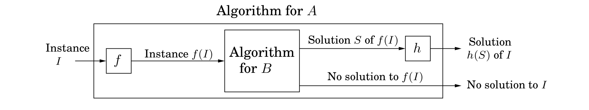

## 8.2 $\textbf{NP}$-Complete Problems

### hard problems, easy problems

In short, the world is full of search problems, some of which can be solved efficiently, while others seem to be very hard. This is depicted in the following table.

This table is worth contemplating. On the right we have problems that can be solved efficiently. On the left, we have a bunch of hard nuts that have escaped efficient solution over many decades or centuries.

The various problems on the right can be solved by algorithms that are specialized and diverse: dynamic programming, network flow, graph search, greedy. These problems are easy for a variety of different reasons.

In stark contrast, the problems on the left *are all difficult for the same reason!* At their core, they are all the same problem, just in different disguises! They are all *equivalent*: as we shall see in Section 8.3, each of them can be reduced to any of the others—and back.

### $\text{P}$ and $\text{NP}$

It's time to introduce some important concepts. We know what a search problem is: its defining characteristic is that any proposed solution can be quickly checked for correctness, in the sense that there is an efficient checking algorithm $C$ that takes as input the given instance $I$ (the data specifying the problem to be solved), as well as the proposed solution $S$, and outputs true if and only if $S$ really is a solution to instance $I$. Moreover the running time of $C(I, S)$ is bounded by a polynomial in $|I|$, the length of the instance. We *denote the class of all search problems by* $\textbf{NP}$.

We've seen many examples of $\textbf{NP}$ search problems that are solvable in polynomial time. In such cases, there is an algorithm that takes as input an instance $I$ and has a running time polynomial in $|I|$. If $I$ has a solution, the algorithm returns such a solution; and if $I$ has no solution, the algorithm correctly reports so. The *class of all search problems that can be solved in polynomial time is denoted* $\textbf{P}$. Hence, all the search problems on the right-hand side of the table are in $\textbf{P}$.

> **Why $\textbf{P}$ and $\textbf{NP}$?**
>
> Okay, $\textbf{P}$ must stand for "polynomial."" But why use the initials $\textbf{NP}$ (the common chatroom abbreviation for "no problem") to describe the class of search problems, some of which are terribly hard?
>
> $\textbf{NP}$ stands for "nondeterministic polynomial time", a term going back to the roots of complexity theory. Intuitively, it means that a solution to any search problem can be found and verified in polynomial time by a special (and quite unrealistic) sort of algorithm, called a *nondeterministic algorithm*. Such an algorithm has the power of *guessing* correctly at every step.
>
> Incidentally, the original definition of $\textbf{NP}$ (and its most common usage to this day) was not as a class of search problems, but as a class of *decision problems*: algorithmic questions that can be answered by yes or no. Example: "Is there a truth assignment that satisfies this Boolean formula?"" But this too reflects a historical reality: At the time the theory of $\textbf{NP}$-completeness was being developed, researchers in the theory of computation were interested in formal languages, a domain in which such decision problems are of central importance.

Are there search problems that cannot be solved in polynomial time? In other words, is $\textbf{P} \neq \textbf{NP}$? Most algorithms researchers think so.[^1] It is hard to believe that exponential search can always be avoided, that a simple trick will crack all these hard problems, famously unsolved for decades and centuries. And there is a good reason for mathematicians to believe that $\textbf{P} \neq \textbf{NP}$—the task of finding a proof for a given mathematical assertion is a search problem and is therefore in $\textbf{NP}$ (after all, when a formal proof of a mathematical statement is written out in excruciating detail, it can be checked mechanically, line by line, by an efficient algorithm).

So if $\textbf{P} = \textbf{NP}$, there would be an efficient method to prove any theorem, thus eliminating the need for mathematicians! All in all, there are a variety of reasons why it is widely believed that $\textbf{P} \neq \textbf{NP}$. However, proving this has turned out to be extremely difficult, one of the deepest and most important unsolved puzzles of mathematics.

### Reductions, Again

Even if we accept that $\textbf{P} \neq \textbf{NP}$, what about the specific problems on the left side of the table? On the basis of what evidence do we believe that these particular problems have no efficient algorithm (besides, of course, the historical fact that many clever mathematicians and computer scientists have tried hard and failed to find any)? Such evidence is provided by *reductions*, which translate one search problem into another.

What they demonstrate is that the problems on the left side of the table are all, in some sense, *exactly the same problem*, except that they are stated in different languages. What's more, we will also use reductions to show that these problems are the *hardest* search problems in $\textbf{NP}$—if even one of them has a polynomial time algorithm, then *every* problem in $\textbf{NP}$ has a polynomial time algorithm. Thus if we believe that $\textbf{P} \neq \textbf{NP}$, then all these search problems are hard.

We defined reductions in Chapter 7 and saw many examples of them. Let's now specialize this definition to search problems.

A *reduction* from search problem $A$ to search problem $B$ is a polynomial-time algorithm $f$ that transforms any instance $I$ of $A$ into an instance $f(I)$ of $B$, together with another polynomial-time algorithm $h$ that maps any solution $S$ of $f(I)$ back into a solution $h(S)$ of $I$; see the following diagram. If $f(I)$ has no solution, then neither does $I$. These two translation procedures $f$ and $h$ imply that any algorithm for $B$ can be converted into an algorithm for $A$ by bracketing it between $f$ and $h$.

And now we can finally define the class of the hardest search problems.

* *A search problem is $\textbf{NP}$-complete if all other search problems reduce to it*.

This is a very strong requirement indeed. For a problem to be $\textbf{NP}$-complete, it must be useful in solving every search problem in the world! It is remarkable that such problems exist. But they do, and the first column of the table we saw earlier is filled with the most famous examples. In Section 8.3 we shall see how all these problems reduce to one another, and also why all other search problems reduce to them.

> **The Two Ways to Use Reductions**
>
> So far in this book the purpose of a reduction from a problem $A$ to a problem $B$ has been straightforward and honorable: We know how to solve $B$ efficiently, and we want to use this knowledge to solve $A$. In this chapter, however, reductions from $A$ to $B$ serve a somewhat perverse goal: we know $A$ is hard, and we use the reduction to prove that $B$ is hard as well!
>
> If we denote a reduction from A to B by $$A \longrightarrow B,$$ then we can say that *difficulty* flows in the direction of the arrow, while *efficient algorithms* move in the opposite direction. It is through this propagation of difficulty that we know $\textbf{NP}$-complete problems are hard: all other search problems reduce to them, and thus each $\textbf{NP}$-complete problem contains the complexity of all search problems. If even one $\textbf{NP}$-complete problem is in $\textbf{P}$, then $\textbf{P} = \textbf{NP}$.
>
> Reductions also have the convenient property that they *compose*. $$\text{If}\ A \longrightarrow B \ \text{and}\ B \longrightarrow C,\ \text{then}\ A \longrightarrow C.$$ To see this, observe first of all that any reduction is completely specified by the pre- and post-processing functions $f$ and $h$ (see the reduction diagram). If ($f_{AB}, h_{AB}$) and ($f_{BC}, h_{BC}$) define the reductions from $A$ to $B$ and from $B$ to $C$, respectively, then a reduction from $A$ to $C$ is given by compositions of these functions: $f_{BC} \circ f_{AB}$ maps an instance of $A$ to an instance of $C$, and $h_{AB} \circ h_{BC}$ sends a solution of $C$ back to a solution of $A$.
>
> This means that once we know a problem $A$ is $\textbf{NP}$-complete, we can use it to prove that a new search problem $B$ is also $\textbf{NP}$-complete, simply by reducing $A$ to $B$. Such a reduction establishes that all problems in $\textbf{NP}$ reduce to $B$, via $A$.

### Factoring

One last point: we started off this book by introducing another famously hard search problem: $\text{FACTORING}$, the task of finding all prime factors of a given integer. But the difficulty of $\text{FACTORING}$ is of a different nature than that of the other hard search problems we have just seen. For example, nobody believes that $\text{FACTORING}$ is $\textbf{NP}$-complete. One major difference is that, in the case of $\text{FACTORING}$, the definition does not contain the now familiar clause "or report that none exists." A number can *always* be factored into primes.

Another difference (possibly not completely unrelated) is this: as we shall see in Chapter 10, $\text{FACTORING}$ succumbs to the power of *quantum computation*—while $\text{SAT}, \text{TSP}$ and the other $\textbf{NP}$-complete problems do not seem to.

[^1]: An interesting-and highly recommended-read on the debate of $\textbf{P} ?= \textbf{NP}$ is [this paper by Scott Aaronson](https://www.scottaaronson.com/papers/pnp.pdf).
