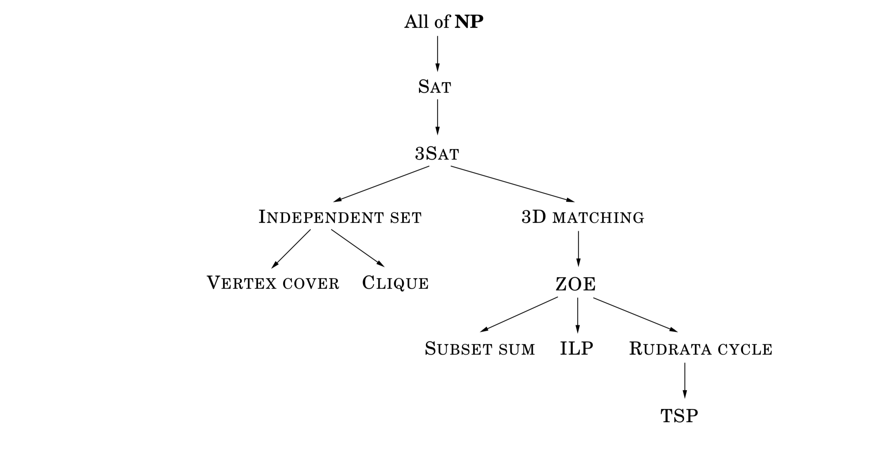
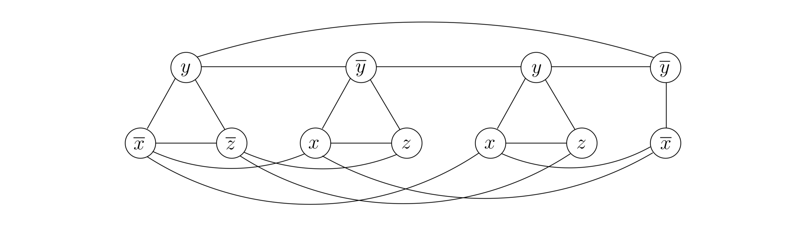
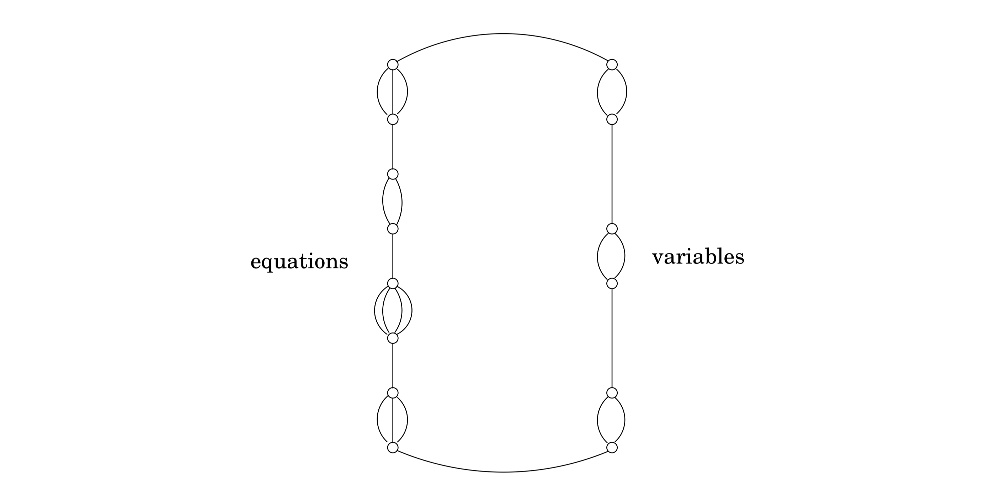
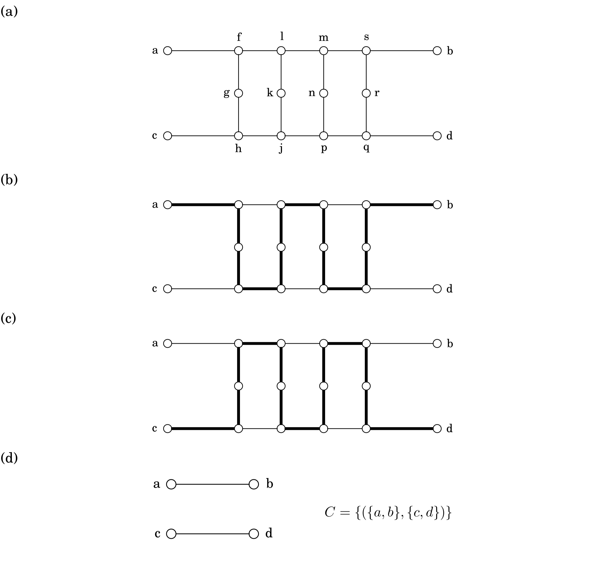
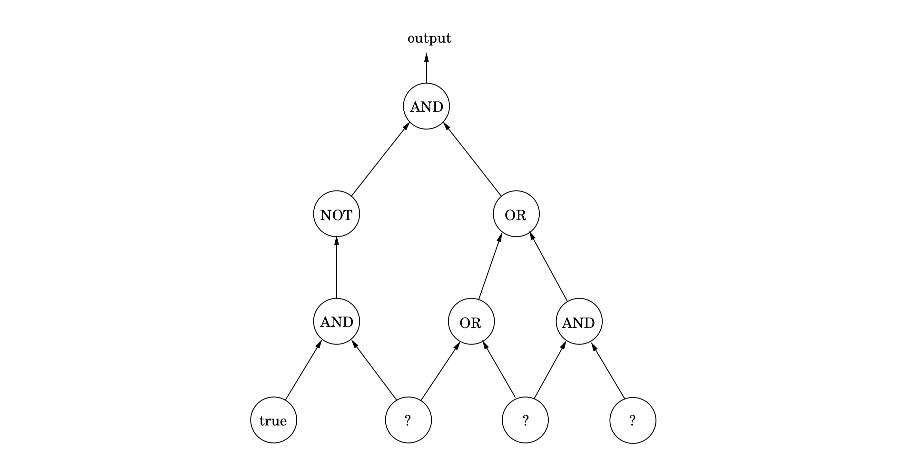
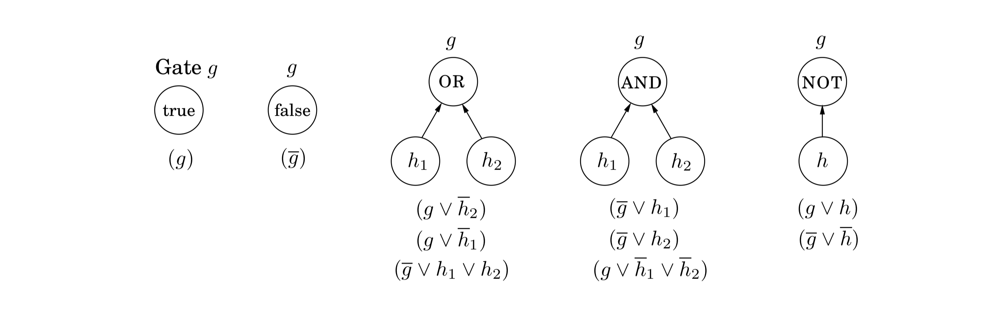

## 8.3 The Reductions

We shall now see that the search problems of Section 8.1 can be reduced to one another as depicted in Figure 8.7. As a consequence, they are all $\textbf{NP}$-complete.

Before we tackle the specific reductions in the tree, let's warm up by relating two versions of the Rudrata problem.

---
&nbsp;

### $\text{RUDRATA}(s, t)-\text{PATH} \longrightarrow \text{RUDRATA CYCLE}$

Recall the $\text{RUDRATA CYCLE}$ problem: given a graph, is there a cycle that passes through each vertex exactly once? We can also formulate the closely related $\text{RUDRATA}(s, t)-\text{PATH}$ problem, in which two vertices $s$ and $t$ are specified, and we want a path starting at $s$ and ending at $t$ that goes through each vertex exactly once. Is it possible that $\text{RUDRATA CYCLE}$ is easier than $\text{RUDRATA}(s, t)-\text{PATH}$? We will show by a reduction that the answer is no.

The reduction maps an instance ($G = (V, E), s, t$) of $\text{RUDRATA}(s, t)-\text{PATH}$ into an instance $G' = (V', E')$ of $\text{RUDRATA CYCLE}$ as follows: $G'$ is simply $G$ with an additional vertex $x$ and two new edges $\{ s, x \}$ and $\{ x, t \}$. For instance:

So $V' = V \cup \{x\}$, and $E' = E \cup \{\{s, x\}, \{x, t\}\}$. How do we recover a $\text{RUDRATA}(s, t)-\text{PATH}$ in $G$ given any $\text{RUDRATA CYCLE}$ in $G'$? Easy, we just delete the edges $\{s, x\}$ and $\{x, t\}$ from the cycle.

To confirm the validity of this reduction, we have to show that it works in the case of either outcome depicted.

1. When the instance of $\text{RUDRATA CYCLE}$ has a solution.

Since the new vertex $x$ has only two neighbors, $s$ and $t$, any Rudrata cycle in $G'$ must consecutively traverse the edges $\{t, x\}$ and $\{x, s\}$. The rest of the cycle then traverses every other vertex en route from $s$ to $t$. Thus deleting the two edges $\{t, x\}$ and $\{x, s\}$ from the Rudrata cycle gives a Rudrata path from $s$ to $t$ in the original graph $G$.

2. When the instance of $\text{RUDRATA CYCLE}$ does not have a solution.

In this case we must show that the original instance of $\text{RUDRATA}(s, t)-\text{PATH}$ cannot have a solution either. It is usually easier to prove the *contrapositive*, that is, to show that if there is a R$\text{RUDRATA}(s, t)-\text{PATH}$ in $G$, then there is also a $\text{RUDRATA CYCLE}$ in $G'$. But this is easy: just add the two edges $\{t, x\}$ and $\{x, s\}$ to the Rudrata path to close the cycle.

One last detail, crucial but typically easy to check, is that the pre- and post-processing functions take time polynomial in the size of the instance ($G, s, t$).

It is also possible to go in the other direction and reduce $\text{RUDRATA CYCLE}$ to $\text{RUDRATA}(s, t)-\text{PATH}$. Together, these reductions demonstrate that the two Rudrata variants are in essence the same problem–which is not too surprising, given that their descriptions are almost the same. But most of the other reductions we will see are between pairs of problems that, on the face of it, look quite different. To show that they are essentially the same, our reductions will have to cleverly translate between them.

---
&nbsp;

### $\text{3SAT} \longrightarrow \text{INDEPENDENT SET}$

One can hardly think of two more different problems. In $\text{3SAT}$ the input is a set of clauses, each with three or fewer literals, for example

$$(\hat{x} \vee y \vee \hat{z})(x \vee \hat{y} \vee z)(x \vee y \vee z)(\hat{x} \vee \hat{y})$$

and the aim is to find a satisfying truth assignment. In $\text{INDEPENDENT SET}$ the input is a graph and a number $g$, and the problem is to find a set of $g$ pairwise non-adjacent vertices. We must somehow relate Boolean logic with graphs!

Let us think. To form a satisfying truth assignment we must pick one literal from each clause and give it the value $\texttt{true}$. But our choices must be consistent: if we choose $x$ in one clause, we cannot choose $x$ in another. Any consistent choice of literals, one from each clause, specifies a truth assignment (variables for which neither literal has been chosen can take on either value).

So, let us represent a clause, say $(x \vee y \vee z)$, by a triangle, with vertices labeled $x, y, z$. Why triangle? Because a triangle has its three vertices maximally connected, and thus forces us to pick only one of them for the independent set. Repeat this construction for all clauses–a clause with two literals will be represented simply by an edge joining the literals. (A clause with one literal is silly and can be removed in a preprocessing step, since the value of the variable is determined.) In the resulting graph, an independent set has to pick at most one literal from each group (clause). To force exactly one choice from each clause, take the goal $g$ to be the number of clauses; in our example, $g = 4$.

All that is missing now is a way to prevent us from choosing opposite literals (that is, both $x$ and $\hat{x}$) in different clauses. But this is easy: put an edge between any two vertices that correspond to opposite literals. The resulting graph for our example is shown in Figure 8.8.

Let's recap the construction. Given an instance $I$ of $\text{3SAT}$, we create an instance ($G, g$) of $\text{INDEPENDENT SET}$ as follows.

* Graph $G$ has a triangle for each clause (or just an edge, if the clause has two literals), with vertices labeled by the clause's literals, and has additional edges between any two vertices that represent opposite literals.

* The goal $g$ is set to the number of clauses.

Clearly, this construction takes polynomial time. However, recall that for a reduction we do not just need an efficient way to map instances of the first problem to instances of the second (the function $f$ in the diagram on page 245), but also a way to reconstruct a solution to the first instance from any solution of the second (the function $h$). As always, there are two things to show.

1. Given an independent set $S$ of $g$ vertices in $G$, it is possible to efficiently recover a satisfying truth assignment to $I$.

For any variable $x$, the set $S$ cannot contain vertices labeled both $x$ and $\hat{x}$, because any such pair of vertices is connected by an edge. So assign $x$ a value of $\texttt{true}$ if $S$ contains a vertex labeled $x$, and a value of $\texttt{false}$ if $S$ contains a vertex labeled $x$ (if $S$ contains neither, then assign either value to $x$). Since $S$ has $g$ vertices, it must have one vertex per clause; this truth assignment satisfies those particular literals, and thus satisfies all clauses.

2. If graph $G$ has no independent set of size $g$, then the Boolean formula $I$ is unsatisfiable.

It is usually cleaner to prove the contrapositive, that if $I$ has a satisfying assignment then $G$ has an independent set of size $g$. This is easy: for each clause, pick any literal whose value under the satisfying assignment is $\texttt{true}$ (there must be at least one such literal), and add the corresponding vertex to $S$. Do you see why set $S$ must be independent?

---
&nbsp;

### $\text{SAT} \longrightarrow \text{3SAT}$

This is an interesting and common kind of reduction, from a problem to a *special case* of itself. We want to show that the problem remains hard even if its inputs are restricted somehow–in the present case, even if all clauses are restricted to have $\leq 3$ literals. Such reductions modify the given instance so as to get rid of the forbidden feature (clauses with $\geq 4$ literals) while keeping the instance essentially the same, in that we can read off a solution to the original instance from any solution of the modified one.

Here's the trick for reducing $\text{SAT}$ to $\text{3SAT}$: given an instance $I$ of $\text{SAT}$, use exactly the same instance for $\text{3SAT}$, except that any clause with more than three literals, ($a_1 \vee a_2 \vee \cdots \vee a_k$) (where the $a_i$'s are literals and $k > 3$), is replaced by a set of clauses,

$$(a_1 \vee a_2 \vee y_1)(\hat{y}_1 \vee a_3 \vee y_2)(\hat{y}_2 \vee a_4 \vee y_3) \cdots (\hat{y}_{k-3} \vee a_{k-1} \vee a_k),$$

where the $y_i$'s are new variables. Call the resulting $\text{3SAT}$ instance $I'$. The conversion from $I$ to $I'$ is clearly polynomial time.

Why does this reduction work? $I'$ is equivalent to $I$ in terms of satisfiability, because for any assignment to the $a_i$'s,

$$\begin{Bmatrix} (a_1 \vee a_2 \vee \cdots \vee a_k) \\ \text{is satisfied} \end{Bmatrix} \Longleftrightarrow \begin{Bmatrix} \text{there is a setting of the $y_i$'s for which} \\  (a_1 \vee a_2 \vee y_1)(\hat{y}_1 \vee a_3 \vee y_2)) \cdots (\hat{y}_{k-3} \vee a_{k-1} \vee a_k) \\ \text{are all satisfied} \end{Bmatrix}.$$

To see this, first suppose that the clauses on the right are all satisfied. Then at least one of the literals $a_1, \cdots, a_k$ must be true–otherwise $y_1$ would have to be true, which would in turn force $y_2$ to be true, and so on, eventually falsifying the last clause. But this means $(a_1 \vee a_2 \vee \cdots ∨ a_k)$ is also satisfied.

Conversely, if $(a_1 \vee a_2 \vee \cdots ∨ a_k)$ is satisfied, then some $a_i$ must be true. Set $y_1, \cdots, y_{i-3}$ to $\texttt{true}$ and the rest to $\texttt{false}$. This ensures that the clauses on the right are all satisfied.

Thus, any instance of $\text{SAT}$ can be transformed into an equivalent instance of $\text{3SAT}$. In fact, $\text{3SAT}$ remains hard even under the further restriction that no variable appears in more than three clauses. To show this, we must somehow get rid of any variable that appears too many times.

Here's the reduction from $\text{3SAT}$ to its constrained version. Suppose that in the $\text{3SAT}$ instance, variable $x$ appears in $k > 3$ clauses. Then replace its first appearance by $x_1$, its second appearance by $x_2$, and so on, replacing each of its $k$ appearances by a different new variable. Finally, add the clauses $$(\hat{x}_1 \vee x_2)(\hat{x}_2 \vee x_3) \cdots (\hat{x}_k \vee x_1).$$ And repeat for every variable that appears more than three times.

It is easy to see that in the new formula no variable appears more than three times (and in fact, no literal appears more than twice). Furthermore, the extra clauses involving $x_1, x_2, \cdots, x_k$ constrain these variables to have the same value; do you see why? Hence the original instance of $\text{3SAT}$ is satisfiable if and only if the constrained instance is satisfiable.

---
&nbsp;

### $\text{INDEPENDENT SET} \longrightarrow \text{VERTEX COVER}$

Some reductions rely on ingenuity to relate two very different problems. Others simply record the fact that one problem is a thin disguise of another. To reduce $\text{INDEPENDENT SET}$ to $\text{VERTEX COVER}$ we just need to notice that a set of nodes $S$ is a vertex cover of graph $G = (V, E)$ (that is, $S$ touches every edge in $E$) if and only if the remaining nodes, $V - S$, are an independent set of $G$ (Figure 8.9).

Therefore, to solve an instance ($G, g$) of $\text{INDEPENDENT SET}$, simply look for a vertex cover of $G$ with $|V| - g$ nodes. If such a vertex cover exists, then take all nodes not in it. If no such vertex cover exists, then $G$ cannot possibly have an independent set of size $g$.

---
&nbsp;

### $\text{INDEPENDENT SET} \longrightarrow \text{CLIQUE}$

$\text{INDEPENDENT SET}$ and $\text{CLIQUE}$ are also easy to reduce to one another. Define the complement of a graph $G = (V, E)$ to be $\hat{G} = (V, \hat{E})$, where $\hat{E}$ contains precisely those unordered pairs of vertices that are not in $E$. Then a set of nodes $S$ is an independent set of $G$ if and only if $S$ is a clique of $G$. To paraphrase, these nodes have no edges between them in $G$ if and only if they have all possible edges between them in $G$.

Therefore, we can reduce $\text{INDEPENDENT SET}$ to $\text{CLIQUE}$ by mapping an instance ($G, g$) of $\text{INDEPENDENT SET}$ to the corresponding instance ($G, g$) of $\text{CLIQUE}$; the solution to both is identical.

---
&nbsp;

### $\text{3SAT} \longrightarrow \text{3D MATCHING}$

Again, two very different problems. We must reduce 3SAT to the problem of finding, among a set of boy-girl-pet triples, a subset that contains each boy, each girl, and each pet exactly once. In short, we must design sets of boy-girl-pet triples that somehow behave like Boolean variables and gates!

Consider the following set of four triples, each represented by a triangular node joining a boy, girl, and pet:

Suppose that the two boys $b_0$ and $b_1$ and the two girls $g_0$ and $g_1$ are not involved in any other triples. (The four pets $p_0, \cdots, p_3$ will of course belong to other triples as well; for otherwise the instance would trivially have no solution.) Then any matching must contain either the two triples ($b_0, g_1, p_0$), ($b_1, g_0, p_2$) or the two triples ($b_0, g_0, p_1$), ($b_1, g_1, p_3$), because these are the only ways in which these two boys and girls can find any match. Therefore, this "gadget" has two possible states: it behaves like a Boolean variable!

To then transform an instance of 3SAT to one of 3D MATCHING, we start by creating a copy of the preceding gadget for *each* variable $x$. Call the resulting nodes $p_{x1}, b_{x0}, g_{x1}$, and so on. The intended interpretation is that boy $b_{x0}$ is matched with girl $g_{x1}$ if $x = \texttt{true}$, and with girl $g_{x0}$ if $x = \texttt{false}$.

Next we must create triples that somehow mimic clauses. For each clause, say $c = (x \vee \hat{y} \vee z)$, introduce a new boy $b_c$ and a new girl $g_c$. They will be involved in three triples, one for each literal in the clause. And the pets in these triples must reflect the three ways whereby the clause can be satisfied: (1) $x = \texttt{true}$, (2) $y = \texttt{false}$, (3) $z = \texttt{true}$.

For (1), we have the triple ($b_c, g_c, p_{x1}$), where $p_{x1}$ is the pet $p_1$ in the gadget for $x$. Here is why we chose $p_1$: if $x = \texttt{true}$, then $b_{x0}$ is matched with $g_{x1}$ and $b_{x1}$ with $g_{x0}$, and so pets $p_{x0}$ and $p_{x2}$ are taken. In which case $b_c$ and $g_c$ can be matched with $p_{x1}$. But if $x = \texttt{false}$, then $p_{x1}$ and $p_{x3}$ are taken, and so $g_c$ and $b_c$ cannot be accommodated this way. We do the same thing for the other two literals of the clause, which yield triples involving $b_c$ and $g_c$ with either $p_{y0}$ or $p_{y2}$ (for the negated variable $y$) and with either $p_{z1}$ or $p_{z3}$ (for variable $z$).

We have to make sure that for every occurrence of a literal in a clause $c$ there is a different pet to match with $b_c$ and $g_c$. But this is easy: by an earlier reduction we can assume that no literal appears more than twice, and so each variable gadget has enough pets, two for negated occurrences and two for unnegated.

The reduction now seems complete: from any matching we can recover a satisfying truth assignment by simply looking at each variable gadget and seeing with which girl $b_{x0}$ was matched with. And from any satisfying truth assignment we can match the gadget corresponding to each variable $x$ so that triples ($b_{x0}, g_{x1}, p_{x0}$) and ($b_{x1}, g_{x0}, p_{x2}$) are chosen if $x = \texttt{true}$ and triples ($b_{x0}, g_{x0}, p_{x1}$) and ($b_{x1}, g_{x1}, p_{x3}$) are chosen if $x = \texttt{false}$; and for each clause $c$ match $b_c$ and $g_c$ with the pet that corresponds to one of its satisfying literals.

But one last problem remains: in the matching defined at the end of the last paragraph, *some pets may be left unmatched*. In fact, if there are $n$ variables and $m$ clauses, then exactly $2n - m$ pets *will* be left unmatched (you can check that this number is sure to be positive, because we have at most three occurrences of every variable, and at least two literals in every clause). But this is easy to fix: add $2n - m$ new boy-girl couples that are "generic animal-lovers", and match them by triples with all the pets!

---
&nbsp;

### $\text{3D MATCHING} \longrightarrow \text{ZOE}$

Recall that in $\text{ZOE}$ we are given an $m \times n$ matrix $\textbf{A}$ with $0-1$ entries, and we must find a $0-1$ vector $x = (x_1, \cdots, x_n)$ such that the $m$ equations $$\textbf{A}x = \textbf{1}$$ are satisfied, where by $\textbf{1}$ we denote the column vector of all $1$'s. How can we express the $\text{3D MATCHING}$ problem in this framework?

$\text{ZOE}$ and $\text{ILP}$ are very useful problems precisely because they provide a format in which many combinatorial problems can be expressed. In such a formulation we think of the $0-1$ variables as describing a solution, and we write equations expressing the constraints of the problem.

For example, here is how we express an instance of $\text{3D MATCHING}$ ($m$ boys, $m$ girls, $m$ pets, and $n$ boy-girl-pet triples) in the language of $\text{ZOE}$. We have $0-1$ variables $x_1, \cdots, x_n$, one per triple, where $x_i = 1$ means that the $i$th triple is chosen for the matching, and $x_i = 0$ means that it is not chosen.

Now all we have to do is write equations stating that the solution described by the $x_i$'s is a legitimate matching. For each boy (or girl, or pet), suppose that the triples containing him (or her, or it) are those numbered $j_1, j_2, \cdots, j_k$; the appropriate equation is then

$$x_{j_1} + x_{j_2} + \cdots + x_{j_k} = 1,$$

which states that exactly one of these triples must be included in the matching.

For example, here is the A matrix for an instance of 3D MATCHING we saw earlier.

The five columns of $\textbf{A}$ correspond to the five triples, while the nine rows are for Al, Bob, Chet, Alice, Beatrice, Carol, Armadillo, Bobcat, and Canary, respectively.

It is straightforward to argue that solutions to the two instances translate back and forth.

---
&nbsp;

### $\text{ZOE} \longrightarrow \text{SUBSET SUM}$

This is a reduction between two special cases of $\text{ILP}$: one with many equations but only $0-1$ coefficients, and the other with a single equation but arbitrary integer coefficients. The reduction is based on a simple and time-honored idea: $0-1$ vectors can encode numbers!

For example, given this instance of $\text{ZOE}$:

$$\textbf{A} = \begin{bmatrix} 1 & 0 & 0 & 0 \\ 0 & 0 & 0 & 1 \\ 0 & 1 & 1 & 0 \\ 1 & 0 & 0 & 0 \\ 0 & 1 & 0 & 0 \end{bmatrix},$$

we are looking for a set of columns of $\textbf{A}$ that, added together, make up the all-$1$'s vector. But if we think of the columns as binary integers (read from top to bottom), we are looking for a subset of the integers $18, 5, 4, 8$ that add up to the binary integer $11111_2 = 31$. And this is an instance of $\text{SUBSET SUM}$. The reduction is complete!

Except for one detail, the one that usually spoils the close connection between $0-1$ vectors and binary integers: *carry*. Because of carry, $5$-bit binary integers can add up to $31$ (for example, $5 + 6 + 20 = 31$ or, in binary, $00101_2 + 00110_2 + 10100_2 = 11111_2$) even when the sum of the corresponding vectors is not ($1, 1, 1, 1, 1$). But this is easy to fix: Think of the column vectors not as integers in base $2$, but as integers in base $n + 1$–one more than the number of columns. This way, since at most $n$ integers are added, and all their digits are $0$ and $1$, there can be no carry, and our reduction works.

---
&nbsp;

### $\text{ZOE} \longrightarrow \text{ILP}$

$\text{3SAT}$ is a special case of $\text{SAT}$–or, $\text{SAT}$ is a generalization of $\text{3SAT}$. By *special case* we mean that the instances of $\text{3SAT}$ are a subset of the instances of $\text{SAT}$ (in particular, the ones with no long clauses), and the definition of solution is the same in both problems (an assignment satisfying all clauses). Consequently, there is a reduction from $\text{3SAT}$ to $\text{SAT}$, in which the input undergoes no transformation, and the solution to the target instance is also kept unchanged. In other words, functions $f$ and $h$ from the reduction diagram (on page 245) are both the identity.

This sounds trivial enough, but it is a very useful and common way of establishing that a problem is $\textbf{NP}$-complete: Simply notice that it is a generalization of a known $\textbf{NP}$-complete problem. For example, the $\text{SET COVER}$ problem is $\textbf{NP}$-complete because it is a generalization of $\text{VERTEX COVER}$ (and also, incidentally, of $\text{3D MATCHING}$). See Exercise 8.10 for more examples.

Often it takes a little work to establish that one problem is a special case of another. The reduction from $\text{ZOE}$ to $\text{ILP}$ is a case in point. In $\text{ILP}$ we are looking for an integer vector $x$ that satisfies $\textbf{A}x \leq b$, for given matrix $\textbf{A}$ and vector $b$. To write an instance of $\text{ZOE}$ in this precise form, we need to rewrite each equation of the $\text{ZOE}$ instance as two inequalities (recall the transformations of Section 7.1.4), and to add for each variable $x_i$ the inequalities $x_i \leq 1$ and $-x_i \leq 0$.

---
&nbsp;

### $\text{ZOE} \longrightarrow \text{RUDRATA CYCLE}$

In the $\text{RUDRATA CYCLE}$ problem we seek a cycle in a graph that visits every vertex exactly once. We shall prove it $\textbf{NP}$-complete in two stages: first we will reduce $\text{ZOE}$ to a generalization of $\text{RUDRATA CYCLE}$, called $\text{RUDRATA CYCLE WITH PAIRED EDGES}$, and then we shall see how to get rid of the extra features of that problem and reduce it to the plain $\text{RUDRATA CYCLE}$ problem.

In an instance of $\text{RUDRATA CYCLE WITH PAIRED EDGES}$ we are given a graph $G = (V, E)$ and a set $C \subseteq E \times E$ of pairs of edges. We seek a cycle that (1) visits all vertices once, like a Rudrata cycle should, and (2) for every pair of edges ($e, e'$) in $C$, traverses either edge $e$ or edge $e'$–exactly one of them. In the simple example of Figure 8.10 a solution is shown in bold. Notice that we allow two or more parallel edges between two nodes–a feature that doesn't make sense in most graph problems–since now the different copies of an edge can be paired with other copies of edges in ways that do make a difference.

Now for the reduction of $\text{ZOE}$ to $\text{RUDRATA CYCLE WITH PAIRED EDGES}$. Given an instance of $\text{ZOE}$, $\textbf{A}x = \textbf{1}$ (where $\textbf{A}$ is an $m \times n$ matrix with $0-1$ entries, and thus describes $m$ equations in $n$ variables), the graph we construct has the very simple structure shown in Figure 8.11: a cycle that connects $m + n$ collections of parallel edges. For each variable $x_i$ we have two parallel edges (corresponding to $x_i = 1$ and $x_i = 0$). And for each equation $x_{j_1} + \cdots + x_{j_k} = 1$ involving $k$ variables we have $k$ parallel edges, one for every variable appearing in the equation. This is the whole graph. Evidently, any Rudrata cycle in this graph must traverse the $m + n$ collections of parallel edges one by one, choosing one edge from each collection. This way, the cycle "chooses" for each variable a value–$0$ or $1$–and, for each equation, a variable appearing in it.

The whole reduction can't be this simple, of course. The structure of the matrix $\textbf{A}$ (and not just its dimensions) must be reflected somewhere, and there is one place left: the set $C$ of pairs of edges such that exactly one edge in each pair is traversed. For every equation (recall there are $m$ in total), and for every variable $x_i$ appearing in it, we add to $C$ the pair ($e, e'$) where $e$ is the edge corresponding to the appearance of $x_i$ in that particular equation (on the left-hand side of Figure 8.11), and $e'$ is the edge corresponding to the variable assignment $x_i = 0$ (on the right side of the figure). This completes the construction.

Take any solution of this instance of $\text{RUDRATA CYCLE WITH PAIRED EDGES}$. As discussed before, it picks a value for each variable and a variable for every equation. We claim that the values thus chosen are a solution to the original instance of $\text{ZOE}$. If a variable $x_i$ has value $1$, then the edge $x_i = 0$ is not traversed, and thus all edges associated with $x_i$ on the equation side must be traversed (since they are paired in $C$ with the $x_i = 0$ edge). So, in each equation exactly one of the variables appearing in it has value $1$—which is the same as saying that all equations are satisfied. The other direction is straightforward as well: from a solution to the instance of $\text{ZOE}$ one easily obtains an appropriate Rudrata cycle.

**Getting rid of the Edge Pairs.**

So far we have a reduction from $\text{ZOE}$ to $\text{RUDRATA CYCLE WITH PAIRED EDGES}$; but we are really interested in $\text{RUDRATA CYCLE}$, which is a special case of the problem with paired edges: the one in which the set of pairs $C$ is empty. To accomplish our goal, we need, as usual, to find a way of getting rid of the unwanted feature—in this case the edge pairs.

Consider the graph shown in Figure 8.12, and suppose that it is a part of a larger graph $G$ in such a way that only the four endpoints $a, b, c, d$ touch the rest of the graph. We claim that this graph has the following important property: in any Rudrata cycle of $G$ the subgraph shown must be traversed in one of the two ways shown in bold in Figure 8.12 (b) and (c).

Here is why. Suppose that the cycle first enters the subgraph from vertex $a$ continuing to $f$. Then it must continue to vertex $g$, because $g$ has degree $2$ and so it must be visited immediately after one of its adjacent nodes is visited—otherwise there is no way to include it in the cycle. Hence we must go on to node $h$, and here we seem to have a choice. We could continue on to $j$, or return to $c$.

But if we take the second option, how are we going to visit the rest of the subgraph? (A Rudrata cycle must leave no vertex unvisited.) It is easy to see that this would be impossible, and so from $h$ we have no choice but to continue to $j$ and from there to visit the rest of the graph as shown in Figure 8.12 (b). By symmetry, if the Rudrata cycle enters this subgraph at $c$, it must traverse it as in Figure 8.12 (c). And these are the only two ways.

But this property tells us something important: this gadget behaves just like two edges $\{a, b\}$ and $\{c, d\}$ that are paired up in the $\text{RUDRATA CYCLE WITH PAIRED EDGES}$ problem (see Figure 8.12 (d)).

The rest of the reduction is now clear: to reduce \text{RUDRATA CYCLE WITH PAIRED EDGES}$ to \text{RUDRATA CYCLE}$ we go through the pairs in $C$ one by one. To get rid of each pair ($\{a, b\}, \{c, d\}$) we replace the two edges with the gadget in Figure 8.12 (a). For any other pair in $C$ that involves $\{a, b\}$, we replace the edge $\{a, b\}$ with the new edge $\{a, f\}$, where $f$ is from the gadget: the traversal of $\{a, f\}$ is from now on an indication that edge $\{a, b\}$ in the old graph would be traversed. Similarly, $\{c, h\}$ replaces $\{c, d\}$. After $|C|$ such replacements (performed in polynomial time, since each replacement adds only $12$ vertices to the graph) we are done, and the Rudrata cycles in the resulting graph will be in one-to-one correspondence with the Rudrata cycles in the original graph that conform to the constraints in $C$.

---
&nbsp;

### $\text{RUDRATA CYCLE} \longrightarrow \text{TSP}$

Given a graph $G = (V, E)$, construct the following instance of the $\text{TSP}$: the set of cities is the same as $V$, and the distance between cities $u$ and $v$ is $1$ if $\{u, v\}$ is an edge of $G$ and $1 + \alpha$ otherwise, for some $\alpha > 1$ to be determined. The budget of the $\text{TSP}$ instance is equal to the number of nodes, $|V|$.

It is easy to see that if $G$ has a Rudrata cycle, then the same cycle is also a tour within the budget of the TSP instance; and that conversely, if G has no Rudrata cycle, then there is no solution: the cheapest possible TSP tour has cost at least $n + \alpha$ (it must use at least one edge of length $1 + \alpha$, and the total length of all $n - 1$ others is at least $n - 1$). Thus $\text{RUDRATA CYCLE}$ reduces to $\text{TSP}$.

In this reduction, we introduced the parameter $\alpha$ because by varying it, we can obtain two interesting results. If $\alpha = 1$, then all distances are either $1$ or $2$, and so this instance of the $\text{TSP}$ satisfies the triangle inequality: if $i, j, k$ are cities, then $d_{ij} + d_{jk} \geq d_{ik}$ (proof: $a + b \geq c$ holds for any numbers $1 \leq a, b, c \leq 2$). This is a special case of the TSP which is of practical importance and which, as we shall see in Chapter 9, is in a certain sense easier, because it can be efficiently *approximated*.

If on the other hand $\alpha$ is large, then the resulting instance of the TSP may not satisfy the triangle inequality, but has another important property: either it has a solution of cost $n$ or less, or all its solutions have cost at least $n + \alpha$ (which now can be arbitrarily larger than $n$). There can be nothing in between! As we shall see in Chapter 9, this important *gap* property implies that, unless $\textbf{P} = \textbf{NP}$, no approximation algorithm is possible.

---
&nbsp;

### $\text{ANY PROBLEM IN } \textbf{NP} \longrightarrow \text{SAT}$

We have reduced $\text{SAT}$ to the various search problems in Figure 8.7. Now we come full circle and argue that all these problems–and in fact all problems in $\textbf{NP}$–reduce to $\text{SAT}$.

In particular, we shall show that all problems in $\textbf{NP}$ can be reduced to a generalization of $\text{SAT}$ which we call $\text{CIRCUIT SAT}$. In $\text{CIRCUIT SAT}$, we are given a (Boolean) circuit (see Figure 8.13, and recall Section 7.7), a dag whose vertices are *gates* of five different types:

* $\text{AND}$ gates and $\text{OR}$ gates have indegree $2$.

* $\text{NOT}$ gates have indegree $1$.

* *Known input* gates have no incoming edges and are labeled $\texttt{false}$ or $\texttt{true}$.

* *Unknown input* gates have no incoming edges and are labeled "$\texttt{?}$".

One of the sinks of the dag is designated as the *output* gate.

Given an assignment of values to the unknown inputs, we can evaluate the gates of the circuit in topological order, using the rules of Boolean logic (such as $\texttt{false} \vee \texttt{true} = \texttt{true}$), until we obtain the value at the output gate. This is the value of the circuit for the particular assignment to the inputs. For instance, the circuit in Figure 8.13 evaluates to $\texttt{false}$ under the assignment $\texttt{true, false, true}$ (from left to right).

$\text{CIRCUIT SAT}$ is then the following search problem: Given a circuit, find a truth assignment for the unknown inputs such that the output gate evaluates to $\texttt{true}$, or report that no such assignment exists. For example, if presented with the circuit in Figure 8.13 we could have returned the assignment $\texttt{false, true, true}$ because, if we substitute these values to the unknown inputs (from left to right), the output becomes $\texttt{true}$.

$\text{CIRCUIT SAT}$ is a generalization of $\text{SAT}$. To see why, notice that $\text{SAT}$ asks for a satisfying truth assignment for a circuit that has this simple structure: a bunch of $\text{AND}$ gates at the top join the clauses, and the result of this big $\text{AND}$ is the output. Each clause is the $\text{OR}$ of its literals. And each literal is either an unknown input gate or the $\text{NOT}$ of one. There are no known input gates.

Going in the other direction, $\text{CIRCUIT SAT}$ can also be reduced to $\text{SAT}$. Here is how we can rewrite any circuit in conjunctive normal form (the $\text{AND}$ of clauses): for each gate $g$ in the circuit we create a variable $g$, and we model the effect of the gate using a few clauses:

(Do you see that these clauses do, in fact, force exactly the desired effect?) And to finish up, if $g$ is the output gate, we force it to be true by adding the clause ($g$). The resulting instance of $\text{SAT}$ is equivalent to the given instance of $\text{CIRCUIT SAT}$: the satisfying truth assignments of this conjunctive normal form are in one-to-one correspondence with those of the circuit

Now that we know $\text{CIRCUIT SAT}$ reduces to $\text{SAT}$, we turn to our main job, showing that all search problems reduce to $\text{CIRCUIT SAT}$. So, suppose that $A$ is a problem in $\textbf{NP}$. We must discover a reduction from $A$ to $\text{CIRCUIT SAT}$. This sounds very difficult, *because we know almost nothing about A!*

All we know about $A$ is that it is a search problem, so we must put this knowledge to work. The main feature of a search problem is that any solution to it can quickly be checked: there is an algorithm $\mathcal{C}$ that checks, given an instance $I$ and a proposed solution $S$, whether or not $S$ is a solution of $I$. Moreover, $\mathcal{C}$ makes this decision in time polynomial in the length of $I$ (we can assume that $S$ is itself encoded as a binary string, and we know that the length of this string is polynomial in the length of $I$).

Recall now our argument in Section 7.7 that any polynomial algorithm can be rendered as a circuit, whose input gates encode the input to the algorithm. Naturally, for any input length (number of input bits) the circuit will be scaled to the appropriate number of inputs, but the total number of gates of the circuit will be polynomial in the number of inputs. If the polynomial algorithm in question solves a problem that requires a yes or no answer (as is the situation with $\mathcal{C}$: "Does $S$ encode a solution to the instance encoded by $I$?"), then this answer is given at the output gate.

We conclude that, given any instance $I$ of problem $A$, we can construct in polynomial time a circuit whose known inputs are the bits of $I$, and whose unknown inputs are the bits of $S$, such that the output is $\texttt{true}$ if and only if the unknown inputs spell a solution $S$ of $I$ . In other words, *the satisfying truth assignments to the unknown inputs of the circuit are in one-to-one correspondence with the solutions of instance $I$ of $A$*. The reduction is complete.

---
&nbsp;

> **Unsolvable problems**
>
> At least an $\textbf{NP}$-complete problem can be solved by *some* algorithm–the trouble is that this algorithm will be exponential. But it turns out there are perfectly decent computational problems for which *no algorithms exist at all!*
>
> One famous problem of this sort is an arithmetical version of SAT. Given a polynomial equation in many variables, perhaps $$x^3 yz + 2y^4 z^2 - 7xy^5 z = 6,$$ are there integer values of $x, y, z$ that satisfy it? There is no algorithm that solves this problem. No algorithm at all, polynomial, exponential, doubly exponential, or worse! Such problems are called *unsolvable*.
>
> The first unsolvable problem was discovered in 1936 by Alan M. Turing, then a student of mathematics at Cambridge, England. When Turing came up with it, there were no computers or programming languages (in fact, it can be argued that these things came about later *exactly because* this brilliant thought occurred to Turing). But today we can state it in familiar terms.
>
> Suppose that you are given a program in your favorite programming language, along with a particular input. Will the program ever terminate, once started on this input? This is a very reasonable question. Many of us would be ecstatic if we had an algorithm, call it $\texttt{terminates(p, x)}$, that took as input a file containing a program $\texttt{p}$, and a file of data $\texttt{x}$, and after grinding away, finally told us whether or not $\texttt{p}$ would ever stop if started on $\texttt{x}$.
>
> But how would you go about writing the program $\texttt{terminates}$? (If you haven't seen this before, it's worth thinking about it for a while, to appreciate the difficulty of writing such an "universal infinite-loop detector.")
>
> Well, you can't. *Such an algorithm does not exist!*
>
> And here is the proof: Suppose we actually had such a program $\texttt{terminates(p, x)}$. Then we could use it as a subroutine of the following evil program:
>
> $\texttt{function paradox(z: file)}$
> $\texttt{1:  if terminates(z, z) goto 1}$
>
> Notice what $\texttt{paradox}$ does: it terminates if and only if program z does not terminate when given its own code as input.
>
> You should smell trouble. What if we put this program in a file named $\texttt{paradox}$ and we executed $\texttt{paradox(paradox)}$? Would this execution ever stop? Or not? Neither answer is possible. Since we arrived at this contradiction by assuming that there is an algorithm for telling whether programs terminate, we must conclude that this problem cannot be solved by any algorithm.
>
> By the way, all this tells us something important about programming: It will never be automated, it will forever depend on discipline, ingenuity, and hackery. We now know that you can't tell whether a program has an infinite loop. But can you tell if it has a buffer overrun? Do you see how to use the unsolvability of the "halting problem" to show that this, too, is unsolvable?
