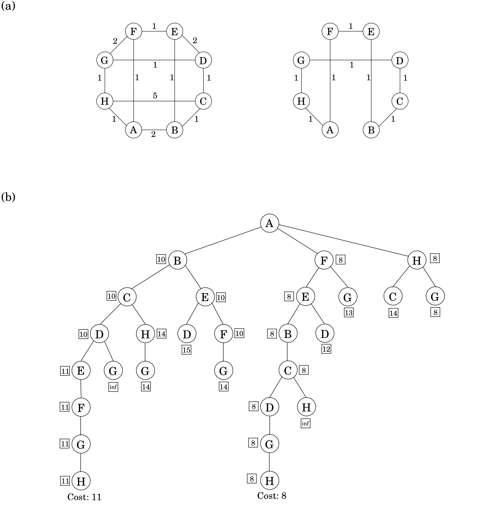

## 9.1 Intelligent Exhaustive Search

&nbsp;

### 9.1.1 Backtracking

Backtracking is based on the observation that it is often possible to reject a solution by looking at just a small portion of it. For example, if an instance of SAT contains the clause ($x_1 \vee x_2$), then all assignments with $x_1 = x_2 = 0$ (i.e., $\texttt{false}$) can be instantly eliminated. To put it differently, by quickly checking and discrediting this *partial assignment*, we are able to prune a quarter of the entire search space. A promising direction, but can it be systematically exploited?

Here's how it is done. Consider the Boolean formula $\phi(w, x, y, z)$ specified by the set of clauses

$$(w \vee x \vee y \vee z), (w \vee \bar{x}), (y \vee \bar{z}), (z \vee \bar{w}), (\bar{w} \vee \bar{z}).$$

We will incrementally grow a tree of partial solutions. We start by branching on any one variable, say $w$:


Plugging $w = 0$ and $w = 1$ into $\phi$, we find that no clause is immediately violated and thus neither of these two partial assignments can be eliminated outright. So we need to keep branching. We can expand either of the two available nodes, and on any variable of our choice. Let's try this one:


This time, we are in luck. The partial assignment $w = 0, x = 1$ violates the clause ($w \vee x$) and can be terminated, thereby pruning a good chunk of the search space. We backtrack out of this cul-de-sac and continue our explorations at one of the two remaining active nodes.

In this manner, backtracking explores the space of assignments, growing the tree only at nodes where there is uncertainty about the outcome, and stopping if at any stage a satisfying assignment is encountered.

In the case of Boolean satisfiability, each node of the search tree can be described either by a partial assignment or by the clauses that remain when those values are plugged into the original formula. For instance, if $w = 0$ and $x = 0$ then any clause with $w$ or $x$ is instantly satisfied and any literal $w$ or $x$ is not satisfied and can be removed.

What's left is

$$(y \vee z), (\bar{y}), (y \vee \bar{z}).$$

Likewise, $w = 0$ and $x = 1$ leaves

$$(), (y \vee \bar{z}),$$

with the “empty clause” $()$ ruling out satisfiability. Thus the nodes of the search tree, representing partial assignments, are themselves SAT *subproblems*.

This alternative representation is helpful for making the two decisions that repeatedly arise: which subproblem to expand next, and which branching variable to use. Since the benefit of backtracking lies in its ability to eliminate portions of the search space, and since this happens only when an empty clause is encountered, it makes sense to choose the subproblem that contains the *smallest clause* and to then branch on a variable in that clause.

If this clause happens to be a singleton, then at least one of the resulting branches will be terminated. (If there is a tie in choosing subproblems, one reasonable policy is to pick the one lowest in the tree, in the hope that it is close to a satisfying assignment.) See Figure 9.1 for the conclusion of our earlier example.


More abstractly, a backtracking algorithm requires a *test* that looks at a subproblem and quickly declares one of three outcomes:

1. Failure: the subproblem has no solution.

2. Success: a solution to the subproblem is found.

3. Uncertainty.

In the case of SAT, this test declares failure if there is an empty clause, success if there are no clauses, and uncertainty otherwise. The backtracking procedure then has the following format.

```python
Start with some problem P0
Let S = {P_0}, the set of active subproblems

Repeat while S is nonempty:
  choose a subproblem P ∈ S and remove it from S
  expand it into smaller subproblems P_1, P_2, ..., P_k

  For each P_i:
    If test(P_i) succeeds: halt and announce this solution
    If test(P_i) fails: discard P_i
    Otherwise: add P_i to S

Announce that there is no solution
```


For SAT, the choose procedure picks a clause, and $\texttt{expand}$ picks a variable within that clause. We have already discussed some reasonable ways of making such choices.

With the right $\texttt{test}, \texttt{expand},$ and $\texttt{choose}$ routines, backtracking can be remarkably effective in practice. The backtracking algorithm we showed for SAT is the basis of many successful satisfiability programs. Another sign of quality is this: if presented with a 2SAT instance, it will always find a satisfying assignment, if one exists, in polynomial time (Exercise 9.1)!

&nbsp;

### 9.1.2 Branch-and-Bound

The same principle can be generalized from search problems such as SAT to optimization problems. For concreteness, let's say we have a minimization problem; maximization will follow the same pattern.

As before, we will deal with partial solutions, each of which represents a *subproblem*, namely, what is the (cost of the) best way to complete this solution? And as before, we need a basis for eliminating partial solutions, since there is no other source of efficiency in our method. To reject a subproblem, we must be certain that its cost exceeds that of some other solution we have already encountered. But its exact cost is unknown to us and is generally not efficiently computable. So instead we use a quick *lower bound* on this cost.

```python
Start with some problem P_0
Let S = {P0}, the set of active subproblems
best_so_far = ∞

Repeat while S is nonempty:
  choose a subproblem (partial solution) P ∈ S and remove it from S expand it into smaller subproblems P_1, P_2, ..., P_k

  For each P_i:
    If P_i is a complete solution: update bestsofar
    else if lowerbound(Pi) < best_so_far: add P_i to S

return best_so_far
```

Let's see how this works for the traveling salesman problem on a graph $G = (V, E)$ with edge lengths $d_e > 0$. A partial solution is a simple path $a \leadsto b$ passing through some vertices $S \subseteq V$, where $S$ includes the endpoints $a$ and $b$. We can denote such a partial solution by the tuple $[a, S, b]$ – in fact, $a$ will be fixed throughout the algorithm. The corresponding subproblem is to find the best completion of the tour, that is, the cheapest complementary path $b \leadsto a$ with intermediate nodes $V - S$. Notice that the initial problem is of the form $[a, \{a\}, a]$ for any $a \in V$ of our choosing.

At each step of the branch-and-bound algorithm, we extend a particular partial solution $[a, S, b]$ by a single edge ($b, x$), where $x \in V - S$. There can be up to $|V - S|$ ways to do this, and each of these branches leads to a subproblem of the form $[a, S \cup \{x\}, x]$.

How can we lower-bound the cost of completing a partial tour $[a, S, b]$? Many sophisticated methods have been developed for this, but let's look at a rather simple one. The remainder of the tour consists of a path through $V - S$, plus edges from $a$ and $b$ to $V - S$. Therefore, its cost is at least the sum of the following:

1. The lightest edge from $a$ to $V - S$.

2. The lightest edge from $b$ to $V - S$.

3. The minimum spanning tree of  $V - S$.


(Do you see why?) And this lower bound can be computed quickly by a minimum spanning tree algorithm. Figure 9.2 runs through an example: each node of the tree represents a partial tour (specifically, the path from the root to that node) that at some stage is considered by the branch-and-bound procedure. Notice how just $28$ partial solutions are considered, instead of the $7! = 5,040$ that would arise in a brute-force search.


