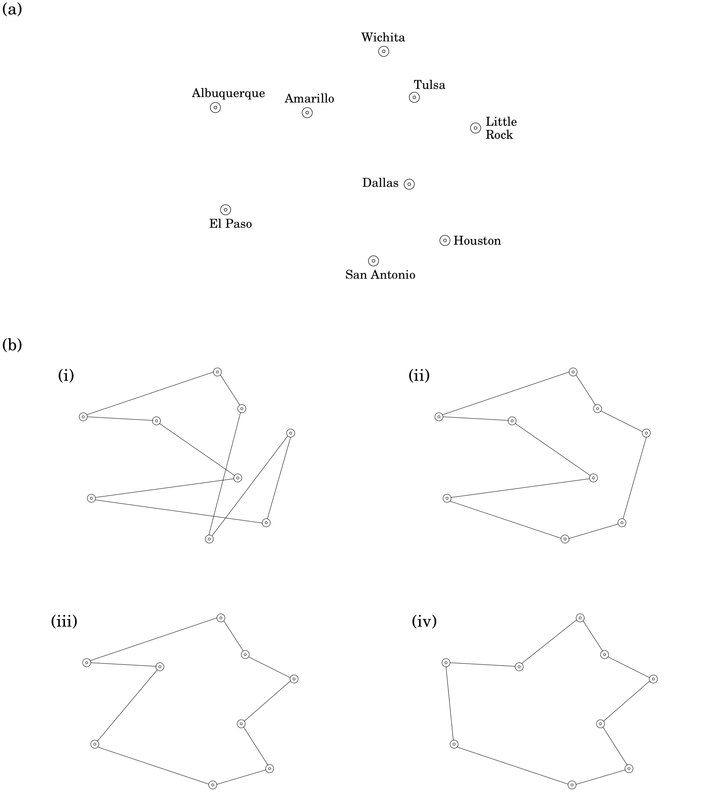
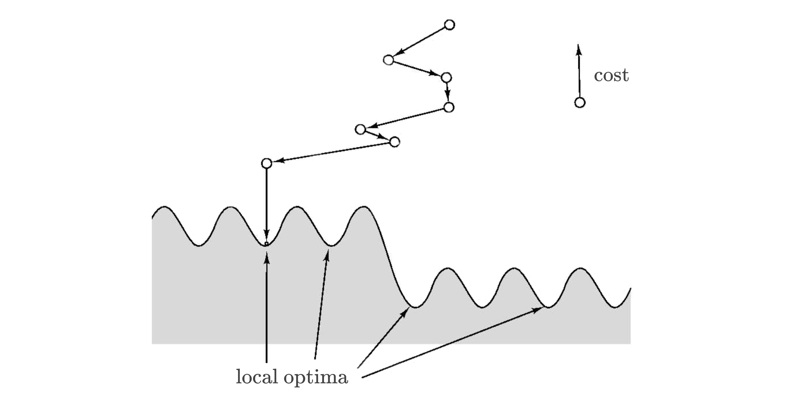
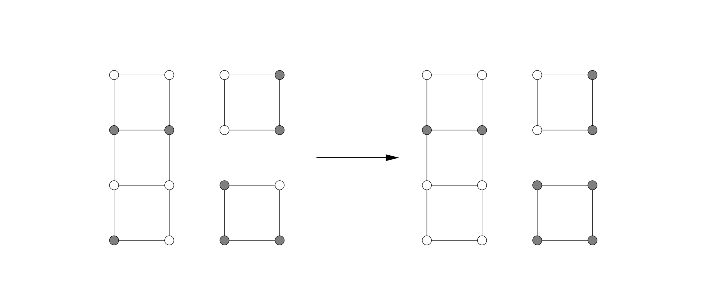
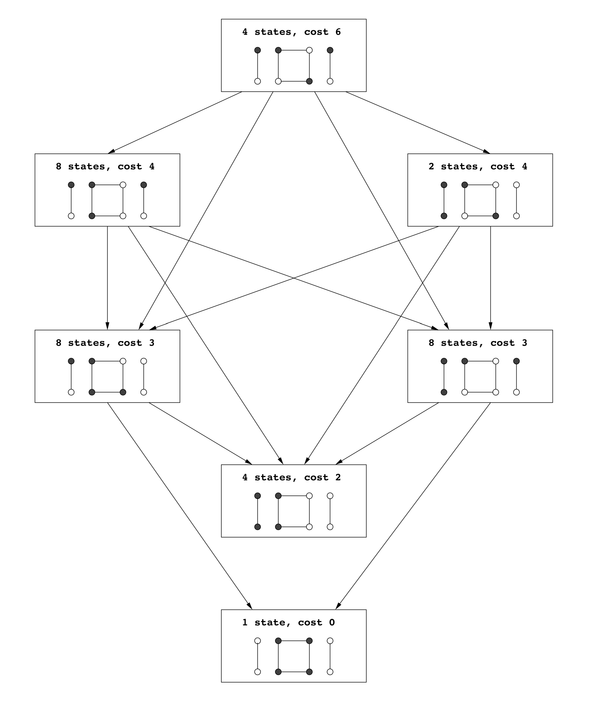
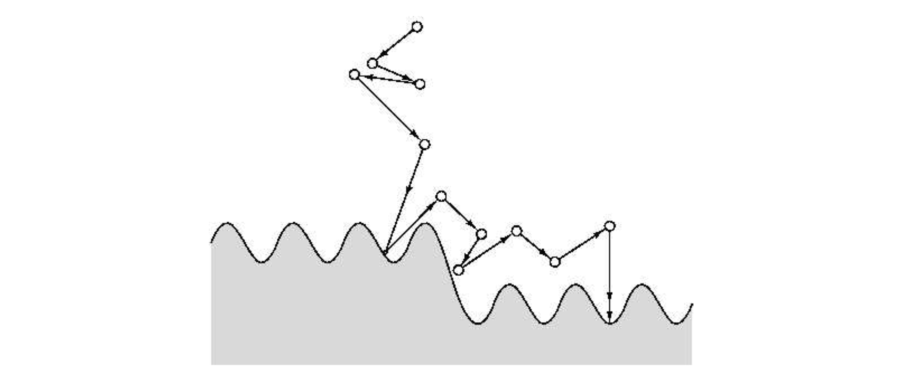

## 9.3 Local Search Heuristics

Our next strategy for coping with $\textbf{NP}$-completeness is inspired by evolution (which is, after all, the world's best-tested optimization procedure)—by its incremental process of introducing small mutations, trying them out, and keeping them if they work well. This paradigm is called *local search* and can be applied to any optimization task. Here's how it looks for a minimization problem.

```python
let s be any initial solution
while there is some solution s* in the neighborhood of s
  for which cost(s*) < cost(s): replace s by s*
return s
```

On each iteration, the current solution is replaced by a better one close to it, in its neighborhood. This neighborhood structure is something we impose upon the problem and is the central design decision in local search. As an illustration, let's revisit the traveling salesman problem.

&nbsp;


### 9.3.1 Traveling Salesman, Once More

Assume we have all interpoint distances between $n$ cities, giving a search space of $(n - 1)!$ different tours. What is a good notion of neighborhood?
The most obvious notion is to consider two tours as being close if they differ in just a few edges. They can't differ in just one edge (do you see why?), so we will consider differences of two edges. We define the $2$-*change* neighborhood of tour $s$ as being the set of tours that can be obtained by removing two edges of $s$ and then putting in two other edges. Here's an example of a local move:


We now have a well-defined local search procedure. How does it measure up under our two standard criteria for algorithms—what is its overall running time, and does it always return the best solution?

Embarrassingly, neither of these questions has a satisfactory answer. Each iteration is certainly fast, because a tour has only $O(n^2)$ neighbors. However, it is not clear how many iterations will be needed: whether for instance, there might be an exponential number of them.

Likewise, all we can easily say about the final tour is that it is locally optimal—that is, it is superior to the tours in its immediate neighborhood. There might be better solutions further away. For instance, the following picture shows a possible final answer that is clearly suboptimal; the range of local moves is simply too limited to improve upon it.


To overcome this, we may try a more generous neighborhood, for instance $3$-*change*, consisting of tours that differ on up to three edges. And indeed, the preceding bad case gets fixed:


But there is a downside, in that the size of a neighborhood becomes $O(n^3)$, making each iteration more expensive. Moreover, there may still be suboptimal local minima, although fewer than before. To avoid these, we would have to go up to $4$-*change*, or higher.

In this manner, efficiency and quality often turn out to be competing considerations in a local search. Efficiency demands neighborhoods that can be searched quickly, but smaller neighborhoods can increase the abundance of low-quality local optima. The appropriate compromise is typically determined by experimentation.

Figure 9.7 shows a specific example of local search at work. Figure 9.8 is a more abstract, stylized depiction of local search.






The solutions crowd the unshaded area, and cost decreases when we move downward. Starting from an initial solution, the algorithm moves downhill until a local optimum is reached.

In general, the search space might be riddled with local optima, and some of them may be of very poor quality. The hope is that with a judicious choice of neighborhood structure, most local optima will be reasonable. Whether this is the reality or merely misplaced faith, it is an empirical fact that local search algorithms are the top performers on a broad range of optimization problems. Let's look at another such example.

&nbsp;


### 9.3.2 Graph Partitioning

The problem of graph partitioning arises in a diversity of applications, from circuit layout to program analysis to image segmentation. We saw a special case of it, $\text{BALANCED CUT}$, in Chapter 8.

&nbsp;

  $\text{GRAPH PARTITIONING}$

* input: an undirected graph $G = (V, E)$ with nonnegative edge weights; a real number $\alpha \in (0, 1/2]$.

* output: a partition of the vertices into two groups $A$ and $B$, each of size at least $\alpha|V|$.

* goal: minimize the capacity of the cut $(A, B)$.

&nbsp;

Figure 9.9 shows an example in which the graph has $16$ nodes, all edge weights are $0$ or $1$, and the optimal solution has cost $0$. Removing the restriction on the sizes of $A$ and $B$ would give the $\text{MINIMUM CUT}$ problem, which we know to be efficiently solvable using flow techniques. The present variant, however, is $\textbf{NP}$-hard. In designing a local search algorithm, it will be a big convenience to focus on the special case $\alpha = 1/2$, in which $A$ and $B$ are forced to contain exactly half the vertices. The apparent loss of generality is purely cosmetic, as $\text{GRAPH PARTITIONING}$ reduces to this particular case.


We need to decide upon a neighborhood structure for our problem, and there is one obvious way to do this. Let ($A, B$), with $|A| = |B|$, be a candidate solution; we will define its neighbors to be all solutions obtainable by swapping one pair of vertices across the cut, that is, all solutions of the form $(A - \{a\} + \{b\}, B - \{b\} + \{a\})$ where $a \in A$ and $b \in B$. Here's an example of a local move:



We now have a reasonable local search procedure, and we could just stop here. But there is still a lot of room for improvement in terms of the *quality* of the solutions produced. The search space includes some local optima that are quite far from the global solution. Here's one which has cost $2$.


What can be done about such suboptimal solutions? We could expand the neighborhood size to allow two swaps at a time, but this particular bad instance would still stubbornly resist. Instead, let's look at some other generic schemes for improving local search procedures.

&nbsp;


### 9.3.3 Dealing with Local Optima

**Randomization and Restarts**

Randomization can be an invaluable ally in local search. It is typically used in two ways: to pick a random initial solution, for instance a random graph partition; and to choose a local move when several are available.

When there are many local optima, randomization is a way of making sure that there is at least some probability of getting to the right one. The local search can then be repeated several times, with a different random seed on each invocation, and the best solution returned. If the probability of reaching a good local optimum on any given run is $p$, then within $O(1 / p)$ runs such a solution is likely to be found (recall Exercise 1.34).

Figure 9.10 shows a small instance of graph partitioning, along with the search space of solutions. There are a total of $\binom{8}{4} = 70$ possible states, but since each of them has an identical twin in which the left and right sides of the cut are flipped, in effect there are just $35$ solutions.

In the figure, these are organized into seven groups for readability. There are five local optima, of which four are bad, with cost $2$, and one is good, with cost $0$. If local search is started at a random solution, and at each step a random neighbor of lower cost is selected, then the search is at most four times as likely to wind up in a bad solution than a good one. Thus only a small handful of repetitions is needed.



&nbsp;

**Simulated Annealing**

In the example of Figure 9.10, each run of local search has a reasonable chance of finding the global optimum. This isn't always true. As the problem size grows, the ratio of bad to good local optima often increases, sometimes to the point of being exponentially large. In such cases, simply repeating the local search a few times is ineffective.

A different avenue of attack is to occasionally allow moves that actually increase the cost, in the hope that they will pull the search out of dead ends. This would be very useful at the bad local optima of Figure 9.10, for instance. The method of *simulated annealing* redefines the local search by introducing the notion of a *temperature* $T$.

```python
let s be any starting solution
repeat
  randomly choose a solution s* in the neighborhood of s
  if ∆ = cost(s*) - cost(s) is negative:
    replace s by s*
  else:
    replace s by s* with probability e^(-∆ / T)
```

If $T$ is zero, this is identical to our previous local search. But if $T$ is large, then moves that increase the cost are occasionally accepted. What value of $T$ should be used?

The trick is to start with $T$ large and then gradually reduce it to zero. Thus initially, the local search can wander around quite freely, with only a mild preference for low-cost solutions. As time goes on, this preference becomes stronger, and the system mostly sticks to the lower-cost region of the search space, with occasional excursions out of it to escape local optima. Eventually, when the temperature drops further, the system converges on a solution.

Figure 9.11 shows this process schematically.



Simulated annealing is inspired by the physics of crystallization. When a substance is to be crystallized, it starts in liquid state, with its particles in relatively unconstrained motion. Then it is slowly cooled, and as this happens, the particles gradually move into more regular configurations. This regularity becomes more and more pronounced until finally a crystal lattice is formed.

The benefits of simulated annealing come at a significant cost: because of the changing temperature and the initial freedom of movement, many more local moves are needed until convergence. Moreover, it is quite an art to choose a good timetable by which to decrease the temperature, called an *annealing schedule*. But in many cases where the quality of solutions improves significantly, the tradeoff is worthwhile.
