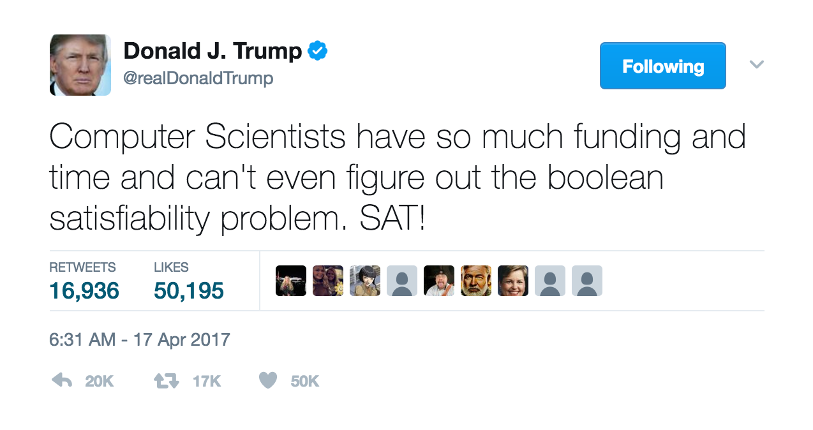

# Algorithms

### Christos Papadimitriou, Sanjoy Dasgupta,  Umesh Vazirani

&nbsp;

&nbsp;

Note: for a list of recommended sections, visit [the course webpage](http://cs170.org/) for this book.

## Contents

[**Preface**](/algorithms/preface)

0.  [**Prologue**](/algorithms/Chapter0/0) ([pdf](/algorithms/PDFs/chap0.pdf))

1.  [**Algorithms With Numbers**](/algorithms/Chapter1/1) ([pdf](/algorithms/PDFs/chap1.pdf))

2.  [**Divide and Conquer**](/algorithms/Chapter2/2) ([pdf](/algorithms/PDFs/chap2.pdf))

3.  [**Graphs Decomposition**](/algorithms/Chapter3/3) ([pdf](/algorithms/PDFs/chap3.pdf))

4.  [**Paths in Graphs**](/algorithms/Chapter4/4) ([pdf](/algorithms/PDFs/chap4.pdf))

5.  [**Greedy Algorithms**](/algorithms/Chapter5/5) ([pdf](/algorithms/PDFs/chap5.pdf))

6.  [**Dynamic Programming**](/algorithms/Chapter6/6) ([pdf](/algorithms/PDFs/chap6.pdf))

7.  [**Linear Programming**](/algorithms/Chapter7/7) ([pdf](/algorithms/PDFs/chap7.pdf))

8.  [**NP-Complete Problems**](/algorithms/Chapter8/8) ([pdf](/algorithms/PDFs/chap8.pdf))

9.  [**Coping with NP-Completeness**](/algorithms/Chapter9/9) ([pdf](/algorithms/PDFs/chap9.pdf))

10. [**Quantum Algorithms**](/algorithms/Chapter10/10) ([pdf](/algorithms/PDFs/chap10.pdf))
